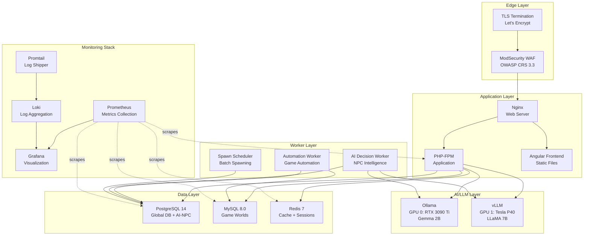
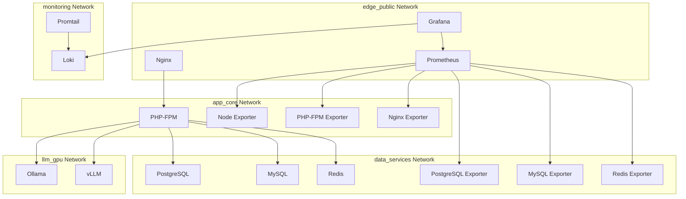
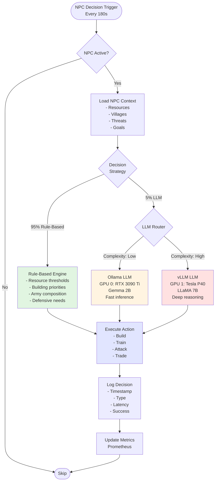
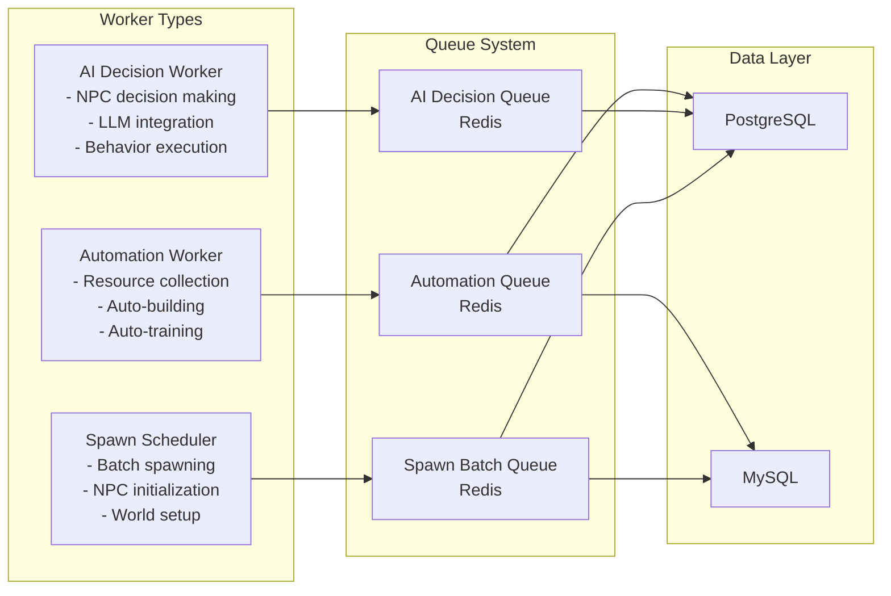

# System Architecture - TravianT4.6

## Overview

TravianT4.6 is a production-grade multiplayer game server featuring AI-powered NPCs, dual-GPU LLM support, comprehensive monitoring, and automated operations. The system is designed for high availability, scalability, and maintainability.

**System Purpose:**
- Host multiple Travian game worlds simultaneously
- Provide intelligent AI-controlled NPCs using LLM technology
- Ensure 99.9% uptime with automated monitoring and recovery
- Support 1000+ concurrent players with 500+ AI NPCs per world

**Key Components:**
- **Frontend:** Angular SPA for game interface
- **Backend:** PHP-FPM API with RESTful endpoints
- **Databases:** PostgreSQL (global/AI data) + MySQL (game worlds)
- **Caching:** Redis for sessions and data caching
- **AI/LLM:** Dual-GPU setup (Ollama + vLLM)
- **Workers:** Background automation (3 worker types)
- **Monitoring:** Prometheus + Grafana + Loki

---

## Technology Stack

### Frontend
- **Framework:** Angular 15+
- **Build Tool:** Webpack
- **State Management:** RxJS
- **HTTP Client:** Angular HttpClient

### Backend
- **Runtime:** PHP 8.2
- **Web Server:** Nginx 1.24
- **Session Storage:** Redis 7
- **Routing:** FastRoute
- **Templating:** Twig
- **Logging:** Monolog

### Databases
- **PostgreSQL 14:** Global data, AI-NPC system
- **MySQL 8.0:** Game world data (multi-database)
- **Redis 7:** Caching, sessions, queues

### AI/LLM
- **Ollama:** Gemma 2B (RTX 3090 Ti)
- **vLLM:** LLaMA 7B (Tesla P40)
- **Strategy:** 95% rule-based + 5% LLM

### Infrastructure
- **Container Runtime:** Docker 24+
- **Orchestration:** Docker Compose
- **OS:** Ubuntu 22.04 (WSL2)
- **GPU:** NVIDIA CUDA 12.0

### Monitoring
- **Metrics:** Prometheus 2.45+
- **Visualization:** Grafana 10+
- **Logging:** Loki + Promtail
- **Exporters:** Node, PostgreSQL, MySQL, Redis, PHP-FPM

---

## System Overview Diagram



**Layer Descriptions:**

- **Edge Layer:** TLS termination and WAF protection
- **Application Layer:** Frontend delivery and API processing
- **Data Layer:** Persistent storage and caching
- **AI/LLM Layer:** LLM inference for NPC intelligence
- **Worker Layer:** Background automation tasks
- **Monitoring Stack:** Observability and alerting

---

## Network Segmentation Diagram



**Network Isolation:**

| Network | Purpose | Services | Isolation Level |
|---------|---------|----------|-----------------|
| **edge_public** | External access | Nginx, Grafana, Prometheus | Public-facing |
| **app_core** | Application logic | PHP-FPM, Workers, Exporters | Internal only |
| **data_services** | Data storage | PostgreSQL, MySQL, Redis | Internal only |
| **llm_gpu** | AI inference | Ollama, vLLM | Internal only |
| **monitoring** | Observability | Loki, Promtail | Internal only |

**Security Benefits:**
- Database layer isolated from direct internet access
- LLM services only accessible to application layer
- Monitoring stack isolated from production data
- Defense in depth with multiple network boundaries

---

## AI Decision Flow Diagram



**Decision Flow Explanation:**

1. **Trigger:** NPC decision timer fires (every 180 seconds configurable)
2. **Context Loading:** Gather NPC state, resources, villages, threats
3. **Strategy Selection:**
   - **95% Rule-Based:** Fast deterministic decisions using predefined rules
   - **5% LLM:** Complex scenarios requiring reasoning
4. **LLM Routing:**
   - **Ollama (Gemma 2B):** Simple decisions, fast inference (<200ms)
   - **vLLM (LLaMA 7B):** Complex decisions, deeper reasoning (<500ms)
5. **Action Execution:** Perform game action (build, train, attack, etc.)
6. **Logging & Metrics:** Record decision for analysis and monitoring

**Performance Targets:**
- Rule-based decisions: <50ms average
- LLM decisions (Ollama): <200ms average
- LLM decisions (vLLM): <500ms average
- Overall system average: <100ms per NPC decision

---

## Worker Orchestration



**Worker Details:**

| Worker | Frequency | Queue Depth Target | Timeout | Health Check |
|--------|-----------|-------------------|---------|--------------|
| **Automation Worker** | Continuous | <100 | 60s | Every 60s |
| **AI Decision Worker** | Continuous | <500 | 120s | Every 60s |
| **Spawn Scheduler** | Batch-triggered | N/A | 300s | Every 60s |

**Scaling Strategy:**
- Horizontal scaling: Add worker instances for increased throughput
- Vertical scaling: Increase memory/CPU for complex AI decisions
- Queue monitoring: Auto-scale based on queue depth

---

## Database Schema Overview

### PostgreSQL (Global + AI-NPC)

**Core Tables:**
- `players` - All players (human + NPC)
- `villages` - All villages
- `worlds` - Game world configurations

**AI-NPC Tables:**
- `ai_configs` - NPC AI configuration
- `npc_actions` - Queued NPC actions
- `decision_logs` - Decision history
- `llm_decision_metrics` - LLM performance metrics
- `spawn_batches` - Batch spawn scheduling
- `spawn_presets` - Spawn configurations

**Key Relationships:**
```
players (1) ──< (N) villages
players (1) ──< (1) ai_configs (for NPCs only)
ai_configs (1) ──< (N) decision_logs
worlds (1) ──< (N) players
worlds (1) ──< (N) spawn_batches
```

### MySQL (Game Worlds)

Each game world has its own MySQL database containing:

**Game Tables:**
- `users` - Player accounts
- `villages` - Village data
- `buildings` - Building states
- `units` - Troop counts
- `research` - Technology levels
- `market` - Trade offers
- `reports` - Battle reports
- `messages` - Player messages

**Multi-Database Architecture:**
```
s1_testworld (100x speed)
s1_demo (5x speed)
s1_production (1x speed)
...
```

**Benefits:**
- Isolation: World data separated
- Scalability: Distribute across MySQL instances
- Maintenance: Backup/restore per world

---

## Component Descriptions

### Nginx (Web Server)

**Responsibilities:**
- TLS termination (Let's Encrypt)
- Static file serving (Angular frontend)
- Reverse proxy to PHP-FPM
- Load balancing (future)
- ModSecurity WAF integration

**Configuration:**
- HTTP/2 enabled
- Gzip compression
- Cache-Control headers
- Rate limiting (global tier)

### PHP-FPM (Application)

**Responsibilities:**
- RESTful API endpoints
- Business logic processing
- Database queries
- LLM integration
- CSRF protection
- Session management

**Configuration:**
- Process manager: dynamic
- Max children: 50
- Memory limit: 1536M
- Execution timeout: 60s

### PostgreSQL (Global Database)

**Responsibilities:**
- Global player data
- AI-NPC configurations
- Decision logging
- Spawn management
- World metadata

**Configuration:**
- Max connections: 200
- Shared buffers: 2GB
- Effective cache: 6GB
- Work mem: 16MB

### MySQL (Game Worlds)

**Responsibilities:**
- Game state per world
- Village data
- Unit counts
- Building states
- Market trades

**Configuration:**
- InnoDB buffer pool: 2GB
- Max connections: 150
- Query cache: Disabled (MySQL 8.0)

### Redis (Cache + Sessions)

**Responsibilities:**
- Session storage
- Data caching
- Worker queues
- Rate limiting counters

**Configuration:**
- Max memory: 1GB
- Eviction policy: allkeys-lru
- Persistence: RDB snapshots

### Ollama (Fast LLM)

**Responsibilities:**
- Simple NPC decisions
- Quick inference
- Low-complexity reasoning

**Configuration:**
- GPU: RTX 3090 Ti (device 0)
- Model: Gemma 2B
- Context window: 8192 tokens
- Temperature: 0.7

### vLLM (Advanced LLM)

**Responsibilities:**
- Complex NPC decisions
- Deep reasoning
- Strategic planning

**Configuration:**
- GPU: Tesla P40 (device 1)
- Model: LLaMA 7B
- Context window: 4096 tokens
- Temperature: 0.8

---

## Data Flow

### User Request Flow

```
1. User Browser
   ↓ (HTTPS)
2. Nginx (TLS termination, static files)
   ↓ (HTTP)
3. PHP-FPM (API processing)
   ↓ (SQL)
4. PostgreSQL / MySQL (data retrieval)
   ↓ (JSON)
5. PHP-FPM (response formatting)
   ↓ (JSON)
6. Nginx (compression)
   ↓ (HTTPS)
7. User Browser
```

**Latency Budget:**
- TLS handshake: <50ms
- Nginx processing: <10ms
- PHP-FPM execution: <200ms
- Database query: <50ms
- Total target: <400ms (95th percentile)

### Background Worker Flow

```
1. Cron/Scheduler
   ↓
2. Worker Process (automation, AI, spawn)
   ↓
3. Redis Queue (job retrieval)
   ↓
4. PostgreSQL / MySQL (data access)
   ↓
5. LLM (if AI decision)
   ↓
6. Database (action execution)
   ↓
7. Prometheus (metrics update)
```

**Performance Targets:**
- Automation worker: 100 jobs/minute
- AI decision worker: 50 decisions/minute
- Spawn scheduler: 50 NPCs/batch

### Monitoring Data Flow

```
1. Application (metrics generation)
   ↓
2. Exporters (metrics exposure)
   ↓
3. Prometheus (scraping every 15s)
   ↓
4. Prometheus (storage + alerting)
   ↓
5. Grafana (visualization)
   ↓
6. Operator (dashboard viewing)
```

**Metrics Collected:**
- System: CPU, memory, disk, network
- Database: Connections, queries, cache hits
- Application: Request rate, latency, errors
- LLM: Inference time, GPU utilization
- Workers: Queue depth, processing rate

---

## Deployment Architecture

### Single-Server Deployment (Current)

```
Windows 11 Host
└── WSL2 Ubuntu 22.04
    ├── Docker Engine
    │   ├── Nginx Container
    │   ├── PHP-FPM Container
    │   ├── PostgreSQL Container
    │   ├── MySQL Container
    │   ├── Redis Container
    │   ├── Ollama Container (GPU 0)
    │   ├── vLLM Container (GPU 1)
    │   ├── Worker Containers (3x)
    │   ├── Prometheus Container
    │   ├── Grafana Container
    │   ├── Loki Container
    │   └── Promtail Container
    └── NVIDIA Container Toolkit
        ├── GPU 0: RTX 3090 Ti
        └── GPU 1: Tesla P40
```

### Future Multi-Server Architecture

**Planned scaling path:**
- Separate database servers
- Dedicated LLM inference servers
- Load-balanced application servers
- Distributed worker fleet

---

## Security Architecture

### Defense in Depth

1. **Network Layer:** WAF, TLS 1.3, network segmentation
2. **Application Layer:** CSRF tokens, input validation, parameterized queries
3. **Data Layer:** Encrypted connections, least privilege access
4. **Monitoring Layer:** Audit logging, anomaly detection, alerting

**See:** [SECURITY-HARDENING.md](SECURITY-HARDENING.md)

---

## See Also

- [DEPLOYMENT-GUIDE.md](DEPLOYMENT-GUIDE.md) - Deployment instructions
- [SYSTEM_DOCUMENTATION.md](SYSTEM_DOCUMENTATION.md) - AI-NPC system details
- [MONITORING.md](MONITORING.md) - Monitoring stack documentation
- [GPU-SETUP.md](GPU-SETUP.md) - Dual-GPU configuration
- [DEVELOPER-ONBOARDING.md](DEVELOPER-ONBOARDING.md) - Developer guide
- [OPERATIONS-RUNBOOK.md](OPERATIONS-RUNBOOK.md) - Day-to-day operations
