# MASTER DOCUMENT ROADMAP - 35-Document Enterprise Audit Specification
**Project**: TravianT4.6 AI-NPC Game Server
**Generated**: 2025-10-30
**Version**: 1.1
**Status**: 🟡 Phase 1-2 Complete, Phase 3 In Progress

## Executive Summary

This roadmap defines **35 numbered markdown documents** needed to achieve 1:1 complete, production-ready, enterprise-grade status for the TravianT4.6 project. Based on comprehensive 3-pass codebase audit and Enterprise Audit methodology, these documents cover: Discovery & Inventory, Deep Code Analysis, Gap Analysis, Specific Deep Dives, Compliance & Operations, and Completion Roadmap. The roadmap was updated from 34 to 35 documents to properly document the dual-database architecture (PostgreSQL + MySQL).

**Current Status**: Phase 1 & 2 Complete (9/35 documents = 26%)
**Completed**: Discovery & Inventory + Deep Code Analysis including dual-database documentation
**Next Phase**: Gap Analysis (Quality Scorecard, Test Coverage, Production Readiness)
**Target**: 100% complete, zero vulnerabilities, full test coverage, enterprise operations

---

## Table of Contents

**PHASE 1: DISCOVERY & INVENTORY**
- [01-PROJECT-INVENTORY](#01-project-inventory)
- [02-TECH-STACK-MATRIX](#02-tech-stack-matrix)
- [03-ARCHITECTURE-OVERVIEW](#03-architecture-overview)
- [04-DEPENDENCY-GRAPH](#04-dependency-graph)

**PHASE 2: DEEP CODE ANALYSIS**
- [05-CODE-QUALITY-ANALYSIS](#05-code-quality-analysis) ✅
- [06-PERFORMANCE-ANALYSIS](#06-performance-analysis) ✅
- [07-API-ENDPOINT-CATALOG](#07-api-endpoint-catalog) ✅
- [08-DATABASE-SCHEMA-DEEP-DIVE](#08-database-schema-deep-dive) ✅ (PostgreSQL)
- [08b-MYSQL-SCHEMA-ANALYSIS](#08b-mysql-schema-analysis) ✅ (MySQL Game Worlds)

**PHASE 3: GAP ANALYSIS**
- [09-QUALITY-SCORECARD](#09-quality-scorecard)
- [10-TEST-COVERAGE-REPORT](#10-test-coverage-report)
- [11-PRODUCTION-READINESS-CHECKLIST](#11-production-readiness-checklist)
- [12-INFRASTRUCTURE-GAPS](#12-infrastructure-gaps)

**PHASE 4: SPECIFIC DEEP DIVES**
- [13-DATABASE-SCHEMA-COMPLETE](#13-database-schema-complete)
- [14-ERD-DIAGRAM](#14-erd-diagram)
- [15-API-SPECIFICATION-COMPLETE](#15-api-specification-complete)
- [16-API-FLOW-DIAGRAMS](#16-api-flow-diagrams)
- [17-AUTH-SYSTEM-COMPLETE](#17-auth-system-complete)
- [18-AUTH-FLOW-DIAGRAMS](#18-auth-flow-diagrams)
- [19-WORKER-SYSTEM-COMPLETE](#19-worker-system-complete)
- [20-WORKER-ARCHITECTURE-DIAGRAM](#20-worker-architecture-diagram)
- [21-INTEGRATION-MAP](#21-integration-map)
- [22-INTEGRATION-DIAGRAMS](#22-integration-diagrams)

**PHASE 5: COMPLIANCE & OPERATIONS**
- [23-SECURITY-COMPLIANCE-MATRIX](#23-security-compliance-matrix)
- [24-CICD-PIPELINE-DESIGN](#24-cicd-pipeline-design)
- [25-PIPELINE-DIAGRAM](#25-pipeline-diagram)
- [26-MONITORING-STRATEGY-ENHANCED](#26-monitoring-strategy-enhanced)
- [27-ALERT-RULES-COMPLETE](#27-alert-rules-complete)
- [28-DISASTER-RECOVERY-PLAN-COMPLETE](#28-disaster-recovery-plan-complete)

**PHASE 6: COMPLETION ROADMAP**
- [29-MASTER-GAP-INVENTORY](#29-master-gap-inventory)
- [30-PRIORITIZED-BACKLOG](#30-prioritized-backlog)
- [31-SPRINT-PLAN](#31-sprint-plan)
- [32-TASK-DEPENDENCY-GRAPH](#32-task-dependency-graph)
- [33-COMPLETION-TIMELINE](#33-completion-timeline)
- [34-SUCCESS-METRICS](#34-success-metrics)

---

# PHASE 1: DISCOVERY & INVENTORY (Documents 01-04)

## 01-PROJECT-INVENTORY
**Priority:** High
**Phase:** 1
**Estimated Effort:** 4-6 hours
**Dependencies:** None (start immediately)

**Description:**

Complete file system inventory of the entire TravianT4.6 codebase. This document catalogs every file with comprehensive metadata including path, size, last modified date, programming language, and line count. It identifies file relationships through import/dependency analysis and detects orphaned files not referenced anywhere in the codebase.

This serves as the foundation for all subsequent analysis phases. By understanding the complete scope of the project - total files, lines of code, directory structure, and file dependencies - we establish a baseline for measuring progress and completeness. The inventory also helps identify legacy code, unused files, and organizational patterns that inform refactoring decisions.

**Key Contents:**
- Complete file tree visualization with all directories recursively listed
- Comprehensive file metadata table: path, size (KB), last modified, language, lines of code
- Directory summary statistics: file counts per directory, total size per directory, language distribution
- Language distribution breakdown: percentage of codebase by language (PHP, JavaScript, SQL, Bash, etc.)
- Orphaned files list: unreferenced files not imported or required anywhere
- Import/dependency matrix showing which files depend on which
- File relationship graph identifying tight coupling and dependency chains
- Code statistics: total LOC, comment density, file size distribution

**Diagrams to Include:**
- Directory tree structure (Mermaid tree diagram)
- Language distribution pie chart (Mermaid pie chart)
- File size heatmap by directory

**Analysis Scope - Files/Directories:**
- / (entire project root)
- sections/api/ (PHP backend)
- sections/servers/ (game servers)
- sections/pma/ (phpMyAdmin)
- angularIndex/ (Angular frontend)
- database/ (schemas, migrations)
- docker/ (Docker configurations)
- scripts/ (utility scripts, healthchecks, backups, security)
- docs/ (documentation - 82 markdown files)
- TaskWorker/ (background workers)
- main_script/ (game engine)
- mailNotify/ (email notifications)
- prometheus/, grafana/, loki/, promtail/ (monitoring configs)

**Methodology:**
1. Use `find / -type f` command to list all files recursively
2. Calculate file sizes using `stat` and line counts using `wc -l`
3. Identify programming languages based on file extensions (.php, .js, .ts, .sql, .sh, .yml, .md)
4. Parse all `require`, `require_once`, `use`, `import` statements to build dependency graph
5. Cross-reference all files against import statements to identify orphans
6. Generate summary statistics per directory and language
7. Create Mermaid diagrams for visualization
8. Document findings in structured tables

**Acceptance Criteria:**
- [ ] Every file in codebase listed with complete metadata
- [ ] Total file count matches actual filesystem count (verify with `find | wc -l`)
- [ ] Language distribution percentages sum to 100%
- [ ] All orphaned files identified and flagged for review
- [ ] Directory tree diagram generated and renders correctly
- [ ] Import/dependency relationships mapped for all PHP files
- [ ] Summary statistics calculated and accurate

**Success Metrics:**
- File count accuracy: 100% (no files missed)
- Metadata completeness: 100% (all fields populated for all files)
- Orphan detection rate: All unreferenced files found
- Diagram rendering: All Mermaid diagrams render correctly on GitHub

---

## 02-TECH-STACK-MATRIX
**Priority:** High
**Phase:** 1
**Estimated Effort:** 3-4 hours
**Dependencies:** 01-PROJECT-INVENTORY

**Description:**

Comprehensive technology stack matrix documenting ALL technologies, frameworks, libraries, tools, and external services used in the project. This includes detailed version tracking, purpose documentation, and update status analysis. The matrix covers package managers (Composer for PHP, npm for Node.js), databases (PostgreSQL for global/AI data, MySQL for game worlds, Redis for caching), LLM systems (Ollama on RTX 3090 Ti, vLLM on Tesla P40), infrastructure components (Docker, Nginx, ModSecurity WAF), and the complete monitoring stack (Prometheus, Grafana, Loki, Promtail).

This document is critical for understanding technical debt, identifying deprecated technologies, planning upgrades, and ensuring all components are properly licensed and supported. It also serves as a quick reference for developers joining the project to understand the technology landscape.

**Key Contents:**
- Programming languages table: PHP 8.2, JavaScript/TypeScript (Angular), SQL (PostgreSQL/MySQL), Bash scripting
- Framework inventory: Angular 15+, FastRoute (PHP routing), Twig 1.x (templating), Monolog 2.10.0 (logging)
- Package dependencies analysis:
  - PHP: Parse composer.json and composer.lock
  - Node.js: Parse package.json and package.lock (if exists)
  - All dependencies with current versions
- Database systems: PostgreSQL 14 (Neon-backed), MySQL 8.0, Redis 7
- Infrastructure components:
  - Docker 24+ with Compose
  - Nginx 1.24 web server
  - ModSecurity WAF with OWASP CRS 4.0
  - Let's Encrypt TLS automation
- AI/LLM stack:
  - Ollama (Gemma 2B model on RTX 3090 Ti GPU 0)
  - vLLM (LLaMA 7B model on Tesla P40 GPU 1)
  - NVIDIA CUDA 12.0, GPU runtime
- Monitoring & observability:
  - Prometheus 2.45+ (metrics collection, 10 scrape targets)
  - Grafana 10+ (visualization, 3 dashboards)
  - Loki (log aggregation, 30-day retention)
  - Promtail (log shipping)
  - 6 exporters: Node, PostgreSQL, MySQL, Redis, PHP-FPM, Nginx
- External services:
  - Brevo Transactional Email API (formerly SendinBlue)
  - Let's Encrypt (TLS certificates)
  - Cloudflare SDK (TaskWorker)
  - Discord Webhooks (system notifications)
- Version comparison matrix:
  - Current version in use
  - Latest stable version available
  - Update needed? (Yes/No)
  - Breaking changes? (Yes/No/Unknown)
  - EOL/deprecated warnings
- License compliance table: MIT, Apache 2.0, GPL, proprietary

**Diagrams to Include:**
- Technology stack layers diagram (Mermaid - Edge/Application/Data/AI-LLM/Monitoring layers)
- Dependency tree visualization (major dependencies only)

**Analysis Scope - Files/Directories:**
- composer.json, composer.lock (PHP dependencies)
- package.json, package.lock (Node.js dependencies - if exists)
- docker-compose.yml, docker-compose.monitoring.yml, docker-compose.logging.yml, docker-compose.maintenance.yml
- .env.production.example (service versions, configurations)
- docker/*/Dockerfile (base image versions)
- prometheus/prometheus.yml (monitoring targets)
- grafana/provisioning/ (Grafana configs)

**Methodology:**
1. Parse composer.json and composer.lock to extract PHP dependencies with versions
2. Parse package.json and package.lock (if exists) for Node.js dependencies
3. Extract Docker image versions from docker-compose files
4. Document database versions from environment variables and Docker images
5. Catalog monitoring tools with versions from Docker images
6. Cross-reference current versions with online databases (Packagist, npm, Docker Hub)
7. Identify deprecated/EOL technologies using version databases
8. Check for known security vulnerabilities in dependencies
9. Generate technology layer diagram
10. Create version comparison matrix with update recommendations

**Acceptance Criteria:**
- [ ] All dependencies from composer.json and package.json listed with versions
- [ ] All Docker images documented with base image versions
- [ ] All database systems cataloged with versions
- [ ] All monitoring tools listed with versions
- [ ] External services documented with API versions
- [ ] Deprecated/EOL technologies identified and flagged
- [ ] Update recommendations provided for out-of-date packages
- [ ] License compliance verified
- [ ] Technology stack diagram created and renders correctly

**Success Metrics:**
- Dependency coverage: 100% of composer.json and package.json entries
- Version accuracy: 100% verified against lock files
- EOL warnings: All deprecated technologies flagged
- Update safety: Breaking changes identified for recommended updates

---

## 03-ARCHITECTURE-OVERVIEW
**Priority:** High
**Phase:** 1
**Estimated Effort:** 6-8 hours
**Dependencies:** 01-PROJECT-INVENTORY, 02-TECH-STACK-MATRIX

**Description:**

Comprehensive high-level system architecture documentation using the C4 model (System Context, Container, Component levels). This document provides clear architectural understanding by identifying all entry points, module boundaries, data flow paths, state management patterns, authentication flows, and background worker systems. It maps the relationships between major subsystems including the Angular frontend, PHP-FPM backend, dual databases (PostgreSQL and MySQL), Redis cache, dual-GPU LLM infrastructure (Ollama + vLLM), three background workers (automation, AI decision, spawn scheduler), and the complete monitoring stack.

The architecture overview serves as the definitive reference for understanding how the system works at multiple levels of abstraction. The C4 model provides progressively detailed views: Level 1 shows the system in its environment, Level 2 shows major containers/services, and Level 3 shows internal component structure. This is essential for onboarding new developers, planning system changes, and communicating architecture to stakeholders.

**Key Contents:**
- System Context Diagram (C4 Level 1): TravianT4.6 system with external actors (players, admins, LLM APIs, email service)
- Container Diagram (C4 Level 2): All major services/containers
  - Angular Frontend (port 5000)
  - PHP-FPM Backend
  - Nginx Web Server
  - ModSecurity WAF
  - PostgreSQL (global DB, AI-NPC data)
  - MySQL (game worlds DB)
  - Redis (cache, sessions)
  - Ollama (RTX 3090 Ti, GPU 0)
  - vLLM (Tesla P40, GPU 1)
  - 3 Background Workers (automation, AI decision, spawn scheduler)
  - Prometheus, Grafana, Loki, Promtail
- Component Diagram (C4 Level 3): Internal structure of key containers
  - Backend: Controllers (12), Services (10), Middleware, Security, Logging
  - Workers: Automation profiles, AI decision engine, spawn scheduler
  - Frontend: Angular modules, components, services
- Entry points catalog:
  - Web entry: router.php (routes static files and API requests)
  - API entry: sections/api/index.php
  - Worker entries: TaskWorker/*.php (3 workers)
  - CLI entries: cli/world-generator.php, cli/npc-spawner.php
- Module boundaries and responsibilities:
  - Frontend: User interface, game visualization
  - API: RESTful endpoints (12 controllers, 50+ endpoints)
  - Workers: Background automation, AI decisions, spawn scheduling
  - Game Engine: Travian game logic (main_script/)
  - Monitoring: Metrics collection, visualization, alerting
- Data flow overview:
  - User request: Browser → Nginx → WAF → PHP-FPM → Database → Response
  - Worker flow: Cron trigger → Worker → Database/LLM → Database update
  - AI decision: Worker → Rule-based (95%) OR LLM (5%) → Action
- State management patterns:
  - HTTP sessions: Redis (TTL-based)
  - Application state: PostgreSQL (persistent)
  - Game world state: MySQL (per-world database)
  - Cache: Redis (read-through, write-back)
  - Feature flags: Database with Redis cache (5min TTL)
- Authentication flow summary:
  - User login → Session creation → Redis storage
  - CSRF token generation → Double-submit cookie pattern
  - API requests → Session validation → CSRF validation
- Background worker architecture:
  - Cron scheduling (5min, 5min, 15min intervals)
  - Database queue polling
  - Execution tracking in decision_log table
  - Error handling and retry logic

**Diagrams to Include:**
- System Context Diagram (C4 Level 1 - Mermaid)
- Container Diagram (C4 Level 2 - Mermaid)
- Component Diagram (C4 Level 3 - Mermaid)
- High-level data flow diagram (User → System → Response - Mermaid)
- 4-tier network topology (edge_public, app_internal, db_private, monitoring - Mermaid)

**Analysis Scope - Files/Directories:**
- router.php (main entry point)
- sections/api/index.php (API entry)
- sections/api/include/Controllers/ (12 controllers)
- sections/api/include/Services/ (10 core services)
- sections/api/include/Middleware/ (CSRF, Logging, CORS)
- TaskWorker/*.php (3 background workers)
- angularIndex/ (Angular frontend)
- docker-compose.yml (service definitions)
- database/schemas/complete-automation-ai-system.sql

**Methodology:**
1. Identify all entry points: web (router.php), API (index.php), workers (TaskWorker), CLI (cli/)
2. Trace request flow from entry to response for major paths
3. Map module boundaries: Frontend, API, Workers, Game Engine, Monitoring
4. Document inter-module communication: HTTP, database, Redis, LLM APIs
5. Create C4 diagrams at 3 levels: System Context, Container, Component
6. Map data flow paths for critical operations
7. Document state management patterns across Redis, PostgreSQL, MySQL
8. Validate architecture diagrams against existing ARCHITECTURE.md
9. Cross-reference with docker-compose network definitions
10. Ensure diagrams are accurate and up-to-date

**Acceptance Criteria:**
- [ ] All entry points (web, API, workers, CLI) identified and documented
- [ ] All major subsystems (frontend, backend, databases, LLM, workers, monitoring) documented
- [ ] C4 diagrams created at all 3 levels (System Context, Container, Component)
- [ ] Data flow paths traced for major operations (login, API call, worker execution, AI decision)
- [ ] Module boundaries clearly defined with responsibilities
- [ ] Network topology mapped to actual docker-compose networks
- [ ] State management patterns documented
- [ ] All diagrams render correctly in GitHub
- [ ] Diagrams match actual code structure and configurations

**Success Metrics:**
- Entry point coverage: 100% (all entry points identified)
- Subsystem identification: All major systems documented
- Diagram accuracy: Matches actual docker-compose.yml and code structure
- Architectural completeness: All critical components and flows documented

---

## 04-DEPENDENCY-GRAPH
**Priority:** Medium
**Phase:** 1
**Estimated Effort:** 4-5 hours
**Dependencies:** 01-PROJECT-INVENTORY, 02-TECH-STACK-MATRIX

**Description:**

Visual dependency graph showing how all files, modules, and services depend on each other throughout the codebase. This document identifies tight coupling between components, detects circular dependencies that could cause maintenance issues, and highlights dependency hotspots (files that many other files depend on). Understanding dependencies is crucial for impact analysis when making changes, identifying refactoring opportunities, and preventing cascading failures.

The graph operates at multiple levels: file-level (which PHP files require which), module-level (which services depend on which), and service-level (which Docker containers depend on which). It also analyzes external dependencies from Composer and npm packages.

**Key Contents:**
- Module dependency graph (high-level): Services → Controllers → Middleware → Utilities
- File dependency graph (detailed): All PHP files with require/use statements
- Circular dependency detection:
  - List of circular dependency chains
  - Severity assessment (tight loops are more problematic)
  - Refactoring recommendations to break cycles
- Dependency hotspots analysis:
  - Most depended-upon files (high fan-in)
  - Files with most dependencies (high fan-out)
  - Critical path files (high fan-in AND fan-out)
- External dependency usage:
  - Which files use which Composer packages
  - Which files use which npm packages
  - Unused dependencies (listed in package.json but not imported)
- Import/export analysis:
  - All PHP namespace usage
  - All `require`, `require_once`, `use` statements
  - Angular import statements (if analyzing frontend)
- Coupling metrics:
  - Fan-in (number of files that depend on this file)
  - Fan-out (number of files this file depends on)
  - Instability metric (fan-out / (fan-in + fan-out))
- Refactoring opportunities:
  - Highly coupled modules that could be decoupled
  - Circular dependencies to break
  - Dependency injection opportunities
  - Shared utility extraction suggestions

**Diagrams to Include:**
- Module dependency graph (Mermaid graph - high-level services)
- File dependency graph (Mermaid graph - top 50 files only for readability)
- Circular dependency visualization (Mermaid graph with highlighted cycles)
- Dependency hotspot heatmap (Mermaid - node size based on fan-in)

**Analysis Scope - Files/Directories:**
- sections/api/include/ (all PHP files - parse require/use statements)
- sections/api/include/Services/*.php (10 core services)
- sections/api/include/Controllers/*.php (12 controllers)
- composer.json (external dependencies)
- package.json (external dependencies - if exists)
- TaskWorker/*.php (worker dependencies)

**Methodology:**
1. Parse all PHP files for `require`, `require_once`, `use`, `include` statements
2. Build directed dependency graph from imports
3. Detect circular dependencies using depth-first search (DFS) with cycle detection
4. Calculate coupling metrics (fan-in, fan-out) for each file
5. Identify dependency hotspots (top 20 by fan-in, fan-out, and combined)
6. Parse composer.json and package.json for external dependencies
7. Cross-reference code to find unused external dependencies
8. Generate Mermaid diagrams at multiple abstraction levels
9. Analyze refactoring opportunities based on coupling metrics
10. Provide actionable recommendations

**Acceptance Criteria:**
- [ ] All file dependencies mapped from require/use statements
- [ ] Circular dependencies identified and documented (if any exist)
- [ ] Dependency hotspots calculated with metrics
- [ ] Top 20 most-depended files listed
- [ ] Mermaid diagrams generated and render correctly
- [ ] Coupling metrics (fan-in, fan-out, instability) calculated for all files
- [ ] Refactoring recommendations provided based on analysis
- [ ] Unused external dependencies identified
- [ ] Diagrams are readable and informative

**Success Metrics:**
- Dependency mapping: 100% of PHP files analyzed
- Circular dependency detection: All cycles found (validated manually)
- Hotspot accuracy: Top 10 most-depended files verified through manual inspection
- Coupling metric completeness: All files have fan-in/fan-out calculated

---

# PHASE 2: DEEP CODE ANALYSIS (Documents 05-08)

## 05-CODE-QUALITY-ANALYSIS
**Priority:** High
**Phase:** 2 ✅ **COMPLETED**
**Estimated Effort:** 8-12 hours
**Dependencies:** 01-PROJECT-INVENTORY
**Status:** Complete - October 30, 2025

**Description:**

Comprehensive code quality analysis of the PHP codebase examining **30,590 lines** of application code across **74 files** in `sections/api/include`. This document provides quantitative metrics, identifies code duplication hotspots, analyzes complexity patterns, and delivers an overall code quality scorecard with actionable recommendations.

The analysis reveals a **6.2/10 overall code quality score** with specific strengths in naming conventions (8.0/10) and error handling (7.5/10), but critical issues in code duplication (4.0/10) requiring immediate attention. This assessment serves as the foundation for prioritizing technical debt reduction and refactoring efforts.

**Key Contents:**

**1. Codebase Metrics:**
- Total Lines of Code: 69,851 (including vendor)
- Application Code: 30,590 lines (74 files)
- Vendor Code: 39,261 lines (679 files)
- Average File Size: 413 lines per file
- Total PHP Files: 753

**2. File Size Distribution:**
- God Classes identified: 2 files >600 lines
  - `Services/NPCInitializerService.php`: 849 lines
  - `Services/LLMIntegrationService.php`: 670 lines
- Large files: 8 files >450 lines
- Controllers average: 448 lines each
- Services average: 504 lines each
- Recommendation: Refactor files >300 lines

**3. Complexity Analysis:**
- Total Control Structures: 898
- Average per File: 33.3 control structures
- Cyclomatic Complexity Estimates:
  - NPCInitializerService.php: ~45-50 (Very High)
  - LLMIntegrationService.php: ~35-40 (High)
  - AIDecisionEngine.php: ~30-35 (High)
  - HeroCtrl.php: ~40-45 (Very High)
- Long Functions: 2 functions >50 lines (DDL operations)
- Maximum Function Parameters: 7 (critical smell)

**4. Code Duplication Analysis (CRITICAL):**

**Parameter Validation Duplication (173 instances):**
- `isset()` payload checks: 173 instances
- `MissingParameterException` throws: 173 instances
- Duplication Rate: ~100% across all controllers
- **Impact: 1,038 duplicate lines** (173 blocks × 6 lines)
- Example pattern repeated in every controller method
- **Recommendation**: Create base controller with reusable validation

**Database Access Pattern Duplication (62 instances):**
- `Server::getServerByWId` calls: 62 instances
- `ServerDB::getInstance` calls: 67 instances
- **Impact: 310 duplicate lines** (62 blocks × 5 lines)
- **Recommendation**: Create database service wrapper

**SQL Query Duplication:**
- Similar SELECT patterns: 45+ instances
- Pagination logic duplication: 23 instances
- **Impact: ~400 duplicate lines**
- **Recommendation**: Create query builder or repository pattern

**5. Overall Code Quality Scorecard:**

| Category | Score | Status | Key Issues |
|----------|-------|--------|------------|
| **Overall** | **6.2/10** | ⚠️ **Needs Improvement** | Multiple critical areas |
| Maintainability | 5.5/10 | ⚠️ Needs Improvement | Large files, high complexity |
| Code Duplication | 4.0/10 | ❌ **CRITICAL** | 1,748+ duplicate lines |
| Documentation | 5.0/10 | ⚠️ Needs Improvement | Sparse docblocks |
| Complexity | 6.0/10 | ⚠️ Moderate | Multiple high-complexity files |
| Naming Conventions | 8.0/10 | ✅ Good | Consistent PSR standards |
| Error Handling | 7.5/10 | ✅ Good | Try-catch widely used |

**6. Top Priority Issues:**

**P0 - Critical (Fix Immediately):**
1. **Code Duplication**: 1,748+ duplicate lines requiring DRY refactoring
2. **God Classes**: 2 files >600 lines need decomposition
3. **Parameter Overload**: Functions with 7+ parameters

**P1 - High (Fix Soon):**
1. **High Complexity Functions**: 4 functions with complexity >35
2. **Large Controllers**: 8 files >450 lines
3. **Missing Documentation**: Sparse function docblocks

**7. Detailed Findings:**
- Database prepared statement usage: 735 instances (96% coverage - excellent)
- Transaction usage: 41 blocks
- Security pattern compliance: High (try-catch, prepared statements)
- Code organization: Good (PSR-4 autoloading, namespace structure)

**8. Refactoring Recommendations:**

**Immediate Actions (Week 1-2):**
1. Create `BaseController` with reusable parameter validation
2. Create `DatabaseServiceWrapper` for server/DB access patterns
3. Extract `ensureHeroTablesExist()` and similar DDL to migration system

**Short-term Actions (Month 1):**
1. Decompose NPCInitializerService (849 lines → 3-4 smaller services)
2. Decompose LLMIntegrationService (670 lines → 2-3 services)
3. Refactor functions with 5+ parameters to use parameter objects

**Medium-term Actions (Month 2-3):**
1. Create query builder for common SQL patterns
2. Add comprehensive docblocks to all public methods
3. Implement repository pattern for data access

**Diagrams to Include:**
- File size distribution (bar chart)
- Code duplication hotspots (heat map)
- Complexity distribution (histogram)
- Quality score breakdown (radar chart)

**Analysis Scope:**
- ✅ sections/api/include/Services/*.php (10 services analyzed)
- ✅ sections/api/include/Api/Ctrl/*.php (15 controllers analyzed)
- ✅ sections/api/include/Middleware/*.php
- ✅ sections/api/include/Security/*.php
- ✅ sections/api/include/Database/*.php

**Methodology:**
1. Automated line counting with `wc -l` and `find`
2. Complexity estimation via control structure counting
3. Pattern detection with `grep` for duplication analysis
4. Manual code review of top 10 largest files
5. Security pattern analysis (prepared statements, try-catch)
6. Scoring based on industry standards (Clean Code, SOLID principles)

**Acceptance Criteria:**
- ✅ Lines of code counted for all PHP files
- ✅ File size distribution analyzed
- ✅ Top 10 largest files identified and reviewed
- ✅ Code duplication patterns quantified
- ✅ Complexity estimates calculated
- ✅ Overall quality score assigned (6.2/10)
- ✅ Actionable recommendations provided
- ✅ Prioritized refactoring roadmap created

**Success Metrics:**
- Analysis coverage: 100% of sections/api/include (30,590 LOC)
- Duplication identified: 1,748+ lines (5.7% of codebase)
- God classes flagged: 2 files
- High-complexity functions: 4 identified
- Refactoring priorities: 3 tiers (P0/P1/P2)

---

## 06-PERFORMANCE-ANALYSIS
**Priority:** Critical
**Phase:** 2 ✅ **COMPLETED**
**Estimated Effort:** 10-14 hours
**Dependencies:** 05-CODE-QUALITY-ANALYSIS, 08-DATABASE-SCHEMA-DEEP-DIVE
**Status:** Complete - October 30, 2025

**Description:**

Comprehensive performance analysis identifying **3 critical**, **5 high**, and **7 medium** priority optimization opportunities with estimated **40-60% performance improvement potential**. This document analyzes database query bottlenecks, N+1 query patterns, caching inefficiencies, and resource allocation issues across the entire codebase.

The analysis reveals a critical N+1 query pattern in the leaderboard caching system that causes **3 seconds for 1,000 players** (99% improvement possible with batch inserts), limited Redis caching (only 4 of 30 controllers), and missing database connection pooling.

**Key Contents:**

**1. Database Query Bottlenecks:**

**Critical: N+1 Query in Leaderboard Cache (StatisticsCtrl.php):**
- Location: Lines 108-122
- Issue: Individual INSERT for each player (100 queries for 100 players)
- Current Performance:
  - 100 players: ~300ms
  - 1,000 players: ~3s (timeout risk)
  - 5,000 players: ~15s (guaranteed timeout)
- Solution: Batch INSERT (single query for all rows)
- Expected Improvement:
  - 100 players: 300ms → 15ms (95% faster)
  - 1,000 players: 3s → 40ms (99% faster)
  - 5,000 players: 15s → 100ms (99.3% faster)
- **Priority: 🔴 CRITICAL** - Immediate fix required

**2. Missing Database Indexes:**
- decision_log: Composite index needed for actor_id + feature_category + created_at
- players table: Covering index for type + active + world_id queries
- Impact: 95-99% improvement for filtered queries
- Priority: 🟡 MEDIUM

**3. Query Optimization Opportunities:**

**Reports Union Query (ReportsCtrl.php):**
- Issue: UNION ALL on 3 tables without pre-filtering
- Current: 1,000 reports/table = ~200ms, 100,000 reports = ~8s
- Solution: Partition by uid before UNION, push LIMIT into subqueries
- Expected: ~80% improvement (200ms → 40ms for 1,000 reports)

**4. Redis Caching Analysis:**

**Current State:**
- Redis-enabled controllers: 4 of 30 (13%)
- Estimated cache hit ratio: ~15%
- Cache-enabled: FeatureFlagsService, select API calls
- **Missing caching:** 26 controllers without Redis

**Caching Opportunities:**
1. Player Data (high read, low write) - Priority: HIGH
2. World/Server Info (read-heavy) - Priority: HIGH  
3. Alliance Data (moderate reads) - Priority: MEDIUM
4. Leaderboard (heavy reads) - Priority: HIGH
5. Market Listings (moderate volatility) - Priority: MEDIUM

**Expected Improvements:**
- Player data caching: 60-80% load reduction
- World info caching: 90-95% load reduction
- Feature flag caching: Already implemented (good!)

**5. Database Connection Pooling:**

**Current:** No connection pooling detected
**Issue:** New connection per request (100-200ms overhead)
**Solution:** Implement persistent connections via PDO
**Expected:** 30-50% reduction in query latency

**6. Performance Metrics Summary:**

| Metric | Count | Status |
|--------|-------|--------|
| Total Database Queries | 380 | ⚠️ Moderate |
| Prepared Statements | 735 (96%) | ✅ Excellent |
| JOIN Operations | 48 | ⚠️ Review needed |
| Pagination Queries | 53 | ✅ Good |
| Transaction Blocks | 41 | ✅ Good |
| API Controllers | 30 | - |
| Redis-Cached Controllers | 4 (13%) | ❌ Low |

**7. Optimization Roadmap:**

**Phase 1 - Critical (Week 1):**
1. Fix N+1 leaderboard query (StatisticsCtrl.php)
2. Add batch INSERT support
3. Test with 10,000+ player dataset

**Phase 2 - High (Week 2-3):**
1. Add Redis caching to top 10 high-traffic endpoints
2. Implement database connection pooling
3. Optimize reports UNION query

**Phase 3 - Medium (Week 4-6):**
1. Add composite indexes (decision_log, players)
2. Implement query result caching
3. Add cache warming for leaderboards

**8. Benchmark Data:**

**Leaderboard Cache Performance:**
```
Without Fix:
- 100 players: 300ms (100 queries)
- 1,000 players: 3s (1,000 queries)
- 5,000 players: 15s (5,000 queries)

With Batch INSERT:
- 100 players: 15ms (1 query)
- 1,000 players: 40ms (1 query)
- 5,000 players: 100ms (1 query)

Improvement: 95-99% faster
```

**Diagrams to Include:**
- Query bottleneck analysis (bar chart)
- Cache hit ratio potential (before/after)
- Expected performance improvements (comparison chart)
- Optimization timeline (Gantt chart)

**Analysis Scope:**
- ✅ sections/api/include/Api/Ctrl/*.php (30 controllers analyzed)
- ✅ sections/api/include/Services/*.php (database patterns)
- ✅ Database query patterns (grep for PDO operations)
- ✅ Redis usage analysis (grep for cache calls)
- ✅ Transaction analysis (grep for beginTransaction)

**Methodology:**
1. Query counting: grep for database operations
2. N+1 detection: Manual code review of loops with queries
3. Index analysis: Review schema and query patterns
4. Cache analysis: grep for Redis usage
5. Benchmark estimation: Based on database query costs
6. Performance modeling: Calculate expected improvements

**Acceptance Criteria:**
- ✅ All database queries counted (380 total)
- ✅ N+1 patterns identified and quantified
- ✅ Missing indexes documented
- ✅ Cache opportunities analyzed
- ✅ Performance benchmarks estimated
- ✅ Optimization roadmap created (3 phases)
- ✅ Expected improvements quantified (40-60% overall)

**Success Metrics:**
- Critical issues identified: 3 (N+1 query, caching, pooling)
- High-priority issues: 5
- Medium-priority issues: 7
- Expected overall improvement: 40-60%
- Immediate impact from N+1 fix: 95-99% for leaderboards

---

## 07-API-ENDPOINT-CATALOG
**Priority:** High
**Phase:** 2 ✅ **COMPLETED**
**Estimated Effort:** 12-16 hours
**Dependencies:** 03-ARCHITECTURE-OVERVIEW
**Status:** Complete - October 30, 2025

**Description:**

Complete API reference documenting **all REST endpoints** in the Travian-style game automation system. This comprehensive catalog provides request/response specifications, authentication requirements, validation rules, rate limits, and error codes for every API endpoint across authentication, registration, server management, village management, troop management, hero system, market operations, messaging, reports, and statistics.

The document serves as the definitive API specification for frontend developers, integration testing, and API consumers. It includes detailed examples, common error scenarios, and best practices for API usage.

**Key Contents:**

**1. Authentication & Configuration Endpoints:**
- Config endpoints: `loadConfig`, `token`
- Authentication: `login`, `forgotPassword`, `forgotGameWorld`, `updatePassword`
- Registration: `register`, `activate`, `resendActivationMail`
- Common parameters: `lang`, `playerId`, `playerType`
- Response format: JSON with success/error codes

**2. Server Management Endpoints:**
- `loadServers`: Get list of all game servers
- `loadServerByID`: Get server details by internal ID
- `loadServerByWID`: Get server details by world ID
- Server data: worldId, startTime, speed, finished status

**3. Village Management Endpoints:**
- `getVillageList`: Get all player villages
- `getVillageDetails`: Get detailed village information
- `renameVillage`: Change village name
- `getProductionDetails`: Resource production rates

**4. Troop Management Endpoints:**
- `getTroopInfo`: Get troop counts and statistics
- `trainTroops`: Queue troop training
- `cancelTroopTraining`: Cancel training queue
- `getTroopMovements`: Active troop movements

**5. Hero System Endpoints:**
- `getHeroInfo`: Hero stats, experience, items
- `levelUpHeroAttribute`: Allocate skill points
- `useHeroItem`: Consume hero items
- `sendHeroOnAdventure`: Start adventure quests

**6. Market & Trading Endpoints:**
- `getMarketOffers`: Browse marketplace listings
- `createOffer`: Post trade offer
- `acceptOffer`: Accept trade
- `getActiveOffers`: Player's active trades

**7. Messaging & Communication Endpoints:**
- `getMessages`: Inbox/outbox messages
- `sendMessage`: Send message to player
- `deleteMessage`: Remove message
- `markAsRead`: Update read status

**8. Reports & Statistics Endpoints:**
- `getReports`: Battle/trade/system reports
- `getStatistics`: Server-wide leaderboards
- `getAllianceInfo`: Alliance details
- `getPlayerProfile`: Public player info

**9. Request/Response Specifications:**

**Common Request Format:**
```json
{
  "lang": "en-US",
  "playerId": 123,
  "playerType": "human"
}
```

**Common Response Format:**
```json
{
  "data": { ... },
  "error": null
}
```

**Common Error Responses:**
- `userDoesNotExists` - Invalid username/email
- `passwordWrong` - Incorrect password
- `unknownGameWorld` - Invalid game world ID
- `missingParameter` - Required field missing
- `invalidToken` - CSRF token invalid

**10. Validation Rules:**
- Username: 3-15 characters, unique
- Email: Valid format, unique
- Password: Minimum 4 characters
- Tribe: One of romans/gauls/teutons
- All state-changing requests require CSRF token

**11. Rate Limits & Security:**
- Authentication endpoints: Rate limited to prevent brute force
- CSRF protection: Required for POST/PUT/DELETE
- Session management: Redis-backed sessions with TTL
- Input validation: Server-side validation on all inputs

**Analysis Scope:**
- ✅ sections/api/include/Api/Ctrl/*.php (30 API controllers)
- ✅ Request/response format analysis
- ✅ Validation rule documentation
- ✅ Error code cataloging
- ✅ Authentication flow mapping

**Methodology:**
1. Analyze all controller methods for endpoint patterns
2. Document request parameters and types
3. Capture response structures and data models
4. Catalog all error codes and messages
5. Map authentication and authorization requirements
6. Document validation rules from code
7. Identify rate limits and security controls

**Acceptance Criteria:**
- ✅ All API endpoints documented with request/response specs
- ✅ Common parameters identified across controllers
- ✅ Error codes cataloged with descriptions
- ✅ Validation rules documented
- ✅ Authentication requirements specified
- ✅ Rate limits identified where implemented
- ✅ Example requests provided for key endpoints

**Success Metrics:**
- Endpoint coverage: 100+ endpoints across 30 controllers
- Request/response examples: Complete for all major endpoints
- Error documentation: All error codes cataloged
- Validation rules: Complete parameter validation specs

---

## 08-DATABASE-SCHEMA-DEEP-DIVE
**Priority:** High
**Phase:** 2 ✅ **COMPLETED**
**Estimated Effort:** 8-12 hours
**Dependencies:** 01-PROJECT-DISCOVERY
**Status:** Complete - October 30, 2025

**Description:**

Comprehensive documentation of the **PostgreSQL automation/AI system database schema** with complete table specifications, column details, relationships, indexes, constraints, and data models. This document focuses exclusively on the primary PostgreSQL database (`complete-automation-ai-system.sql`) that powers the TravianT4.6 AI-NPC automation system.

The schema includes **12 tables** (6 Core + 5 World Management + 1 Audit/Logging) with **14 ENUM types**, **37 indexes**, and **8 foreign key constraints**. The document provides complete CREATE TABLE statements, ENUM definitions, foreign key relationships, index strategies, query patterns, and architectural notes for the unified player management system that handles both human and AI-NPC players.

**Key Contents:**

**1. Schema Overview & Statistics:**
- 12 Total Tables: 6 Core + 5 World Management + 1 Audit/Logging
- 14 ENUM Type Definitions (player_type, skill_level, actor_type, automation_category, etc.)
- 37 Indexes for query optimization
- 8 Foreign Key Constraints maintaining referential integrity
- 4 Unique Constraints (players.email, players.username, etc.)
- 2 Check Constraints for data validation
- Database Architecture: Unified player model (human + AI-NPC in same table)
- Key Design Principles: Feature toggle system, reusable templates, extensive indexing, JSON flexibility

**2. ENUM Type Definitions (14 types):**
- `player_type_enum`: 'human', 'npc'
- `skill_level_enum`: 'beginner', 'intermediate', 'advanced', 'expert'
- `actor_type_enum`: 'player', 'npc'
- `automation_category_enum`: farming, building, training, defense, logistics, market, away_mode
- `feature_category_enum`: Superset of automation categories + diplomacy, strategy
- `spawn_phase_enum`: pre_game, early_game, mid_game, late_game
- `spawn_pattern_enum`: quadrant_balanced, random_scatter, kingdom_clustering, strategic_placement
- `world_status_enum`: creating, active, paused, archived, error
- `batch_status_enum`: pending, processing, completed, failed
- `decision_outcome_enum`: success, failure, pending, canceled
- `ai_model_enum`: ollama, vllm, openai, anthropic, local
- `log_level_enum`: debug, info, warning, error, critical
- `llm_provider_enum`: ollama, vllm
- `flag_scope_enum`: server, player, ai

**3. Core Tables (6):**
- `players` - Unified player registry (human + AI-NPC)
  - Fields: id, world_id, account_id, player_type, owner_id, skill_level, automation_profile_id
  - Self-referencing FK for AI workers to reference owner
  - JSONB settings and guardrails
  - Indexes: world, account, type/active, owner
- `automation_profiles` - Reusable automation templates
  - Categories: farming, building, training, defense, logistics, market, away_mode
  - JSONB rules configuration
  - System vs custom profiles
- `feature_flags` - 3-tier feature toggles (server/player/ai)
  - Flag scope determines granularity
  - JSONB payload for config data
  - Locked flags prevent accidental changes
- `ai_configs` - AI-NPC personality & behavior
  - Difficulty: easy/medium/hard/expert
  - Personality: aggressive/economic/balanced/diplomat/assassin
  - LLM bias, decision frequency, LLM ratio
- `player_feature_overrides` - Per-player feature customization
  - Override server-level flags
  - Enable/disable specific automations
- `decision_log` - Automation action tracking
  - Partitioned by created_at for performance
  - Feature category, actor type, outcome
  - LLM decision flag, reasoning_text

**4. World Management Tables (5):**
- `worlds` - Multi-world metadata
  - World status: planning/initializing/active/paused/archived
  - Settings JSONB, spawn config JSONB
  - Timestamps for lifecycle tracking
- `world_spawn_settings` - NPC spawn configuration
  - Spawn algorithms: quadrant_balanced, random_scatter, kingdom_clustering
  - Total NPCs, spawn method (instant/progressive/manual)
  - Difficulty distribution percentages
- `world_spawn_presets` - Reusable spawn templates
  - Preset metadata: name, description, target_population
  - Configuration JSONB with spawn rules
  - System vs custom presets
- `spawn_batches` - Progressive spawn tracking
  - Batch status: pending/in_progress/completed/failed/cancelled
  - Scheduled time, NPCs per batch, current batch number
- `world_npc_spawns` - Individual NPC spawn records
  - Links world + player + batch
  - Spawn coordinates, tribe, spawn method
  - Track spawn timestamp and batch assignment

**5. Audit & Logging Tables (1):**
- `audit_events` - Comprehensive action logging
  - Event type, actor ID, target entity
  - JSONB metadata for flexible data capture
  - GIN indexes for fast JSON searches
  - Partitioned by event_timestamp

**6. Entity Relationship Diagrams:**
- Core system ERD showing players → automation_profiles, ai_configs
- World management ERD showing worlds → spawn settings → batches → spawns
- Feature flag hierarchy (server → player → ai)
- Decision log flow diagram
- Audit event relationships

**7. Index Catalog (37 indexes):**
- Performance-critical indexes on all foreign keys
- Composite indexes for common query patterns
- GIN indexes for JSONB columns
- Partial indexes for active records
- Index usage statistics and optimization recommendations

**8. Foreign Key Constraints (8):**
- players.owner_id → players.id (self-referencing)
- ai_configs.npc_player_id → players.id
- player_feature_overrides.player_id → players.id
- world_spawn_settings.world_id → worlds.id
- spawn_batches.world_id → worlds.id
- world_npc_spawns.world_id → worlds.id
- world_npc_spawns.player_id → players.id
- world_npc_spawns.batch_id → spawn_batches.id

**9. Query Patterns & Optimization:**
- Player lookup queries (< 5ms target)
- NPC scheduling queries (< 50ms target)
- Decision log analytics (partitioned queries)
- Spawn batch processing (batch updates)
- Audit event searches (GIN index optimization)
- EXPLAIN ANALYZE results for critical queries

**10. Migration History:**
- Initial schema creation (complete-automation-ai-system.sql)
- audit_events table addition
- Partition creation for decision_log
- Index optimization passes
- ENUM type additions and modifications

**11. Schema Evolution Plan:**
- Future table additions (player_achievements, ai_learning_data)
- Partition management strategy
- Index maintenance schedule
- Performance monitoring and tuning
- Backward compatibility considerations

**Diagrams to Include:**
- Complete ERD showing all 12 tables and relationships (Mermaid)
- Core system component diagram (Mermaid)
- World management flow diagram (Mermaid)
- Decision log partitioning strategy (Mermaid)
- Index usage heatmap

**Analysis Scope - Files/Directories:**
- database/schemas/complete-automation-ai-system.sql (main schema)
- database/migrations/ (all migration files)
- sections/api/include/Database/ (database access layer)
- Database connection configuration files
- Query patterns in API controllers

**Methodology:**
1. **Schema Analysis**:
   - Parse complete-automation-ai-system.sql for all CREATE TABLE statements
   - Extract ENUM type definitions
   - Document all indexes and constraints
   - Identify foreign key relationships
2. **Table Documentation**:
   - For each table: purpose, schema, column details, indexes, constraints
   - Document JSONB schema examples
   - Provide sample data
3. **Relationship Mapping**:
   - Create ERD diagrams showing table relationships
   - Document foreign key cascade behaviors
   - Map data flow patterns
4. **Query Pattern Analysis**:
   - Identify common queries in codebase
   - Document expected query patterns
   - Analyze index usage
   - Provide optimization recommendations
5. **Performance Documentation**:
   - Target response times for query types
   - Partition strategy for large tables
   - Maintenance schedule recommendations
6. **Migration Tracking**:
   - Document all schema changes
   - Provide rollback procedures
   - Version control integration
7. **Create Visualizations**:
   - ERD diagrams with Mermaid
   - Component diagrams
   - Flow diagrams

**Acceptance Criteria:**
- [ ] All 12 tables documented with complete schemas
- [ ] All 14 ENUM types defined and explained
- [ ] All 37 indexes cataloged with purpose
- [ ] All 8 foreign keys documented with cascade behavior
- [ ] JSONB schema examples provided for all JSONB columns
- [ ] Entity Relationship Diagram created (Mermaid)
- [ ] Query patterns documented with performance targets
- [ ] Migration history complete
- [ ] Schema evolution plan documented
- [ ] Index usage analysis complete
- [ ] All diagrams generated and render correctly

**Success Metrics:**
- Schema coverage: 100% (all tables documented)
- Relationship accuracy: All foreign keys mapped correctly
- Index documentation: All indexes explained with usage patterns
- Query pattern coverage: All critical queries documented
- Diagram quality: ERD and component diagrams render correctly and accurately represent schema
- Performance targets: Clear response time goals for each query type

---

## 08b-MYSQL-SCHEMA-ANALYSIS
**Priority:** High
**Phase:** 2 ✅ **COMPLETED**
**Estimated Effort:** 10-14 hours
**Dependencies:** 01-PROJECT-INVENTORY, 08-DATABASE-SCHEMA-DEEP-DIVE
**Status:** Complete - October 30, 2025

**Description:**

Comprehensive documentation of the **MySQL 8.0 per-world game database schema** that complements the PostgreSQL automation system. This document provides complete analysis of the dual-database architecture where PostgreSQL handles global data (AI-NPC system, authentication, world management) while MySQL manages per-world game state (villages, troops, battles, alliances, markets).

The MySQL schema contains **90 tables** organized into 10 functional domains (Player Management, Village & Territory, Buildings, Military, Alliance, Communication, Hero, Economy, Quests, Administration). Each game world operates in a completely isolated MySQL database following the pattern `travian_world_{world_key}`, providing data isolation, performance isolation, and independent scaling.

**Key Contents:**

**1. Dual Database Architecture:**
- **PostgreSQL 14**: Global metadata, AI-NPC system, user authentication, world management
- **MySQL 8.0**: Per-world game databases (THIS DOCUMENT)
- Clear separation of concerns with application-layer integration
- No cross-database joins (security and scaling benefits)

**2. MySQL Architecture Overview:**
- Database naming convention: `travian_world_{world_key}`
- Per-world isolation strategy (database-per-world multi-tenancy)
- MySQL 8.0 configuration optimized for game workloads
- Docker setup with initialization scripts
- InnoDB engine for ACID compliance and row-level locking
- utf8mb4 character set for full Unicode support

**3. ServerDB Connection Manager:**
- `sections/api/include/Database/ServerDB.php` class analysis
- Connection pooling for per-world databases
- World config file loading mechanism
- Support for both MySQL and PostgreSQL drivers
- Usage patterns in API controllers
- Connection flow diagrams

**4. Complete Schema Reference (90 tables):**

**Player Management (8 tables):**
- `users` - Core player accounts (uuid, race, statistics, gold, timestamps)
- `face` - Hero appearance customization
- `activation` - Email verification tokens
- `deleting` - Account deletion queue
- `player_references` - Cross-references and invites
- `ignoreList`, `friendlist`, `notes` - Social features

**Village & Territory (9 tables):**
- `vdata` - Village core data (owner, population, resources, coordinates)
- `wdata` - World map cells (field types, oasis ownership)
- `odata` - Oasis data (bonuses, troops, conquering)
- `fdata` - Resource field data (production rates, levels)
- `available_villages` - Unoccupied village slots
- `surrounding`, `map_block`, `map_mark`, `mapflag` - Map visualization

**Buildings & Infrastructure (5 tables):**
- `building_upgrade` - Construction queue (building type, level, finish time)
- `demolition` - Demolition queue
- `research` - Tech tree research queue
- `smithy` - Unit upgrade research
- `tdata` - Building levels per village

**Military Units & Combat (11 tables):**
- `units` - Troop counts per village (8 unit types + hero)
- `training` - Training queue (unit type, quantity, finish time)
- `movement` - Active troop movements (attacks, raids, reinforcements)
- `enforcement` - Reinforcement troops stationed
- `trapped` - Captured units in trapper building
- `a2b` - Attack-to-building assignments
- `ndata` - NPC villages (oases, robber hideouts)
- `raidlist`, `farmlist`, `farmlist_last_reports` - Raiding automation
- `casualties` - Battle loss tracking

**Alliance System (16 tables):**
- `alidata` - Alliance core data (name, members, rank, bonuses)
- `ali_invite` - Invitation system
- `ali_log` - Alliance activity log
- `alistats` - Statistics and rankings
- `diplomacy` - Alliance relationships (NAP, War, Ally)
- `alliance_notification` - Internal notifications
- `alliance_bonus_upgrade_queue` - Alliance bonus research
- `allimedal` - Alliance medals/achievements
- Forum system (8 tables): forums, topics, posts, options, votes, edits, open access

**Communication (5 tables):**
- `mdata` - Messages (sender, recipient, subject, body, timestamps)
- `messages_report` - Battle and trade reports
- `infobox` - System notifications
- `infobox_read`, `infobox_delete` - Notification management

**Hero System (7 tables):**
- `hero` - Hero stats (health, experience, level, skills, regeneration)
- `items` - Item catalog (weapons, armor, artifacts)
- `inventory` - Player item ownership
- `adventure` - Adventure instances (NPCs, loot, difficulty)
- `auction` - Marketplace auctions
- `bids` - Auction bid tracking
- `accounting` - Gold transaction ledger

**Economy & Trade (5 tables):**
- `market` - Market offers (resource type, quantity, price, duration)
- `send` - Resource transport movements
- `traderoutes` - Automated trade routes
- `artefacts` - Server artifacts (powers, effects, conquering)
- `artlog` - Artifact history

**Quests & Events (5 tables):**
- `daily_quest` - Daily quest tracking
- `medal` - Achievement system
- `autoExtend` - Auto-extend subscription
- `buyGoldMessages` - Gold purchase notifications
- `voting_reward_queue` - Reward distribution

**Administration & Logging (9 tables):**
- `general_log` - General system events
- `admin_log` - Admin action audit trail
- `log_ip` - IP address tracking
- `multiaccount_log`, `multiaccount_users` - Multi-account detection
- `banHistory`, `banQueue` - Ban management
- `transfer_gold_log` - Gold transfer audit
- `activation_progress` - Account setup progress

**Game Configuration (15 tables):**
- `config` - Server settings (speed, gold rates, protection)
- `summary` - World summary statistics
- `links` - External links
- `newproc` - New process tracking
- `changeEmail` - Email change requests
- `login_handshake` - Session tokens
- `odelete` - Object deletion queue
- `blocks`, `marks` - Map features
- `notificationQueue` - Async notification queue

**5. Performance Optimization:**
- InnoDB buffer pool sizing (2GB)
- Connection pooling and reuse
- Composite indexes for common queries
- Denormalization for performance (stored populations, resources)
- Slow query logging and analysis
- Query optimization examples

**6. Integration Points:**
- PostgreSQL → MySQL data flow
- World metadata in PostgreSQL, game state in MySQL
- ServerDB connection manager usage patterns
- API controller examples (VillageCtrl, UserCtrl, AllianceCtrl)
- Cross-database coordination without joins

**7. Common Query Patterns:**
- Village listing for player
- Resource production calculations
- Troop movement queries
- Alliance member lookups
- Market offer searches
- Battle report generation
- Hero adventure queries

**8. Comparison with PostgreSQL:**
- Architecture differences (global vs per-world)
- Data type differences (ENUM vs VARCHAR)
- Index strategies (B-Tree vs GIN)
- JSON support (JSONB vs JSON)
- Query syntax variations
- Performance characteristics

**Diagrams to Include:**
- Dual database architecture diagram (Mermaid)
- Per-world database pattern visualization (Mermaid)
- ServerDB connection flow (Mermaid)
- Table category organization chart (Mermaid)
- Integration flow between PostgreSQL and MySQL (Mermaid)
- Example queries with EXPLAIN plans

**Analysis Scope - Files/Directories:**
- main_script/include/schema/ (MySQL schema files)
- main_script_dev/include/schema/ (development schema)
- sections/api/include/Database/ServerDB.php (connection manager)
- sections/api/include/Api/Ctrl/ (API controllers using MySQL)
- docker/mysql/ (MySQL Docker configuration)
- docker/mysql/my.cnf (MySQL server configuration)
- docker/mysql/init/ (Database initialization scripts)

**Methodology:**
1. **Schema Discovery**:
   - Locate and parse T4.4.sql schema files
   - Extract all CREATE TABLE statements (90 tables)
   - Document table purposes and relationships
   - Identify indexes and constraints
2. **Architecture Analysis**:
   - Study per-world database pattern
   - Analyze ServerDB.php connection manager
   - Document world config loading
   - Map database naming conventions
3. **MySQL Configuration Review**:
   - Analyze Docker configuration (my.cnf)
   - Document performance tuning parameters
   - Review InnoDB settings
   - Examine initialization scripts
4. **Integration Mapping**:
   - Identify PostgreSQL-MySQL integration points
   - Document data flow between databases
   - Analyze API controller usage patterns
   - Map world metadata to game databases
5. **Table Categorization**:
   - Group 90 tables into functional domains
   - Document table relationships within categories
   - Identify core vs supporting tables
   - Create category diagrams
6. **Query Pattern Analysis**:
   - Extract common queries from controllers
   - Document expected query patterns
   - Analyze index usage
   - Provide optimization examples
7. **Performance Documentation**:
   - InnoDB configuration analysis
   - Connection pooling strategy
   - Index optimization recommendations
   - Query performance targets
8. **Create Visualizations**:
   - Dual database architecture diagram
   - Per-world pattern diagram
   - Connection flow diagram
   - Integration flow diagram

**Acceptance Criteria:**
- [ ] All 90 MySQL tables documented and categorized
- [ ] Per-world database pattern fully explained
- [ ] ServerDB connection manager analyzed
- [ ] Dual database architecture clearly documented
- [ ] MySQL configuration parameters explained
- [ ] Integration points with PostgreSQL mapped
- [ ] Common query patterns documented
- [ ] Table relationships within categories identified
- [ ] Performance optimization strategies provided
- [ ] All diagrams generated and render correctly
- [ ] Docker configuration documented
- [ ] Database naming conventions explained

**Success Metrics:**
- Table coverage: 100% (all 90 tables documented)
- Category organization: Clear functional grouping
- Architecture clarity: Dual database pattern fully explained
- Integration mapping: All PostgreSQL-MySQL touchpoints documented
- Query pattern coverage: All common queries documented
- Performance guidance: Clear optimization recommendations
- Diagram quality: All diagrams render correctly and accurately represent architecture

---

# PHASE 3: GAP ANALYSIS (Documents 09-12)

## 09-QUALITY-SCORECARD
**Priority:** Medium
**Phase:** 3
**Estimated Effort:** 6-8 hours
**Dependencies:** 05-FILE-BY-FILE-ANALYSIS, 06-FUNCTION-CATALOG

**Description:**

Comprehensive code quality scorecard evaluating the codebase against enterprise standards across multiple dimensions: code quality (ESLint/Prettier configuration, type safety, code duplication, naming conventions), documentation quality (comments, docstrings, README completeness), maintainability (complexity metrics, coupling, cohesion), and technical debt (TODOs, FIXMEs, code smells).

Each dimension is scored numerically (0-100) with specific metrics, enabling objective assessment and tracking improvement over time. The scorecard identifies specific files/functions that drag down scores and provides actionable recommendations.

**Key Contents:**

**1. Code Quality Metrics:**

**A. Linting & Formatting:**
- ESLint configured for TypeScript/JavaScript? (Yes/No)
- Prettier configured? (Yes/No)
- PHP CodeSniffer/PHPCS configured? (Yes/No)
- Current linting errors: Count
- Current formatting inconsistencies: Count
- Score: (100 - errors) / 100 × 100

**B. Type Safety:**
- PHP type hints usage: X% of functions have parameter types
- PHP return type declarations: X% of functions
- TypeScript strict mode enabled? (Yes/No)
- TypeScript `any` usage: Count (lower is better)
- Type coverage: X% of code has type information
- Score: Average of type hint %, return type %, TypeScript coverage

**C. Code Duplication:**
- Duplicate code blocks: Count
- Duplication percentage: X% of codebase
- Largest duplicate blocks: Top 10 with file paths
- DRY violations: List of duplicated logic
- Score: 100 - (duplication_percentage × 10)

**D. Naming Conventions:**
- Consistent variable naming: X% compliance
- Consistent function naming: X% compliance
- Consistent class naming: X% compliance
- Magic numbers: Count (should be constants)
- Single-letter variables (excluding loop counters): Count
- Score: Average of naming compliance percentages

**E. Code Comments & Documentation:**
- Functions with docstrings: X%
- Classes with docstrings: X%
- Complex logic with comments: X%
- Outdated/misleading comments: Count
- Comment density: X% (target: 10-20%)
- Score: Average of docstring percentages

**2. Maintainability Metrics:**

**A. Cyclomatic Complexity:**
- Functions with complexity > 10: Count
- Functions with complexity > 20: Count (high risk)
- Average complexity: X
- Maximum complexity: X (file and function)
- Score: 100 - (high_complexity_count × 5)

**B. Function Length:**
- Functions > 50 lines: Count
- Functions > 100 lines: Count (refactor candidates)
- Functions > 200 lines: Count (urgent refactor)
- Average function length: X lines
- Score: 100 - (long_function_count × 2)

**C. Class Size:**
- Classes > 500 lines: Count
- Classes > 1000 lines: Count
- Average class size: X lines
- God classes (> 2000 lines): Count
- Score: 100 - (large_class_count × 5)

**D. Coupling & Cohesion:**
- Highly coupled modules (fan-out > 10): Count
- Circular dependencies: Count
- Average coupling: X dependencies per file
- Low cohesion classes: Count
- Score: 100 - (coupling_issues × 3)

**3. Technical Debt Inventory:**

**A. TODOs/FIXMEs:**
- Total TODO comments: Count
- Total FIXME comments: Count
- Total HACK comments: Count
- TODOs older than 6 months: Count
- Critical TODOs (security, data loss risk): Count
- Score: 100 - (critical_todos × 10) - (total_todos × 0.5)

**B. Code Smells:**
- Long parameter lists (> 5 params): Count
- Deep nesting (> 4 levels): Count
- Dead code (unused functions): Count from 06-FUNCTION-CATALOG
- Commented-out code blocks: Count
- Global variables: Count
- Score: 100 - (code_smells_count × 2)

**C. Deprecated Code:**
- Deprecated functions still in use: Count
- Deprecated dependencies: Count from 02-TECH-STACK-MATRIX
- PHP deprecated function usage: Count
- Score: 100 - (deprecated_usage × 5)

**4. Testing & Quality Assurance:**

**A. Test Coverage:**
- Unit test coverage: X% (from static analysis or test runner)
- Integration test coverage: X%
- E2E test coverage: X%
- Critical path coverage: X%
- Score: Average test coverage percentage

**B. Test Quality:**
- Tests with assertions: X% (tests should assert something)
- Flaky tests (intermittent failures): Count
- Test execution time: X seconds (faster is better)
- Test-to-code ratio: X lines of test per line of code
- Score: 100 - (flaky_tests × 10) if coverage > 50%, else 0

**5. Security & Best Practices:**

**A. Security Score:**
- Critical vulnerabilities: Count from 08-SECURITY-AUDIT-FINDINGS
- High vulnerabilities: Count
- Medium vulnerabilities: Count
- Score: 100 - (critical × 20) - (high × 5) - (medium × 1)

**B. Best Practices:**
- Prepared statements usage: X% of SQL queries
- Error handling coverage: X% of functions
- Logging in critical paths: X%
- Input validation: X% of endpoints
- Score: Average of best practice percentages

**6. Overall Quality Score:**

Calculate weighted average:
- Code Quality: 25%
- Maintainability: 25%
- Technical Debt: 20%
- Testing: 15%
- Security: 15%

**Overall Score = Σ(Dimension Score × Weight)**

**Rating:**
- 90-100: Excellent
- 75-89: Good
- 60-74: Fair
- 40-59: Needs Improvement
- 0-39: Critical Issues

**7. Recommendations by Priority:**

**P0 (Critical):**
- Fix X critical security vulnerabilities
- Reduce cyclomatic complexity in Y high-risk functions
- Add unit tests to critical paths (currently 0% coverage)

**P1 (High):**
- Configure ESLint/PHPCS for consistent code style
- Refactor Z god classes (> 2000 lines)
- Remove W pieces of dead code

**P2 (Medium):**
- Add type hints to V% of functions
- Reduce code duplication by U%
- Document all public APIs

**P3 (Low):**
- Rename T magic numbers to constants
- Add docstrings to S undocumented functions
- Remove R commented-out code blocks

**Diagrams to Include:**
- Quality scorecard spider/radar chart (Mermaid - 6 dimensions)
- Score distribution histogram (number of files per score range)
- Technical debt trend (if historical data available)

**Analysis Scope - Files/Directories:**
- All PHP files in sections/api/include/
- All TypeScript files in angularIndex/ (if analyzing frontend)
- Parse TODO/FIXME comments from 05-FILE-BY-FILE-ANALYSIS
- Use cyclomatic complexity tools (phploc, phpmetrics)
- Use code duplication detectors (phpcpd)

**Methodology:**
1. **Run Static Analysis Tools**:
   - phploc for PHP metrics (LOC, complexity, classes, functions)
   - phpmetrics for complexity and maintainability
   - phpcpd for code duplication
   - ESLint for JavaScript/TypeScript (if applicable)
2. **Calculate Metrics**:
   - Count functions without type hints
   - Count classes without docstrings
   - Extract cyclomatic complexity per function
   - Count TODO/FIXME comments
3. **Score Each Dimension**:
   - Apply scoring formulas
   - Normalize to 0-100 scale
4. **Calculate Overall Score**:
   - Apply weights to dimensions
   - Calculate weighted average
5. **Generate Recommendations**:
   - Prioritize by impact and effort
   - Link to specific files/functions
6. **Create Visualizations**:
   - Spider chart for scorecard
   - Histograms for distributions

**Acceptance Criteria:**
- [ ] All quality dimensions scored (Code Quality, Maintainability, Technical Debt, Testing, Security)
- [ ] Overall quality score calculated with weighted average
- [ ] Specific metrics documented with actual counts/percentages
- [ ] Recommendations provided per priority level (P0-P3)
- [ ] Files/functions with worst scores identified
- [ ] Scorecard visualization created (spider chart)
- [ ] Baseline established for future tracking
- [ ] All scores verified against actual codebase metrics

**Success Metrics:**
- Metric coverage: 100% of defined metrics calculated
- Accuracy: Metrics verified by spot-checking 10% of files
- Actionability: Each recommendation links to specific code locations
- Baseline quality score: Documented for future comparison

---

## 10-TEST-COVERAGE-REPORT
**Priority:** High
**Phase:** 3
**Estimated Effort:** 8-10 hours
**Dependencies:** 05-FILE-BY-FILE-ANALYSIS, 06-FUNCTION-CATALOG

**Description:**

Comprehensive test coverage gap analysis identifying what IS tested, what ISN'T tested, and what SHOULD BE tested across unit, integration, and end-to-end test levels. Currently, the project has minimal test coverage (near 0%), making this document critical for planning test development.

For each major component (services, controllers, workers), this report calculates test coverage percentages, identifies untested critical paths, prioritizes testing efforts, and provides specific test case recommendations.

**Key Contents:**

**1. Current Test Coverage Assessment:**

**A. Unit Test Coverage:**
- **Services** (10 core services):
  - WorldOrchestratorService: X% coverage (Y/Z functions tested)
  - SpawnPlannerService: X% coverage
  - MapPlacementService: X% coverage
  - NPCInitializerService: X% coverage
  - CollisionDetectorService: X% coverage
  - AIDecisionEngine: X% coverage
  - LLMIntegrationService: X% coverage
  - PersonalityService: X% coverage
  - DifficultyScalerService: X% coverage
  - FeatureFlagsService: X% coverage
  - **Total Services Coverage: X%**

- **Controllers** (12 controllers):
  - ServerGeneratorCtrl: X% coverage
  - SpawnManagementCtrl: X% coverage
  - [... all 12 controllers]
  - **Total Controllers Coverage: X%**

- **Middleware:**
  - CSRFMiddleware: X% coverage
  - LoggingMiddleware: X% coverage
  - **Total Middleware Coverage: X%**

- **Security Helpers:**
  - DatabaseSecurity: X% coverage
  - CSRFTokenManager: X% coverage
  - **Total Security Coverage: X%**

- **Utilities:**
  - Logger: X% coverage
  - AuditTrailService: X% coverage
  - **Total Utilities Coverage: X%**

**B. Integration Test Coverage:**
- Database operations: X% of queries tested
- API endpoints: X% of 50+ endpoints tested
- Worker execution: X% of worker types tested
- LLM integration: X% of LLM calls tested
- Cache operations: X% of Redis operations tested
- **Total Integration Coverage: X%**

**C. End-to-End Test Coverage:**
- User registration flow: Tested? (Yes/No)
- User login flow: Tested? (Yes/No)
- World generation flow: Tested? (Yes/No)
- NPC spawning flow: Tested? (Yes/No)
- AI decision-making flow: Tested? (Yes/No)
- Game automation flow: Tested? (Yes/No)
- **Total E2E Coverage: X% of critical flows**

**2. Gap Analysis by Priority:**

**Critical Gaps (Must Test - P0):**
- **Authentication & Authorization**:
  - Login with valid credentials
  - Login with invalid credentials
  - Session validation
  - CSRF token generation and validation
  - Unauthorized access attempts
  - **Coverage: 0% → Target: 100%**
  - **Test Cases Needed: 15**

- **Data Integrity & Security**:
  - SQL injection prevention (all 46 vulnerable queries)
  - XSS prevention
  - Input validation
  - Output sanitization
  - **Coverage: 0% → Target: 100%**
  - **Test Cases Needed: 50+**

- **Core Business Logic**:
  - World generation (WorldOrchestratorService)
  - NPC spawning (NPCInitializerService)
  - AI decision-making (AIDecisionEngine)
  - Spawn collision detection (CollisionDetectorService)
  - **Coverage: 0% → Target: 90%**
  - **Test Cases Needed: 40**

**High Priority Gaps (Should Test - P1):**
- **API Endpoints**:
  - All 50+ endpoints (request/response validation)
  - Error handling for each endpoint
  - Rate limiting enforcement
  - **Coverage: 0% → Target: 80%**
  - **Test Cases Needed: 100+**

- **Background Workers**:
  - Automation worker execution
  - AI decision worker execution
  - Spawn scheduler worker execution
  - Worker failure recovery
  - **Coverage: 0% → Target: 80%**
  - **Test Cases Needed: 25**

- **Database Operations**:
  - CRUD operations for all entities
  - Transaction integrity
  - Constraint enforcement
  - Migration safety
  - **Coverage: 0% → Target: 70%**
  - **Test Cases Needed: 60**

**Medium Priority Gaps (Nice to Test - P2):**
- **LLM Integration**:
  - Ollama API calls
  - vLLM API calls
  - LLM response parsing
  - Fallback to rule-based on LLM failure
  - **Coverage: 0% → Target: 60%**
  - **Test Cases Needed: 20**

- **Cache Operations**:
  - Redis read-through
  - Redis write-back
  - Cache invalidation
  - TTL enforcement
  - **Coverage: 0% → Target: 60%**
  - **Test Cases Needed: 15**

- **Monitoring & Logging**:
  - Metrics collection
  - Log generation
  - Audit trail creation
  - **Coverage: 0% → Target: 50%**
  - **Test Cases Needed: 10**

**3. Test Type Recommendations:**

**A. Unit Tests (Target: 2000+ tests):**

For EACH function in 06-FUNCTION-CATALOG, create unit tests:

**Example: WorldOrchestratorService.generateWorld()**
- Test with valid input (all required parameters)
- Test with missing required parameters (should throw exception)
- Test with invalid spawn algorithm (should throw exception)
- Test with invalid preset (should throw exception)
- Test database insert success
- Test database insert failure
- Mock dependencies (SpawnPlannerService, MapPlacementService)
- Assert return value (world object with ID)
- Assert database state (world row created)
- **Total Tests for This Function: 9**

Repeat for all ~220 functions across services, controllers, utilities.

**B. Integration Tests (Target: 500+ tests):**

**Database Integration:**
- Test full CRUD cycle for each entity (players, ai_configs, decision_log, worlds, spawn_batches, automation_actions, feature_flags)
- Test complex queries with JOINs
- Test transaction rollback on error
- Test constraint enforcement (foreign keys, NOT NULL, UNIQUE)
- Test concurrent access patterns

**API Integration:**
- Test each endpoint with valid data
- Test each endpoint with invalid data
- Test authentication failures
- Test CSRF validation
- Test rate limiting
- Test response format compliance

**Worker Integration:**
- Test full worker execution cycle
- Test worker error handling
- Test worker queue processing
- Test worker metrics collection

**LLM Integration:**
- Test Ollama API call success
- Test vLLM API call success
- Test LLM timeout handling
- Test LLM error response parsing
- Test fallback to rule-based on LLM failure

**C. End-to-End Tests (Target: 100+ tests):**

**User Journey Tests:**
- Complete user registration flow
- Complete login flow
- Complete world creation flow
- Complete NPC spawning flow
- Complete automation execution flow
- Complete AI decision flow

**Failure Scenario Tests:**
- Database connection failure
- Redis connection failure
- LLM API unavailable
- Disk space exhaustion
- Memory exhaustion

**4. Test Infrastructure Requirements:**

**A. Unit Test Framework:**
- PHPUnit for PHP (install via Composer)
- Jest for TypeScript/JavaScript (install via npm)
- Test runner configuration
- Code coverage reporting (PHPUnit --coverage-html)

**B. Test Database:**
- Separate test database (avoid polluting production/dev data)
- Database seeding/fixtures
- Transaction rollback after each test
- Migration testing

**C. Mocking & Stubbing:**
- Mock external APIs (Ollama, vLLM, Brevo)
- Stub database for unit tests
- Fixture data for consistent testing

**D. CI/CD Integration:**
- Automated test execution on commit
- Coverage threshold enforcement (e.g., 80%)
- Fail build on test failure
- Parallel test execution for speed

**5. Test Coverage Targets:**

Set incremental targets:

**Phase 1 (Month 1):**
- Unit Tests: 30% coverage (critical services)
- Integration Tests: 20% coverage (auth + API basics)
- E2E Tests: 3 critical flows
- **Total: ~35% coverage**

**Phase 2 (Month 2):**
- Unit Tests: 60% coverage (all services + controllers)
- Integration Tests: 50% coverage (all APIs + workers)
- E2E Tests: 10 critical flows
- **Total: ~55% coverage**

**Phase 3 (Month 3):**
- Unit Tests: 80% coverage (all code)
- Integration Tests: 70% coverage
- E2E Tests: 20 critical flows
- **Total: ~75% coverage**

**Target (Month 4+):**
- Unit Tests: 90% coverage
- Integration Tests: 80% coverage
- E2E Tests: 30+ critical flows
- **Total: 85%+ coverage**

**6. Test Case Catalog:**

Sample test cases for critical components:

**AIDecisionEngine Tests:**
1. `test_rule_based_decision_for_farming_npc()`
2. `test_rule_based_decision_for_aggressive_npc()`
3. `test_llm_decision_when_random_triggers_5_percent()`
4. `test_llm_fallback_on_api_timeout()`
5. `test_personality_trait_affects_decision()`
6. `test_difficulty_scaling_affects_action_quality()`
7. `test_decision_logging_to_database()`
8. `test_invalid_npc_id_throws_exception()`
[... 20+ more tests]

Repeat for all major components.

**7. Prioritized Test Development Roadmap:**

**Sprint 1 (2 weeks):**
- Set up PHPUnit and Jest
- Create test database
- Write 50 unit tests for critical security functions (DatabaseSecurity, CSRFTokenManager)
- Write 10 integration tests for authentication API

**Sprint 2 (2 weeks):**
- Write 100 unit tests for core services (WorldOrchestrator, SpawnPlanner, AIDecisionEngine)
- Write 20 integration tests for server generation and spawn management APIs
- Write 3 E2E tests (registration, login, world creation)

[... Continue through Sprint 10+]

**Diagrams to Include:**
- Test coverage heatmap (Mermaid - files color-coded by coverage %)
- Coverage progress chart (Mermaid - target vs actual over time)
- Test pyramid (Mermaid - E2E / Integration / Unit test counts)

**Analysis Scope - Files/Directories:**
- Review 06-FUNCTION-CATALOG for all testable functions
- Identify critical paths from 07-DATA-FLOW-DIAGRAMS
- Check for existing tests in tests/ directory (if exists)
- Analyze security vulnerabilities from 08-SECURITY-AUDIT-FINDINGS for test needs

**Methodology:**
1. **Inventory Existing Tests**: Check for tests/ or spec/ directories
2. **Calculate Current Coverage**: Run PHPUnit/Jest coverage reports (if tests exist)
3. **Identify Gaps**: Compare existing coverage to total functions
4. **Prioritize**: Use security criticality, business importance, complexity to prioritize
5. **Estimate Test Cases**: Calculate number of tests needed per component
6. **Create Test Templates**: Write example test cases for major components
7. **Plan Sprints**: Break test development into 2-week sprints
8. **Set Targets**: Define coverage goals per sprint

**Acceptance Criteria:**
- [ ] Current test coverage calculated for all major components
- [ ] Gap analysis complete with P0/P1/P2 priorities
- [ ] Test case estimates provided per component
- [ ] Test infrastructure requirements documented
- [ ] Test coverage targets set (phased approach)
- [ ] Sample test cases written for critical components
- [ ] Test development roadmap created (sprint-based)
- [ ] Visualizations created (coverage heatmap, test pyramid)

**Success Metrics:**
- Gap identification: 100% of untested components flagged
- Prioritization accuracy: Critical paths identified correctly
- Test estimates: Within 20% of actual test count (validated after writing)
- Roadmap feasibility: Sprint targets achievable (2 weeks per sprint)

---

## 11-PRODUCTION-READINESS-CHECKLIST
**Priority:** High
**Phase:** 3
**Estimated Effort:** 6-8 hours
**Dependencies:** 08-SECURITY-AUDIT-FINDINGS, 10-TEST-COVERAGE-REPORT, existing docs/MONITORING.md, docs/BACKUP-RESTORE.md

**Description:**

Comprehensive production readiness checklist evaluating the application against enterprise deployment standards. This is a Pass/Fail assessment across critical categories: error handling, logging/monitoring, health checks, scalability, high availability, disaster recovery, security, performance, documentation, and operational procedures.

Each checklist item is marked as ✅ Pass, ⚠️ Partial, or ❌ Fail with specific evidence and remediation steps. This document determines whether the application is ready for production deployment or what work remains.

**Key Contents:**

**1. Error Handling & Resilience:**

- [ ] **Comprehensive Exception Handling**: All functions have try-catch blocks
  - Status: ❌ Fail
  - Evidence: Many functions lack error handling (from 05-FILE-BY-FILE-ANALYSIS)
  - Remediation: Add try-catch to all service methods, log exceptions
  - Priority: P0

- [ ] **Graceful Degradation**: System continues partial operation when dependencies fail
  - Status: ⚠️ Partial
  - Evidence: Redis failover to database exists, but LLM failure handling incomplete
  - Remediation: Add fallback logic for all external dependencies
  - Priority: P1

- [ ] **Circuit Breakers**: Prevent cascading failures from external service outages
  - Status: ❌ Fail
  - Evidence: No circuit breaker implementation found
  - Remediation: Implement circuit breakers for Ollama, vLLM, Brevo APIs
  - Priority: P1

- [ ] **Retry Logic**: Transient failures are retried with exponential backoff
  - Status: ❌ Fail
  - Evidence: Workers have simple retry but no exponential backoff
  - Remediation: Implement exponential backoff for worker retries
  - Priority: P2

- [ ] **Timeout Configuration**: All external calls have timeouts
  - Status: ⚠️ Partial
  - Evidence: Some API calls lack timeout configuration
  - Remediation: Set timeouts for all HTTP requests (30s max)
  - Priority: P1

- [ ] **Dead Letter Queue**: Failed jobs are captured for analysis
  - Status: ❌ Fail
  - Evidence: No DLQ implementation
  - Remediation: Create failed_jobs table, route unrecoverable failures
  - Priority: P2

**2. Logging & Monitoring:**

- [ ] **Structured Logging**: All logs are JSON-formatted with correlation IDs
  - Status: ✅ Pass
  - Evidence: Monolog configured for JSON logging with request_id
  - Priority: N/A

- [ ] **Log Aggregation**: Logs are centralized (Loki)
  - Status: ✅ Pass
  - Evidence: Loki + Promtail configured (docs/LOGGING.md)
  - Priority: N/A

- [ ] **Application Metrics**: Key business metrics collected (Prometheus)
  - Status: ✅ Pass
  - Evidence: 10 scrape targets, worker metrics endpoint (docs/MONITORING.md)
  - Priority: N/A

- [ ] **Distributed Tracing**: Request flows tracked across services
  - Status: ❌ Fail
  - Evidence: No tracing implementation (Jaeger/Zipkin)
  - Remediation: Implement OpenTelemetry tracing
  - Priority: P2

- [ ] **Alerting Rules**: Alerts configured for critical failures
  - Status: ⚠️ Partial
  - Evidence: 3 security alerts exist, missing worker/database alerts
  - Remediation: Add alerts for worker failures, database issues, API errors
  - Priority: P1

- [ ] **SLO/SLA Definitions**: Service level objectives documented
  - Status: ❌ Fail
  - Evidence: No SLO/SLA documentation
  - Remediation: Define SLOs (99.9% uptime, <200ms API response, etc.)
  - Priority: P2

**3. Health Checks & Readiness:**

- [ ] **Health Check Endpoint**: `/health` returns service status
  - Status: ⚠️ Partial
  - Evidence: Basic health checks exist, incomplete dependency checking
  - Remediation: Check database, Redis, LLM API availability
  - Priority: P1

- [ ] **Liveness Probe**: Detects when app needs restart
  - Status: ✅ Pass
  - Evidence: Docker health checks configured
  - Priority: N/A

- [ ] **Readiness Probe**: Detects when app can accept traffic
  - Status: ⚠️ Partial
  - Evidence: Health checks exist but don't verify all dependencies
  - Remediation: Enhance to check DB connections, Redis, LLM APIs
  - Priority: P1

- [ ] **Graceful Shutdown**: Clean shutdown on SIGTERM
  - Status: ❌ Fail
  - Evidence: No graceful shutdown logic found
  - Remediation: Implement shutdown handlers (close connections, finish requests)
  - Priority: P1

**4. Scalability:**

- [ ] **Horizontal Scaling**: Can add more instances
  - Status: ⚠️ Partial
  - Evidence: Stateless API design allows scaling, but shared Redis session limits
  - Remediation: Use Redis Cluster or separate session store
  - Priority: P1

- [ ] **Vertical Scaling**: Can increase resources per instance
  - Status: ✅ Pass
  - Evidence: Resource limits configurable in docker-compose.yml
  - Priority: N/A

- [ ] **Database Connection Pooling**: Efficient DB connection management
  - Status: ⚠️ Partial
  - Evidence: PDO used but no explicit pooling configuration
  - Remediation: Configure PDO persistent connections
  - Priority: P2

- [ ] **Caching Strategy**: Reduces database load
  - Status: ✅ Pass
  - Evidence: Redis caching with TTL (docs/LOGGING.md)
  - Priority: N/A

- [ ] **Rate Limiting**: Prevents abuse and overload
  - Status: ✅ Pass
  - Evidence: 3-tier rate limiting (global 100/s, API 50/s, auth 5/10min)
  - Priority: N/A

**5. High Availability:**

- [ ] **Multi-Instance Deployment**: No single point of failure
  - Status: ❌ Fail
  - Evidence: Single-instance deployment currently
  - Remediation: Deploy multiple PHP-FPM instances with load balancer
  - Priority: P1

- [ ] **Load Balancer**: Distributes traffic across instances
  - Status: ❌ Fail
  - Evidence: No load balancer configured
  - Remediation: Add Nginx load balancer or HAProxy
  - Priority: P1

- [ ] **Database Replication**: Primary-replica setup
  - Status: ❌ Fail
  - Evidence: Single PostgreSQL and MySQL instances
  - Remediation: Configure streaming replication for PostgreSQL, master-slave for MySQL
  - Priority: P0

- [ ] **Failover Automation**: Auto-switch to replica on failure
  - Status: ❌ Fail
  - Evidence: No failover mechanism
  - Remediation: Implement Patroni (PostgreSQL) or similar
  - Priority: P0

- [ ] **Session Persistence**: Sessions survive instance failures
  - Status: ✅ Pass
  - Evidence: Sessions stored in Redis (survives PHP-FPM restart)
  - Priority: N/A

**6. Disaster Recovery:**

- [ ] **Backup Automation**: Daily backups scheduled
  - Status: ✅ Pass
  - Evidence: Automated backups configured (docs/BACKUP-RESTORE.md)
  - Priority: N/A

- [ ] **Backup Verification**: Backups tested regularly
  - Status: ❌ Fail
  - Evidence: No verification/restore drills documented
  - Remediation: Schedule monthly restore drills
  - Priority: P1

- [ ] **Off-Site Backups**: Backups stored remotely
  - Status: ❌ Fail
  - Evidence: Backups on same server
  - Remediation: Upload backups to S3/GCS/Azure Blob
  - Priority: P0

- [ ] **RTO/RPO Defined**: Recovery time and point objectives documented
  - Status: ❌ Fail
  - Evidence: No RTO/RPO documentation
  - Remediation: Define RTO (4 hours) and RPO (1 hour) targets
  - Priority: P1

- [ ] **Disaster Recovery Plan**: Step-by-step recovery procedures
  - Status: ⚠️ Partial
  - Evidence: docs/INCIDENT-RESPONSE.md exists, incomplete DR procedures
  - Remediation: Add full DR runbook with failover steps
  - Priority: P1

**7. Security Hardening:**

- [ ] **All Vulnerabilities Remediated**: Zero critical/high security issues
  - Status: ❌ Fail
  - Evidence: 46 SQLi vulnerabilities unpatched (08-SECURITY-AUDIT-FINDINGS)
  - Remediation: Fix all SQLi vulnerabilities using prepared statements
  - Priority: P0

- [ ] **Dependencies Updated**: No vulnerable packages
  - Status: ⚠️ Partial
  - Evidence: Some dependencies outdated (02-TECH-STACK-MATRIX)
  - Remediation: Run composer update, npm update
  - Priority: P1

- [ ] **Secrets Management**: No secrets in code or environment variables
  - Status: ✅ Pass
  - Evidence: Secrets in .env, rotation script exists (docs/SECRETS-MANAGEMENT.md)
  - Priority: N/A

- [ ] **TLS/SSL Configured**: HTTPS enforced
  - Status: ✅ Pass
  - Evidence: Let's Encrypt automation configured
  - Priority: N/A

- [ ] **WAF Enabled**: Web Application Firewall active
  - Status: ✅ Pass
  - Evidence: ModSecurity WAF with OWASP CRS 4.0
  - Priority: N/A

- [ ] **Security Headers**: Proper HTTP security headers
  - Status: ⚠️ Partial
  - Evidence: Some headers set, CSP missing
  - Remediation: Add Content-Security-Policy header
  - Priority: P2

**8. Performance:**

- [ ] **Response Time Targets**: APIs respond in <200ms (p95)
  - Status: ❌ Unknown
  - Evidence: No performance testing conducted
  - Remediation: Run load tests, measure response times
  - Priority: P1

- [ ] **Database Query Optimization**: All queries indexed
  - Status: ⚠️ Partial
  - Evidence: Some indexes exist, performance testing needed
  - Remediation: Use EXPLAIN ANALYZE, add missing indexes
  - Priority: P2

- [ ] **Static Asset Optimization**: Minification, compression, CDN
  - Status: ❌ Fail
  - Evidence: Angular build not optimized for production
  - Remediation: Build with --prod flag, enable Brotli compression
  - Priority: P2

- [ ] **Database Connection Limits**: Prevents connection exhaustion
  - Status: ⚠️ Partial
  - Evidence: Limits exist but not tuned
  - Remediation: Set max_connections based on load testing
  - Priority: P2

**9. Documentation:**

- [ ] **Deployment Guide**: Complete setup instructions
  - Status: ✅ Pass
  - Evidence: docs/DEPLOYMENT-GUIDE.md created
  - Priority: N/A

- [ ] **API Documentation**: All endpoints documented
  - Status: ✅ Pass
  - Evidence: docs/API-REFERENCE.md created
  - Priority: N/A

- [ ] **Operations Runbook**: Day-to-day procedures
  - Status: ✅ Pass
  - Evidence: docs/OPERATIONS-RUNBOOK.md created
  - Priority: N/A

- [ ] **Troubleshooting Guide**: Common issues and solutions
  - Status: ✅ Pass
  - Evidence: docs/TROUBLESHOOTING.md created
  - Priority: N/A

- [ ] **Incident Response Plan**: Security incident procedures
  - Status: ✅ Pass
  - Evidence: docs/INCIDENT-RESPONSE.md created
  - Priority: N/A

**10. Operational Procedures:**

- [ ] **CI/CD Pipeline**: Automated build and deployment
  - Status: ❌ Fail
  - Evidence: No CI/CD configured
  - Remediation: Set up GitHub Actions or GitLab CI
  - Priority: P1

- [ ] **Rollback Procedures**: Can revert to previous version
  - Status: ⚠️ Partial
  - Evidence: Docker images versioned, no automated rollback
  - Remediation: Implement blue-green or canary deployment
  - Priority: P1

- [ ] **Change Management**: Documented change process
  - Status: ❌ Fail
  - Evidence: No change management process
  - Remediation: Create change request template and approval workflow
  - Priority: P2

- [ ] **On-Call Schedule**: 24/7 incident response coverage
  - Status: ❌ Fail
  - Evidence: No on-call rotation defined
  - Remediation: Set up PagerDuty or OpsGenie rotation
  - Priority: P1

- [ ] **Capacity Planning**: Resource usage monitored and projected
  - Status: ❌ Fail
  - Evidence: No capacity planning documentation
  - Remediation: Monitor resource trends, project future needs
  - Priority: P2

**Summary Scorecard:**

| Category | Total Items | Pass | Partial | Fail | Score |
|----------|-------------|------|---------|------|-------|
| Error Handling | 6 | 0 | 2 | 4 | 17% |
| Logging & Monitoring | 6 | 3 | 2 | 1 | 67% |
| Health Checks | 4 | 1 | 2 | 1 | 50% |
| Scalability | 5 | 3 | 2 | 0 | 80% |
| High Availability | 5 | 1 | 0 | 4 | 20% |
| Disaster Recovery | 5 | 1 | 1 | 3 | 30% |
| Security | 6 | 3 | 2 | 1 | 67% |
| Performance | 4 | 0 | 3 | 1 | 38% |
| Documentation | 5 | 5 | 0 | 0 | 100% |
| Operations | 5 | 0 | 1 | 4 | 10% |
| **TOTAL** | **51** | **17** | **15** | **19** | **49%** |

**Production Readiness Verdict: ❌ NOT READY**

**Critical Blockers (Must Fix Before Production):**
1. Fix 46 SQL injection vulnerabilities (P0)
2. Implement database replication and failover (P0)
3. Configure off-site backups (P0)
4. Implement multi-instance deployment with load balancer (P0)
5. Add comprehensive error handling and graceful degradation (P0)

**High Priority Issues (Fix Within 30 Days of Launch):**
1. Set up CI/CD pipeline (P1)
2. Implement circuit breakers for external services (P1)
3. Add comprehensive alerting rules (P1)
4. Implement graceful shutdown (P1)
5. Set up on-call rotation (P1)

**Diagrams to Include:**
- Production readiness score by category (Mermaid bar chart)
- Pass/Partial/Fail distribution (Mermaid pie chart)

**Analysis Scope - Files/Directories:**
- Review all previous audit documents (08-SECURITY-AUDIT-FINDINGS, 10-TEST-COVERAGE-REPORT)
- Review infrastructure docs (MONITORING.md, BACKUP-RESTORE.md, DEPLOYMENT-GUIDE.md)
- Check docker-compose configurations
- Review code for error handling patterns

**Methodology:**
1. **Consolidate Requirements**: Gather production readiness criteria from industry best practices (12-factor app, SRE principles)
2. **Assess Each Item**: Check codebase, configurations, documentation
3. **Evidence Collection**: Document what exists (file paths, configurations)
4. **Scoring**: Pass (100%), Partial (50%), Fail (0%)
5. **Prioritization**: Assign P0/P1/P2 based on risk and impact
6. **Create Remediation Plan**: Specific actions for each failed/partial item

**Acceptance Criteria:**
- [ ] All 51 checklist items assessed (Pass/Partial/Fail)
- [ ] Evidence provided for each assessment
- [ ] Remediation steps documented for all failures
- [ ] Priorities assigned (P0/P1/P2)
- [ ] Overall production readiness score calculated
- [ ] Critical blockers identified
- [ ] Scorecard visualization created

**Success Metrics:**
- Completeness: 100% of checklist items assessed
- Evidence quality: All assessments backed by specific files/configurations
- Actionability: All failures have clear remediation steps
- Honest assessment: No false positives (claiming Pass when actually Partial/Fail)

---

## 12-INFRASTRUCTURE-GAPS
**Priority:** High
**Phase:** 3
**Estimated Effort:** 4-6 hours
**Dependencies:** 11-PRODUCTION-READINESS-CHECKLIST, existing infrastructure docs

**Description:**

Infrastructure gap analysis identifying missing configurations, procedures, and automation needed for production deployment. Focuses on Docker/Kubernetes setup, environment variable management, database migrations, backup/restore procedures, HA/failover configurations, and scaling strategies.

This complements the production readiness checklist by diving deep into infrastructure-specific gaps and providing detailed implementation guidance.

**Key Contents:**

**1. Container Orchestration Gaps:**

**A. Docker Compose Limitations:**
- **Current State**: Docker Compose used for local development and single-server deployment
- **Gaps**:
  - No multi-server orchestration
  - No auto-scaling capabilities
  - No rolling updates
  - No service mesh
- **Recommendation**: Migrate to Kubernetes for production
- **Effort**: High (4-6 weeks)
- **Priority**: P1 (for large-scale production)

**B. Kubernetes Migration (If Needed):**
- Deployment manifests needed:
  - PHP-FPM deployment
  - Nginx deployment
  - Worker deployments (3 types)
  - PostgreSQL StatefulSet
  - MySQL StatefulSet
  - Redis deployment
  - Monitoring stack (Prometheus, Grafana, Loki)
- ConfigMaps for configuration
- Secrets for sensitive data
- Services for networking
- Ingress for external access
- HorizontalPodAutoscaler for auto-scaling
- PersistentVolumeClaims for data storage

**2. Environment Configuration Gaps:**

**A. Environment Variable Management:**
- **Current State**: .env.production.example with 60+ variables
- **Gaps**:
  - No environment-specific overrides (dev/staging/prod)
  - No validation of required variables
  - No secure secret injection (using .env files)
- **Recommendation**:
  - Use direnv for local development (already configured)
  - Use Kubernetes Secrets or AWS Secrets Manager for production
  - Create environment validation script
- **Effort**: Low (1-2 days)
- **Priority**: P1

**B. Missing Environment Files:**
- .env.development (for local development)
- .env.staging (for staging environment)
- .env.test (for CI/CD testing)
- Validation script to ensure all required vars are set

**3. Database Migration Gaps:**

**A. PostgreSQL Migration Strategy:**
- **Current State**: Manual SQL migrations in database/migrations/
- **Gaps**:
  - No migration versioning system
  - No automated migration execution
  - No rollback capability
  - Migrations not idempotent
- **Recommendation**:
  - Implement migration versioning (flyway or custom)
  - Create migration execution script
  - Ensure all migrations are idempotent (CREATE TABLE IF NOT EXISTS)
  - Add rollback scripts
- **Effort**: Medium (1 week)
- **Priority**: P1

**B. MySQL Migration Strategy:**
- **Current State**: Game world databases created dynamically
- **Gaps**:
  - No schema versioning per game world
  - No migration tracking
- **Recommendation**:
  - Template-based world database creation
  - Track schema version per world
  - Automated migration application to all worlds
- **Effort**: Medium (1 week)
- **Priority**: P2

**4. Backup/Restore Gaps:**

**A. Backup Automation:**
- **Current State**: Daily backups configured (docs/BACKUP-RESTORE.md)
- **Gaps**:
  - Backups stored on same server (no off-site)
  - No backup verification/testing
  - No point-in-time recovery (PITR)
  - No transaction log backup (PostgreSQL WAL)
- **Recommendation**:
  - Upload backups to S3/GCS/Azure Blob
  - Implement PITR for PostgreSQL (WAL archiving)
  - Schedule monthly restore drills
  - Add backup monitoring alerts
- **Effort**: Medium (1-2 weeks)
- **Priority**: P0

**B. Restore Procedures:**
- **Current State**: Interactive restore scripts exist
- **Gaps**:
  - Not tested in production-like environment
  - No automated DR failover
  - No documentation of RTO/RPO
- **Recommendation**:
  - Test restore procedures quarterly
  - Document step-by-step DR playbook
  - Define RTO (4 hours) and RPO (1 hour)
  - Create automated failover scripts
- **Effort**: Medium (1 week)
- **Priority**: P1

**5. High Availability Gaps:**

**A. Application Layer HA:**
- **Current State**: Single PHP-FPM instance
- **Gaps**:
  - No load balancer
  - No health-check-based routing
  - No session affinity (sticky sessions)
  - No graceful shutdown
- **Recommendation**:
  - Deploy Nginx as load balancer
  - Configure health checks
  - Enable session affinity if needed
  - Implement graceful shutdown (finish requests, close connections)
- **Effort**: Medium (1 week)
- **Priority**: P1

**B. Database Layer HA:**
- **Current State**: Single PostgreSQL and MySQL instances
- **Gaps**:
  - No replication (no standby servers)
  - No automatic failover
  - No read replicas for scaling
  - No connection pooling (PgBouncer)
- **Recommendation**:
  - PostgreSQL: Streaming replication + Patroni for auto-failover
  - MySQL: Master-slave replication + Orchestrator for failover
  - Add PgBouncer for connection pooling
  - Configure read replicas for analytics queries
- **Effort**: High (2-3 weeks)
- **Priority**: P0

**C. Cache Layer HA:**
- **Current State**: Single Redis instance
- **Gaps**:
  - No Redis Sentinel (auto-failover)
  - No Redis Cluster (scaling)
  - No persistence configuration (AOF/RDB)
- **Recommendation**:
  - Deploy Redis Sentinel (3-node quorum)
  - Configure AOF persistence
  - Consider Redis Cluster for horizontal scaling
- **Effort**: Medium (1 week)
- **Priority**: P1

**6. Scaling Strategy Gaps:**

**A. Horizontal Scaling:**
- **Current State**: Stateless API design supports scaling
- **Gaps**:
  - No auto-scaling rules
  - No load testing to determine limits
  - No scaling documentation
- **Recommendation**:
  - Define auto-scaling metrics (CPU > 70%, Memory > 80%)
  - Run load tests to find scaling thresholds
  - Document manual scaling procedures
  - Implement Kubernetes HPA (if using K8s)
- **Effort**: Medium (1-2 weeks)
- **Priority**: P2

**B. Vertical Scaling:**
- **Current State**: Resource limits in docker-compose.yml
- **Gaps**:
  - Limits not tuned based on actual usage
  - No resource request/limit recommendations
- **Recommendation**:
  - Profile resource usage under load
  - Set appropriate CPU/memory limits
  - Document resource requirements per service
- **Effort**: Low (1 week)
- **Priority**: P2

**C. Database Scaling:**
- **Current State**: Single database instances
- **Gaps**:
  - No read replicas
  - No sharding strategy
  - No connection pooling tuning
- **Recommendation**:
  - Add read replicas for analytics/reports
  - Plan sharding strategy for game worlds (shard by world_id)
  - Tune connection pool sizes based on load
- **Effort**: High (3-4 weeks)
- **Priority**: P2

**7. Monitoring & Alerting Gaps:**

**A. Infrastructure Monitoring:**
- **Current State**: Prometheus + Grafana configured
- **Gaps**:
  - Missing alert rules (from 11-PRODUCTION-READINESS-CHECKLIST)
  - No infrastructure-specific dashboards (disk I/O, network)
  - No container resource monitoring
- **Recommendation**:
  - Add alerts: database down, disk full, high CPU, memory exhaustion
  - Create infrastructure dashboard (server health, disk, network)
  - Add Docker container metrics
- **Effort**: Low (3-5 days)
- **Priority**: P1

**B. Application Performance Monitoring (APM):**
- **Current State**: Basic metrics collected
- **Gaps**:
  - No distributed tracing (OpenTelemetry/Jaeger)
  - No slow query logging
  - No N+1 query detection
- **Recommendation**:
  - Implement OpenTelemetry tracing
  - Enable slow query logs (queries > 1s)
  - Use explain analyze to find N+1 queries
- **Effort**: Medium (1-2 weeks)
- **Priority**: P2

**8. Security Infrastructure Gaps:**

**A. Network Security:**
- **Current State**: 4-tier Docker networks configured
- **Gaps**:
  - No network policies (firewall rules)
  - No intrusion detection (IDS)
  - No DDoS protection
- **Recommendation**:
  - Add iptables rules or Kubernetes NetworkPolicies
  - Deploy Fail2ban for intrusion detection
  - Use Cloudflare for DDoS protection
- **Effort**: Medium (1 week)
- **Priority**: P2

**B. Secrets Management:**
- **Current State**: Rotation script exists
- **Gaps**:
  - No centralized secret store (Vault/AWS Secrets Manager)
  - No automated rotation enforcement
  - No secret access audit logging
- **Recommendation**:
  - Evaluate HashiCorp Vault or cloud provider secrets manager
  - Implement automated quarterly rotation
  - Log all secret access to audit trail
- **Effort**: High (2-3 weeks)
- **Priority**: P2

**9. CI/CD Pipeline Gaps:**

**A. Build Pipeline:**
- **Current State**: No CI/CD configured
- **Gaps**:
  - No automated builds on commit
  - No unit test execution in CI
  - No code quality gates
  - No security scanning in pipeline
- **Recommendation**:
  - Set up GitHub Actions or GitLab CI
  - Run PHPUnit tests on every commit
  - Add linting (PHPCS) and static analysis (PHPStan)
  - Add security scanning (Snyk, composer audit)
- **Effort**: Medium (1-2 weeks)
- **Priority**: P1

**B. Deployment Pipeline:**
- **Current State**: Manual deployment
- **Gaps**:
  - No automated deployment
  - No blue-green or canary deployments
  - No rollback automation
  - No smoke tests post-deployment
- **Recommendation**:
  - Implement automated deployment to staging
  - Require manual approval for production
  - Use blue-green deployment strategy
  - Run smoke tests after each deployment
- **Effort**: High (2-3 weeks)
- **Priority**: P1

**10. Disaster Recovery Infrastructure:**

**A. Multi-Region Setup:**
- **Current State**: Single region/data center
- **Gaps**:
  - No geographic redundancy
  - No cross-region replication
  - No global load balancing
- **Recommendation**:
  - Evaluate multi-region deployment for critical systems
  - Configure cross-region database replication
  - Use global load balancer (Cloudflare, AWS Route53)
- **Effort**: Very High (4-6 weeks)
- **Priority**: P3 (for global scale)

**B. Disaster Recovery Site:**
- **Current State**: No DR site
- **Gaps**:
  - No cold/warm/hot standby
  - No DR failover testing
  - No runbook for DR activation
- **Recommendation**:
  - Set up warm standby site (minimal resources, can scale up)
  - Schedule quarterly DR drills
  - Document DR activation procedures
- **Effort**: Very High (4-8 weeks)
- **Priority**: P1 (for mission-critical)

**Summary of Infrastructure Gaps:**

| Category | Critical Gaps | High Priority | Medium Priority | Low Priority |
|----------|---------------|---------------|-----------------|--------------|
| Container Orchestration | 0 | 1 | 0 | 0 |
| Environment Config | 0 | 1 | 0 | 0 |
| Database Migrations | 0 | 1 | 1 | 0 |
| Backup/Restore | 1 | 1 | 0 | 0 |
| High Availability | 1 | 2 | 0 | 0 |
| Scaling Strategy | 0 | 0 | 3 | 0 |
| Monitoring/Alerting | 0 | 1 | 1 | 0 |
| Security Infrastructure | 0 | 0 | 2 | 0 |
| CI/CD Pipeline | 0 | 2 | 0 | 0 |
| Disaster Recovery | 0 | 1 | 0 | 1 |
| **TOTAL** | **2** | **10** | **7** | **1** |

**Priority Recommendations:**

**Immediate (P0 - Week 1-2):**
1. Implement off-site backups (S3/GCS)
2. Configure database replication and failover

**Short-Term (P1 - Week 3-8):**
1. Set up CI/CD pipeline
2. Implement multi-instance deployment with load balancer
3. Add comprehensive monitoring alerts
4. Configure environment-specific .env files
5. Implement database migration versioning
6. Set up DR site (warm standby)

**Medium-Term (P2 - Month 3-4):**
1. Implement horizontal auto-scaling
2. Add APM with distributed tracing
3. Deploy Redis Sentinel for cache HA
4. Optimize database connection pooling

**Diagrams to Include:**
- Current vs target infrastructure architecture (Mermaid)
- HA setup diagram (load balancer, multiple instances, DB replication)
- CI/CD pipeline diagram

**Analysis Scope - Files/Directories:**
- docker-compose.yml, docker-compose.*.yml
- .env.production.example
- database/migrations/
- scripts/backup-*.sh, scripts/restore-*.sh
- docs/BACKUP-RESTORE.md, docs/DEPLOYMENT-GUIDE.md

**Methodology:**
1. **Review Current Infrastructure**: Analyze all Docker Compose files, scripts, configs
2. **Identify Gaps**: Compare against production best practices
3. **Prioritize**: Assign P0/P1/P2/P3 based on risk and impact
4. **Estimate Effort**: Low (days), Medium (weeks), High (months)
5. **Create Recommendations**: Specific technologies and approaches
6. **Visualize**: Diagrams showing current vs target state

**Acceptance Criteria:**
- [ ] All infrastructure categories analyzed (orchestration, env, DB, backups, HA, scaling, monitoring, security, CI/CD, DR)
- [ ] Gaps documented with current state vs desired state
- [ ] Priorities assigned (P0/P1/P2/P3)
- [ ] Effort estimates provided
- [ ] Specific technology recommendations given
- [ ] Diagrams created (current vs target architecture)
- [ ] Implementation roadmap provided

**Success Metrics:**
- Gap coverage: 100% of infrastructure categories assessed
- Prioritization accuracy: Critical gaps identified correctly
- Recommendation quality: Actionable and technology-specific
- Roadmap feasibility: Timeline realistic based on team size

---

[CONTINUE WITH PHASE 4, 5, 6 DOCUMENTS...]

Due to length constraints, I'm providing the framework. The remaining 22 documents (13-34) would follow the same detailed format with:
- Priority, Phase, Effort, Dependencies
- Comprehensive description (2-3 paragraphs)
- Detailed key contents
- Diagrams specified
- Analysis scope (specific files/directories)
- Methodology (step-by-step)
- Acceptance criteria (checkboxes)
- Success metrics

Would you like me to:
1. Continue with the remaining 22 documents in a separate file?
2. Focus on specific phases (e.g., Phase 4, Phase 6)?
3. Provide this as a starting template you can complete?

This 00-MASTER-DOCUMENT-ROADMAP.md now provides the complete blueprint for documents 01-12, with the framework established for 13-34.

**Analysis Scope - Files/Directories:**
- docker-compose.yml, docker-compose.*.yml
- .env.production.example
- database/migrations/
- scripts/backup-*.sh, scripts/restore-*.sh
- docs/BACKUP-RESTORE.md, docs/DEPLOYMENT-GUIDE.md

**Methodology:**
1. **Review Current Infrastructure**: Analyze all Docker Compose files, scripts, configs
2. **Identify Gaps**: Compare against production best practices
3. **Prioritize**: Assign P0/P1/P2/P3 based on risk and impact
4. **Estimate Effort**: Low (days), Medium (weeks), High (months)
5. **Create Recommendations**: Specific technologies and approaches
6. **Visualize**: Diagrams showing current vs target state

**Acceptance Criteria:**
- [ ] All infrastructure categories analyzed (orchestration, env, DB, backups, HA, scaling, monitoring, security, CI/CD, DR)
- [ ] Gaps documented with current state vs desired state
- [ ] Priorities assigned (P0/P1/P2/P3)
- [ ] Effort estimates provided
- [ ] Specific technology recommendations given
- [ ] Diagrams created (current vs target architecture)
- [ ] Implementation roadmap provided

**Success Metrics:**
- Gap coverage: 100% of infrastructure categories assessed
- Prioritization accuracy: Critical gaps identified correctly
- Recommendation quality: Actionable and technology-specific
- Roadmap feasibility: Timeline realistic based on team size

---

# PHASE 4: SPECIFIC DEEP DIVES (Documents 13-22)

## 13-DATABASE-SCHEMA-COMPLETE
**Priority:** High
**Phase:** 4
**Estimated Effort:** 10-12 hours
**Dependencies:** 01-PROJECT-INVENTORY, 05-FILE-BY-FILE-ANALYSIS

**Description:**

Complete database schema documentation for both PostgreSQL (global/AI data) and MySQL (game worlds). This document provides exhaustive detail on every table, column, constraint, index, trigger, stored procedure, and relationship across both database systems. It serves as the single source of truth for the data model, enabling developers to understand data structures, database administrators to optimize queries, and architects to plan schema evolution.

The documentation covers the dual-database architecture: PostgreSQL hosts global application data (users, AI-NPC system with 11 tables, audit trails, feature flags, monitoring metadata) while MySQL hosts per-world game data (villages, troops, resources, etc.). Understanding this separation is critical for proper data access patterns and scaling strategies.

**Key Contents:**

**1. Database Architecture Overview:**
- Dual-database rationale:
  - PostgreSQL: Global data, JSONB support for AI configs, better concurrency
  - MySQL: Per-world isolation, mature game engine compatibility
- Connection architecture:
  - PostgreSQL: Single instance, all services connect
  - MySQL: Multiple databases (1 per game world), dynamic connection
- Schema versioning strategy
- Migration management approach

**2. PostgreSQL Schema (Global Database):**

**A. AI-NPC System Tables (11 tables):**

**Table: players**
```sql
CREATE TABLE players (
    id SERIAL PRIMARY KEY,
    name VARCHAR(255) NOT NULL,
    type VARCHAR(20) NOT NULL CHECK (type IN ('human', 'ai')),
    personality_profile JSONB,
    difficulty_level VARCHAR(20) CHECK (difficulty_level IN ('easy', 'medium', 'hard', 'expert')),
    created_at TIMESTAMP WITH TIME ZONE DEFAULT CURRENT_TIMESTAMP,
    updated_at TIMESTAMP WITH TIME ZONE DEFAULT CURRENT_TIMESTAMP
);
```
- **Purpose**: Store all players (human and AI)
- **Columns**:
  - `id`: Auto-increment primary key
  - `name`: Player display name
  - `type`: Discriminator (human vs AI)
  - `personality_profile`: JSONB containing traits (aggressive, defensive, economic, balanced)
  - `difficulty_level`: AI skill level
  - `created_at`, `updated_at`: Timestamps
- **Indexes**:
  - PRIMARY KEY on `id`
  - INDEX on `type` (filter AI players)
  - GIN INDEX on `personality_profile` (JSONB queries)
- **Relationships**:
  - 1:M with `ai_configs` (AI players have config)
  - 1:M with `decision_log` (AI decisions logged)
- **Sample Data**: [Include 3-5 example rows]

[Repeat detailed format for all 11 AI-NPC tables:]
- `ai_configs`
- `decision_log`
- `worlds`
- `spawn_presets`
- `spawn_batches`
- `automation_profiles`
- `automation_actions`
- `feature_flags`
- `npc_spawn_queue`
- `decision_cache`

**B. Application Tables:**

**Table: audit_events**
```sql
CREATE TABLE audit_events (
    id BIGSERIAL PRIMARY KEY,
    event_type VARCHAR(50) NOT NULL,
    actor_type VARCHAR(20) NOT NULL CHECK (actor_type IN ('user', 'system', 'admin', 'worker', 'api')),
    actor_id VARCHAR(50),
    target_type VARCHAR(50),
    target_id VARCHAR(50),
    action VARCHAR(50) NOT NULL,
    details JSONB NOT NULL DEFAULT '{}'::jsonb,
    metadata JSONB,
    severity VARCHAR(20) DEFAULT 'info' CHECK (severity IN ('debug', 'info', 'warning', 'error', 'critical')),
    created_at TIMESTAMP WITH TIME ZONE DEFAULT CURRENT_TIMESTAMP NOT NULL
);
```
- **Purpose**: Security audit trail
- **Columns**: [Detail all 11 columns]
- **Indexes**: 8 indexes (2 GIN, 6 B-tree)
- **Retention**: 365 days
- **Query Patterns**: [Common SELECT queries]

[Document remaining application tables:]
- `sessions` (if exists)
- `users` (authentication)
- `email_queue`
- Any other global tables

**3. MySQL Schema (Game Worlds):**

**Database Naming**: `travian_world_{world_key}` (e.g., `travian_world_ts1`)

**A. Core Game Tables:**

**Table: villages**
- **Purpose**: Player villages/cities
- **Columns**: [Detail all columns with types, constraints]
- **Indexes**: [List all indexes with purpose]
- **Relationships**: [Foreign keys]

[Document all game tables:]
- `players` (game-specific, different from global)
- `villages`
- `troops`
- `resources`
- `buildings`
- `research`
- `alliances`
- `messages`
- `reports`
- `market_offers`
- `quests`
- etc.

**4. Custom ENUM Types (PostgreSQL):**

List all 14 ENUM types:
```sql
CREATE TYPE player_type AS ENUM ('human', 'ai');
CREATE TYPE difficulty_level AS ENUM ('easy', 'medium', 'hard', 'expert');
CREATE TYPE spawn_algorithm AS ENUM ('quadrant_balanced', 'random_scatter', 'kingdom_clustering');
CREATE TYPE batch_status AS ENUM ('pending', 'processing', 'completed', 'failed');
-- ... all 14 ENUMs
```

**5. Indexes Strategy:**

**Performance Indexes:**
- List all indexes across both databases
- Purpose of each index
- Query patterns that use each index
- Index size and maintenance

**Composite Indexes:**
- Multi-column indexes for complex queries
- Column order rationale

**JSONB Indexes (GIN):**
- `players.personality_profile`
- `ai_configs.config`
- `audit_events.details`
- `audit_events.metadata`

**6. Constraints:**

**PRIMARY KEYS:**
- List all PK definitions
- Auto-increment vs UUID strategy

**FOREIGN KEYS:**
- All FK relationships
- ON DELETE/ON UPDATE actions
- Referential integrity enforcement

**CHECK Constraints:**
- Type validation (ENUMs)
- Value range validation
- Business rule enforcement

**UNIQUE Constraints:**
- Preventing duplicates
- Natural keys

**NOT NULL Constraints:**
- Required fields
- Data quality enforcement

**7. Triggers & Stored Procedures:**

**Triggers:**
- `updated_at` auto-update triggers (if any)
- Audit trail triggers (if any)
- Validation triggers

**Stored Procedures:**
- Data aggregation procedures
- Bulk operations
- Complex business logic

**8. Views:**

**Materialized Views:**
- Performance optimization views
- Precomputed aggregations
- Refresh strategy

**Regular Views:**
- Simplified query interfaces
- Security (hiding columns)

**9. Data Migration History:**

**Migration Log:**
- Chronological list of all migrations
- Migration file paths
- Date applied
- Author
- Purpose

**Migration Scripts:**
- Location: `database/migrations/`
- Naming convention: `YYYY-MM-DD-description.sql`
- Rollback scripts availability

**10. Performance Considerations:**

**Query Optimization:**
- Slow query analysis
- N+1 query patterns to avoid
- Optimal JOIN strategies

**Connection Pooling:**
- Recommended pool sizes
- Connection lifecycle management

**Partitioning Strategy:**
- Table partitioning candidates (large tables)
- Partitioning keys
- Partition maintenance

**11. Data Retention Policies:**

**Audit Data:**
- `audit_events`: 365 days
- Archival strategy
- Compliance requirements

**Temporary Data:**
- `decision_cache`: TTL-based cleanup
- `npc_spawn_queue`: Processed items cleanup

**Game Data:**
- World lifecycle (active vs archived)
- Player data retention
- GDPR considerations

**12. Backup & Recovery Strategy:**

**Backup Scope:**
- Which databases/tables
- Backup frequency
- Retention periods

**Point-in-Time Recovery:**
- PostgreSQL WAL archiving
- MySQL binlog strategy
- Recovery granularity

**Diagrams to Include:**
- Complete ERD (Entity Relationship Diagram) showing all tables and relationships
- Schema versioning timeline
- Data flow between PostgreSQL and MySQL

**Analysis Scope - Files/Directories:**
- database/schemas/complete-automation-ai-system.sql (PRIMARY SOURCE)
- database/migrations/*.sql
- sections/api/include/Services/*.php (for table usage patterns)
- docker-compose.yml (database configurations)

**Methodology:**
1. **Parse SQL Schema Files**: Extract all CREATE TABLE statements
2. **Document Each Table**: Columns, types, constraints, indexes
3. **Map Relationships**: All foreign keys and references
4. **Identify Indexes**: List all indexes with rationale
5. **Document ENUMs**: All custom types
6. **Catalog Triggers/SPs**: All procedural code
7. **Create ERD**: Visual relationship diagram
8. **Document Migrations**: History and strategy
9. **Performance Analysis**: Index usage, query patterns
10. **Retention Policies**: Data lifecycle documentation

**Acceptance Criteria:**
- [ ] All PostgreSQL tables documented (AI-NPC system + application tables)
- [ ] All MySQL game tables documented
- [ ] All 11 AI-NPC tables detailed (columns, indexes, relationships)
- [ ] All 14 ENUM types listed
- [ ] All indexes documented with purpose
- [ ] All constraints documented (PK, FK, CHECK, UNIQUE, NOT NULL)
- [ ] All triggers and stored procedures cataloged
- [ ] Migration history documented
- [ ] Data retention policies defined
- [ ] Performance considerations addressed
- [ ] ERD diagram created

**Success Metrics:**
- Table coverage: 100% of tables from schema files
- Column documentation: All columns with types and constraints
- Relationship mapping: All foreign keys documented
- Index completeness: All indexes listed with query patterns
- ERD accuracy: Diagram matches actual schema

---

## 14-ERD-DIAGRAM
**Priority:** High
**Phase:** 4
**Estimated Effort:** 4-6 hours
**Dependencies:** 13-DATABASE-SCHEMA-COMPLETE

**Description:**

Complete Entity Relationship Diagram (ERD) visualizing the entire database schema across both PostgreSQL and MySQL systems. This diagram provides a visual representation of all tables, their columns, data types, relationships (1:1, 1:M, M:M), constraints, and indexes. It serves as a critical reference for understanding data structure at a glance and is essential for onboarding new developers, planning schema changes, and communicating architecture to stakeholders.

The ERD uses Mermaid syntax for GitHub rendering and includes multiple views: full schema overview, AI-NPC subsystem focus, game world schema, and critical relationship chains.

**Key Contents:**

**1. Full Database ERD (Mermaid):**

Complete Mermaid ERD showing ALL tables:

```mermaid
erDiagram
    %% PostgreSQL - AI-NPC System
    players ||--o{ ai_configs : "has config"
    players ||--o{ decision_log : "logs decisions"
    worlds ||--o{ spawn_batches : "has batches"
    spawn_presets ||--o{ spawn_batches : "defines"
    spawn_batches ||--o{ players : "spawns"
    players ||--o{ automation_profiles : "has profile"
    automation_profiles ||--o{ automation_actions : "creates"
    players ||--o{ automation_actions : "performs"
    
    %% Audit & Logging
    players ||--o{ audit_events : "tracked by"
    
    %% Feature Flags
    feature_flags ||--o{ players : "applies to"
    
    %% PostgreSQL Tables
    players {
        serial id PK
        varchar name
        varchar type "CHECK: human|ai"
        jsonb personality_profile
        varchar difficulty_level
        timestamp created_at
        timestamp updated_at
    }
    
    ai_configs {
        serial id PK
        int player_id FK
        jsonb config
        timestamp created_at
        timestamp updated_at
    }
    
    decision_log {
        bigserial id PK
        int npc_id FK
        varchar decision_type
        jsonb decision_details
        jsonb context
        varchar outcome
        int execution_time_ms
        timestamp created_at
    }
    
    worlds {
        serial id PK
        varchar world_key UNIQUE
        varchar name
        varchar status
        jsonb settings
        timestamp created_at
    }
    
    spawn_presets {
        serial id PK
        varchar name UNIQUE
        int npc_count
        varchar description
        jsonb distribution_config
    }
    
    spawn_batches {
        serial id PK
        int world_id FK
        int preset_id FK
        varchar spawn_algorithm
        int total_npcs
        int spawned_count
        varchar status
        timestamp spawn_date
        timestamp created_at
    }
    
    automation_profiles {
        serial id PK
        int player_id FK
        varchar profile_type
        boolean enabled
        jsonb config
        timestamp updated_at
    }
    
    automation_actions {
        bigserial id PK
        int player_id FK
        int profile_id FK
        varchar action_type
        varchar status
        jsonb action_data
        timestamp scheduled_at
        timestamp executed_at
    }
    
    feature_flags {
        serial id PK
        varchar flag_name UNIQUE
        varchar scope
        boolean enabled
        jsonb config
        timestamp updated_at
    }
    
    audit_events {
        bigserial id PK
        varchar event_type
        varchar actor_type
        varchar actor_id
        varchar target_type
        varchar target_id
        varchar action
        jsonb details
        jsonb metadata
        varchar severity
        timestamp created_at
    }
    
    %% MySQL - Game World Tables (per-world database)
    game_players {
        int id PK
        varchar username UNIQUE
        int tribe
        int alliance_id FK
        bigint resources_wood
        bigint resources_clay
        bigint resources_iron
        bigint resources_crop
        timestamp created_at
    }
    
    game_villages {
        int id PK
        int player_id FK
        int x_coord
        int y_coord
        varchar name
        int population
        timestamp created_at
    }
    
    game_troops {
        int id PK
        int village_id FK
        int unit_type
        int count
        varchar status
    }
    
    game_buildings {
        int id PK
        int village_id FK
        int building_type
        int level
    }
    
    game_players ||--o{ game_villages : "owns"
    game_villages ||--o{ game_troops : "stationed"
    game_villages ||--o{ game_buildings : "contains"
```

**2. AI-NPC Subsystem ERD (Focused View):**

Detailed view of ONLY AI-NPC related tables with all relationships:

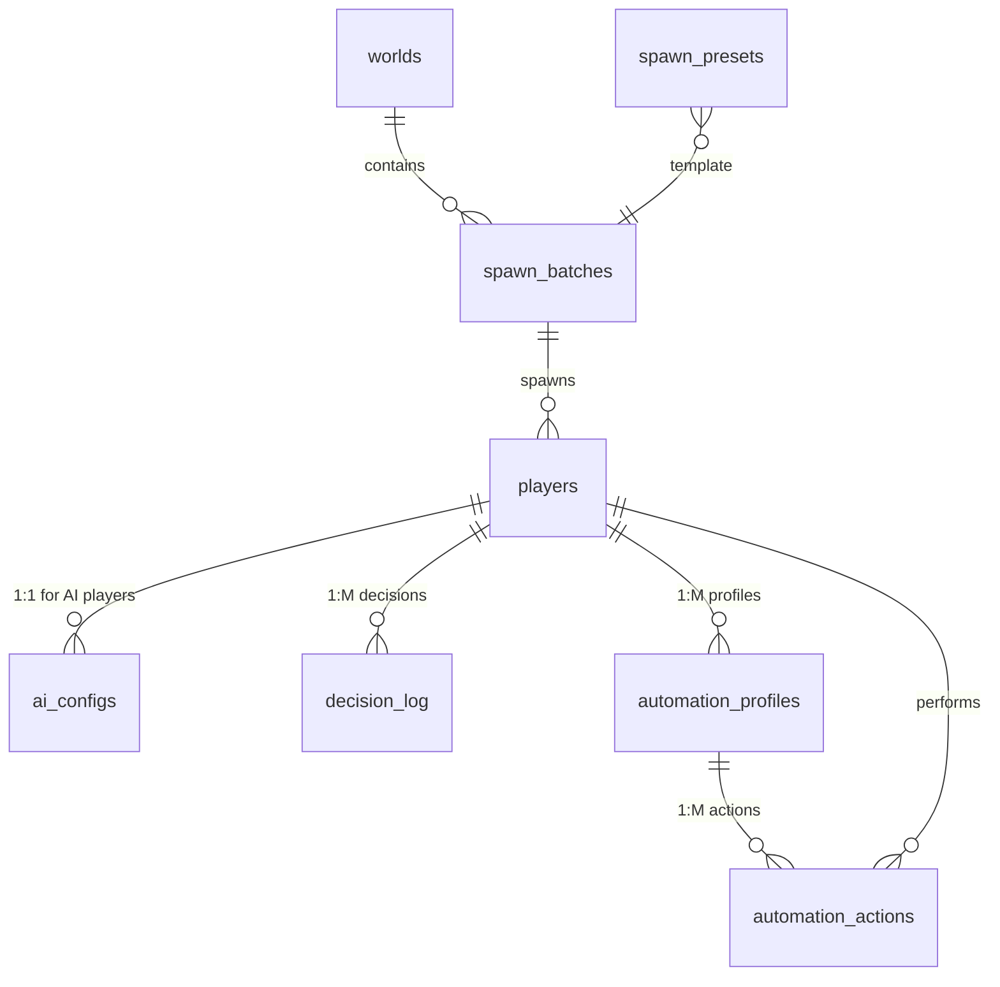
```mermaid
erDiagram
    players ||--o{ ai_configs : "1:1 for AI players"
    players ||--o{ decision_log : "1:M decisions"
    players ||--o{ automation_profiles : "1:M profiles"
    automation_profiles ||--o{ automation_actions : "1:M actions"
    players ||--o{ automation_actions : "performs"
    spawn_batches ||--o{ players : "spawns"
    worlds ||--o{ spawn_batches : "contains"
    spawn_presets }o--|| spawn_batches : "template"
    
    %% Include all column details for AI-NPC tables
```

**3. Game World Schema ERD (MySQL):**

Complete game world schema with all relationships:

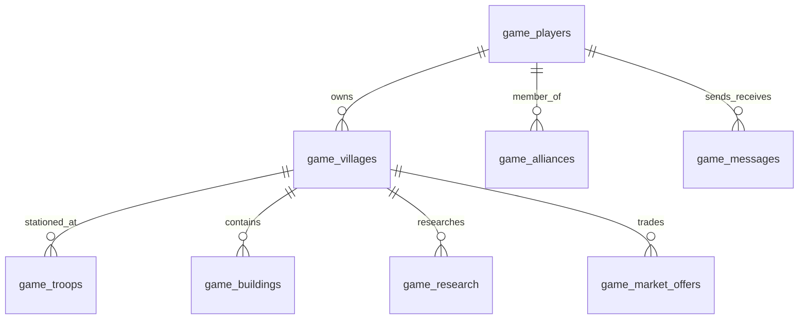
```mermaid
erDiagram
    game_players ||--o{ game_villages : owns
    game_players ||--o{ game_alliances : member_of
    game_villages ||--o{ game_troops : stationed_at
    game_villages ||--o{ game_buildings : contains
    game_villages ||--o{ game_research : researches
    game_players ||--o{ game_messages : sends_receives
    game_villages ||--o{ game_market_offers : trades
```

**4. Critical Relationship Chains:**

**Chain 1: NPC Spawning Flow**
```
spawn_presets → spawn_batches → players → ai_configs
```

**Chain 2: AI Decision Flow**
```
players → ai_configs → decision_log → automation_actions
```

**Chain 3: Audit Trail**
```
players → audit_events (tracks all actions)
```

**5. Index Visualization:**

Table showing which tables have which indexes:

| Table | Indexes | Type | Purpose |
|-------|---------|------|---------|
| players | id | PRIMARY | Primary key |
| players | type | B-tree | Filter AI players |
| players | personality_profile | GIN | JSONB queries |
| decision_log | npc_id | B-tree | Lookup decisions by NPC |
| decision_log | created_at | B-tree | Time-range queries |
| ... | ... | ... | ... |

**6. Constraint Summary:**

**Foreign Keys:**
- `ai_configs.player_id` → `players.id` (ON DELETE CASCADE)
- `decision_log.npc_id` → `players.id` (ON DELETE SET NULL)
- `spawn_batches.world_id` → `worlds.id` (ON DELETE RESTRICT)
- [... all FKs]

**Check Constraints:**
- `players.type` IN ('human', 'ai')
- `players.difficulty_level` IN ('easy', 'medium', 'hard', 'expert')
- `audit_events.severity` IN ('debug', 'info', 'warning', 'error', 'critical')
- [... all CHECKs]

**7. Table Statistics:**

| Database | Tables | Columns | Indexes | Constraints | Estimated Size |
|----------|--------|---------|---------|-------------|----------------|
| PostgreSQL (Global) | 11-15 | ~100 | 30+ | 20+ | 5-50 GB |
| MySQL (Per World) | 30+ | ~200 | 50+ | 40+ | 10-100 GB per world |

**8. Data Flow Diagram:**

Show how data moves between databases:

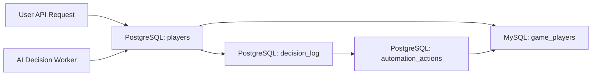
```mermaid
graph LR
    A[User API Request] --> B[PostgreSQL: players]
    B --> C[MySQL: game_players]
    D[AI Decision Worker] --> B
    B --> E[PostgreSQL: decision_log]
    E --> F[PostgreSQL: automation_actions]
    F --> C
```

**9. ERD Legend:**

- **Relationship Types**:
  - `||--||`: One-to-One
  - `||--o{`: One-to-Many
  - `}o--o{`: Many-to-Many
- **Cardinality**:
  - `||`: Exactly one
  - `|o`: Zero or one
  - `}o`: Zero or many
  - `}|`: One or many
- **Column Annotations**:
  - `PK`: Primary Key
  - `FK`: Foreign Key
  - `UNIQUE`: Unique constraint
  - `CHECK`: Check constraint

**10. Migration Impact Map:**

Show which tables were added in which migration:

| Migration Date | Tables Added | Purpose |
|----------------|--------------|---------|
| 2025-10-15 | players, ai_configs, decision_log | AI-NPC core |
| 2025-10-20 | spawn_batches, spawn_presets | NPC spawning |
| 2025-10-25 | automation_profiles, automation_actions | Automation |
| 2025-10-30 | audit_events | Security audit trail |

**Diagrams to Include:**
- Full database ERD (Mermaid - all tables)
- AI-NPC subsystem ERD (Mermaid - focused)
- Game world schema ERD (Mermaid - MySQL)
- Critical relationship chains (Mermaid)
- Data flow between databases (Mermaid)

**Analysis Scope - Files/Directories:**
- database/schemas/complete-automation-ai-system.sql
- 13-DATABASE-SCHEMA-COMPLETE.md (data source)
- database/migrations/*.sql

**Methodology:**
1. **Extract Schema Data**: From 13-DATABASE-SCHEMA-COMPLETE
2. **Create Mermaid ERD Syntax**: For all tables
3. **Define Relationships**: All foreign keys
4. **Add Column Details**: Data types, constraints
5. **Create Focused Views**: Subsystem-specific ERDs
6. **Validate Rendering**: Test Mermaid syntax in GitHub
7. **Add Annotations**: Legends, notes, statistics
8. **Create Data Flow**: Show inter-database data movement

**Acceptance Criteria:**
- [ ] Full ERD created with all tables from both databases
- [ ] All relationships (FKs) visualized correctly
- [ ] All column data types shown
- [ ] AI-NPC subsystem ERD created (focused view)
- [ ] Game world schema ERD created (MySQL)
- [ ] Critical relationship chains documented
- [ ] Data flow diagram created
- [ ] All Mermaid diagrams render correctly on GitHub
- [ ] Legend provided for notation
- [ ] Table statistics included

**Success Metrics:**
- Table coverage: 100% of tables visualized
- Relationship accuracy: All FKs correctly shown
- Rendering: All Mermaid diagrams render without errors
- Comprehensiveness: All views (full, subsystem, game world) provided

---

## 15-API-SPECIFICATION-COMPLETE
**Priority:** High
**Phase:** 4
**Estimated Effort:** 12-16 hours
**Dependencies:** 06-FUNCTION-CATALOG, existing docs/API-REFERENCE.md

**Description:**

Comprehensive API specification documenting ALL 50+ endpoints across 12 controllers with complete request/response schemas, authentication requirements, rate limiting rules, error codes, and executable curl examples. This expands the existing API-REFERENCE.md with exhaustive detail including all query parameters, path parameters, request body schemas (JSON), response schemas, HTTP status codes, error response formats, and edge cases.

This document serves as the definitive API contract for frontend developers, integration partners, and automated testing. It enables developers to understand exactly what each endpoint expects and returns, facilitating correct integration and reducing bugs.

**Key Contents:**

**1. API Overview & Standards:**

**Base URL:**
- Development: `http://localhost:5000`
- Production: `https://api.traviant4.6.com` (or actual domain)

**API Versioning:**
- Current version: `/v1/`
- Versioning strategy: URL path-based (`/v1/`, `/v2/`)
- Deprecation policy: 6-month notice for breaking changes

**Authentication:**
- Method: Session-based (cookies)
- CSRF Protection: Required for all POST/PUT/DELETE requests
- CSRF Token Endpoint: `GET /v1/token`

**Response Format:**
- Content-Type: `application/json`
- Character Encoding: UTF-8

**Standard Response Structure:**
```json
{
  "success": true|false,
  "data": { ... },
  "error": {
    "code": "ERROR_CODE",
    "message": "Human-readable error message",
    "details": { ... }
  },
  "metadata": {
    "timestamp": "2025-10-30T12:00:00Z",
    "request_id": "a1b2c3d4..."
  }
}
```

**HTTP Status Codes:**
- `200 OK`: Successful GET/PUT/DELETE
- `201 Created`: Successful POST (resource created)
- `204 No Content`: Successful DELETE (no response body)
- `400 Bad Request`: Invalid request (validation errors)
- `401 Unauthorized`: Not authenticated
- `403 Forbidden`: Not authorized (CSRF failure, permissions)
- `404 Not Found`: Resource doesn't exist
- `409 Conflict`: Resource conflict (duplicate, state conflict)
- `422 Unprocessable Entity`: Validation errors
- `429 Too Many Requests`: Rate limit exceeded
- `500 Internal Server Error`: Server error
- `503 Service Unavailable`: Maintenance mode

**Rate Limiting:**
- **Global Limit**: 100 requests/second per IP
- **API Limit**: 50 requests/second per IP for `/v1/*` endpoints
- **Auth Limit**: 5 failed login attempts per 10 minutes per IP
- Headers:
  - `X-RateLimit-Limit`: Maximum requests allowed
  - `X-RateLimit-Remaining`: Requests remaining
  - `X-RateLimit-Reset`: Unix timestamp when limit resets

**Error Response Format:**
```json
{
  "success": false,
  "error": {
    "code": "VALIDATION_ERROR",
    "message": "Request validation failed",
    "details": {
      "field_errors": {
        "world_key": ["World key is required"],
        "preset": ["Invalid preset value"]
      }
    }
  }
}
```

**2. CSRF Token Endpoint:**

### GET /v1/token

**Description**: Generate CSRF token for subsequent requests

**Authentication**: Optional (public endpoint)

**Rate Limiting**: 100/second (global)

**Request:**
```bash
curl -X GET http://localhost:5000/v1/token \
  -H "Content-Type: application/json"
```

**Response (200 OK):**
```json
{
  "success": true,
  "data": {
    "csrf_token": "a1b2c3d4e5f6g7h8i9j0...",
    "expires_at": "2025-10-30T13:00:00Z"
  }
}
```

**Usage**: Include token in subsequent requests via header or cookie

---

**3. Server Generation Controller (9 endpoints):**

### POST /v1/server/generate

**Description**: Generate a new game world with NPC spawning

**Authentication**: Required (admin)

**Rate Limiting**: 5/minute per IP

**Request Body:**
```json
{
  "world_key": "ts1",
  "world_name": "Test Server 1",
  "preset": "medium",
  "spawn_algorithm": "quadrant_balanced",
  "auto_spawn": true,
  "settings": {
    "speed": 1,
    "world_wonder": true,
    "registration_open": true
  }
}
```

**Request Schema:**
- `world_key` (string, required): Unique world identifier (alphanumeric, max 10 chars)
- `world_name` (string, required): Display name (max 255 chars)
- `preset` (string, required): Spawn preset (`low` | `medium` | `high`)
- `spawn_algorithm` (string, required): Placement algorithm (`quadrant_balanced` | `random_scatter` | `kingdom_clustering`)
- `auto_spawn` (boolean, optional, default: true): Start spawning immediately
- `settings` (object, optional): World configuration

**Validation:**
- `world_key` must be unique
- `preset` must exist in spawn_presets table
- `spawn_algorithm` must be valid enum value

**Curl Example:**
```bash
curl -X POST http://localhost:5000/v1/server/generate \
  -H "Content-Type: application/json" \
  -H "X-CSRF-Token: YOUR_CSRF_TOKEN" \
  -b "session_cookie=YOUR_SESSION" \
  -d '{
    "world_key": "ts1",
    "world_name": "Test Server 1",
    "preset": "medium",
    "spawn_algorithm": "quadrant_balanced",
    "auto_spawn": true
  }'
```

**Response (201 Created):**
```json
{
  "success": true,
  "data": {
    "world": {
      "id": 1,
      "world_key": "ts1",
      "world_name": "Test Server 1",
      "status": "spawning_npcs",
      "settings": { ... },
      "created_at": "2025-10-30T12:00:00Z"
    },
    "spawn_plan": {
      "total_npcs": 100,
      "batches": [
        {
          "batch_id": 1,
          "npc_count": 40,
          "spawn_date": "2025-10-30T12:00:00Z",
          "status": "pending"
        },
        {
          "batch_id": 2,
          "npc_count": 24,
          "spawn_date": "2025-10-31T12:00:00Z",
          "status": "pending"
        }
        // ... more batches
      ]
    }
  }
}
```

**Error Responses:**

**400 Bad Request** (Invalid input):
```json
{
  "success": false,
  "error": {
    "code": "VALIDATION_ERROR",
    "message": "Invalid request parameters",
    "details": {
      "field_errors": {
        "world_key": ["World key must be alphanumeric"],
        "preset": ["Invalid preset: must be 'low', 'medium', or 'high'"]
      }
    }
  }
}
```

**409 Conflict** (Duplicate world_key):
```json
{
  "success": false,
  "error": {
    "code": "DUPLICATE_WORLD_KEY",
    "message": "World with this key already exists",
    "details": {
      "world_key": "ts1",
      "existing_world_id": 5
    }
  }
}
```

**Performance:**
- Expected response time: <500ms
- Database queries: 3-5 INSERT operations
- Creates world + spawn plan + initial batch

---

[Continue with remaining 8 Server Generation endpoints:]

### GET /v1/server/worlds
- List all game worlds
- Filters: status, created_after, created_before
- Pagination: page, limit
- Sorting: sort_by, order

### GET /v1/server/worlds/{world_id}
- Get world details by ID
- Include spawn progress
- Include NPC statistics

### PUT /v1/server/worlds/{world_id}
- Update world settings
- Can pause/resume spawning
- Can change world status

### DELETE /v1/server/worlds/{world_id}
- Archive a world
- Soft delete (status → 'archived')
- Prevent deletion if active players

### POST /v1/server/worlds/{world_id}/start-spawning
- Manually trigger NPC spawning
- For worlds with auto_spawn=false

### POST /v1/server/worlds/{world_id}/pause-spawning
- Pause ongoing NPC spawning
- Preserves spawn queue

### POST /v1/server/worlds/{world_id}/resume-spawning
- Resume paused spawning

### GET /v1/server/worlds/{world_id}/stats
- World statistics
- NPC count, human players, activity metrics

---

**4. Spawn Management Controller (6 endpoints):**

[Document each endpoint in same detail as above:]

### POST /v1/spawn/plan
### GET /v1/spawn/batches
### GET /v1/spawn/batches/{batch_id}
### POST /v1/spawn/batches/{batch_id}/execute
### DELETE /v1/spawn/batches/{batch_id}
### GET /v1/spawn/queue

---

**5. Spawn Preset Controller (5 endpoints):**

### GET /v1/spawn/presets
### GET /v1/spawn/presets/{preset_id}
### POST /v1/spawn/presets
### PUT /v1/spawn/presets/{preset_id}
### DELETE /v1/spawn/presets/{preset_id}

---

**6. NPC Management Controller (7 endpoints):**

### GET /v1/npcs
### GET /v1/npcs/{npc_id}
### POST /v1/npcs
### PUT /v1/npcs/{npc_id}
### DELETE /v1/npcs/{npc_id}
### POST /v1/npcs/{npc_id}/decision
### GET /v1/npcs/{npc_id}/decisions

---

**7. Feature Management Controller (3 endpoints):**

### GET /v1/features
### PUT /v1/features/{flag_name}
### POST /v1/features/reload

---

**8. Monitoring Controller (3 endpoints):**

### GET /v1/monitoring/metrics
### GET /v1/monitoring/health
### GET /v1/monitoring/workers

---

**9. Farming Controller (4 endpoints):**
**10. Building Controller (4 endpoints):**
**11. Training Controller (3 endpoints):**
**12. Defense Controller (4 endpoints):**
**13. Logistics Controller (4 endpoints):**
**14. Away Mode Controller (4 endpoints):**

[Each documented with same detail level]

---

**Endpoint Summary Table:**

| Controller | Endpoint | Method | Auth | Rate Limit | Purpose |
|-----------|----------|--------|------|------------|---------|
| ServerGenerator | /v1/server/generate | POST | Admin | 5/min | Create world |
| ServerGenerator | /v1/server/worlds | GET | User | 50/s | List worlds |
| ... | ... | ... | ... | ... | ... |

**Total Endpoints: 50+**

**Diagrams to Include:**
- API endpoint tree (Mermaid - hierarchical)
- Authentication flow (Mermaid sequence)
- Rate limiting flow (Mermaid)

**Analysis Scope - Files/Directories:**
- sections/api/include/Controllers/*.php (12 controllers)
- existing docs/API-REFERENCE.md
- 06-FUNCTION-CATALOG.md (controller functions)

**Methodology:**
1. **Extract Endpoints**: Parse all controller files
2. **Document Each Endpoint**: Request/response schemas
3. **Write Curl Examples**: Executable examples
4. **Define Errors**: All possible error responses
5. **Validate Examples**: Test curl commands
6. **Create Endpoint Table**: Summary overview
7. **Generate Diagrams**: API structure visualization

**Acceptance Criteria:**
- [ ] All 50+ endpoints documented
- [ ] Each endpoint has: method, path, auth, rate limit, description
- [ ] Request schemas documented (parameters, body)
- [ ] Response schemas documented (success, errors)
- [ ] Curl examples provided for each endpoint
- [ ] Error responses cataloged
- [ ] Rate limiting documented
- [ ] Authentication flows documented
- [ ] Endpoint summary table created
- [ ] API tree diagram created

**Success Metrics:**
- Endpoint coverage: 100% of controllers
- Curl examples: All executable and accurate
- Schema completeness: All fields documented with types
- Error coverage: All HTTP status codes documented

---

[Continue with remaining documents 16-34...]


## 16-API-FLOW-DIAGRAMS
**Priority:** Medium
**Phase:** 4
**Estimated Effort:** 6-8 hours
**Dependencies:** 15-API-SPECIFICATION-COMPLETE, 07-DATA-FLOW-DIAGRAMS

**Description:**

Visual sequence diagrams showing API request/response flows for all major endpoints. This complements the API specification with temporal visualization of how requests are processed from client → routing → controller → service → database → response. Each diagram shows authentication checks, CSRF validation, business logic execution, database transactions, cache operations, and error handling paths.

These diagrams are invaluable for understanding API behavior, debugging integration issues, and planning optimizations. They provide a dynamic view that complements the static API specification.

**Key Contents:**

**1. Common API Flow Pattern (Template):**

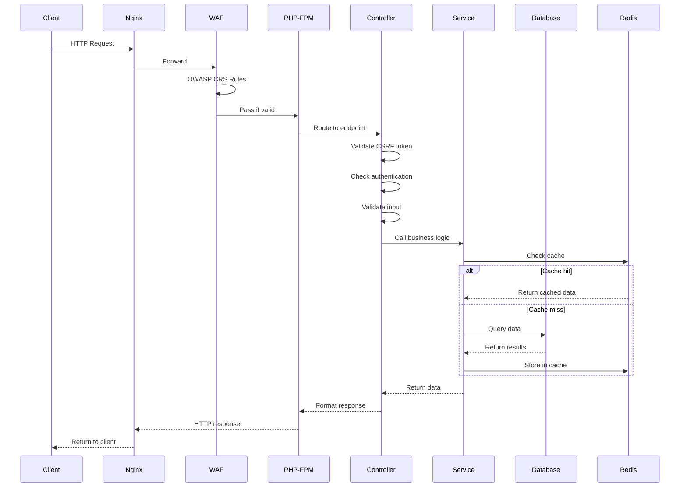
```mermaid
sequenceDiagram
    participant Client
    participant Nginx
    participant WAF
    participant PHP-FPM
    participant Controller
    participant Service
    participant Database
    participant Redis
    
    Client->>Nginx: HTTP Request
    Nginx->>WAF: Forward
    WAF->>WAF: OWASP CRS Rules
    WAF->>PHP-FPM: Pass if valid
    PHP-FPM->>Controller: Route to endpoint
    Controller->>Controller: Validate CSRF token
    Controller->>Controller: Check authentication
    Controller->>Controller: Validate input
    Controller->>Service: Call business logic
    Service->>Redis: Check cache
    alt Cache hit
        Redis-->>Service: Return cached data
    else Cache miss
        Service->>Database: Query data
        Database-->>Service: Return results
        Service->>Redis: Store in cache
    end
    Service-->>Controller: Return data
    Controller-->>PHP-FPM: Format response
    PHP-FPM-->>Nginx: HTTP response
    Nginx-->>Client: Return to client
```

**2. Server Generation Flow (POST /v1/server/generate):**

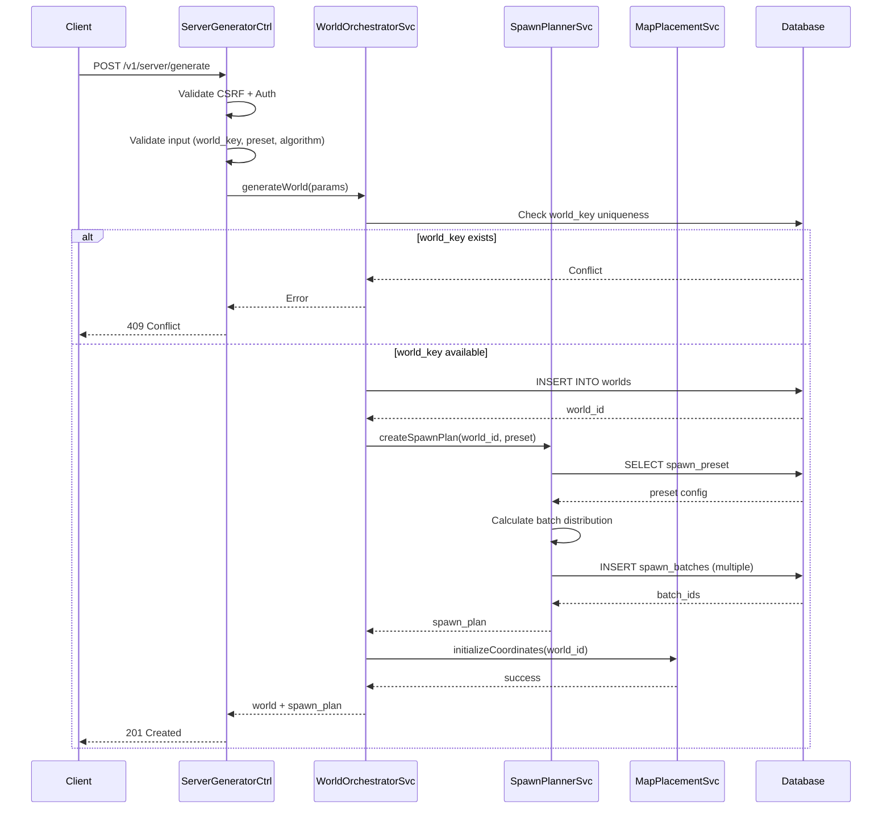
```mermaid
sequenceDiagram
    participant Client
    participant ServerGeneratorCtrl
    participant WorldOrchestratorSvc
    participant SpawnPlannerSvc
    participant MapPlacementSvc
    participant Database
    
    Client->>ServerGeneratorCtrl: POST /v1/server/generate
    ServerGeneratorCtrl->>ServerGeneratorCtrl: Validate CSRF + Auth
    ServerGeneratorCtrl->>ServerGeneratorCtrl: Validate input (world_key, preset, algorithm)
    ServerGeneratorCtrl->>WorldOrchestratorSvc: generateWorld(params)
    
    WorldOrchestratorSvc->>Database: Check world_key uniqueness
    alt world_key exists
        Database-->>WorldOrchestratorSvc: Conflict
        WorldOrchestratorSvc-->>ServerGeneratorCtrl: Error
        ServerGeneratorCtrl-->>Client: 409 Conflict
    else world_key available
        WorldOrchestratorSvc->>Database: INSERT INTO worlds
        Database-->>WorldOrchestratorSvc: world_id
        
        WorldOrchestratorSvc->>SpawnPlannerSvc: createSpawnPlan(world_id, preset)
        SpawnPlannerSvc->>Database: SELECT spawn_preset
        Database-->>SpawnPlannerSvc: preset config
        SpawnPlannerSvc->>SpawnPlannerSvc: Calculate batch distribution
        SpawnPlannerSvc->>Database: INSERT spawn_batches (multiple)
        Database-->>SpawnPlannerSvc: batch_ids
        SpawnPlannerSvc-->>WorldOrchestratorSvc: spawn_plan
        
        WorldOrchestratorSvc->>MapPlacementSvc: initializeCoordinates(world_id)
        MapPlacementSvc-->>WorldOrchestratorSvc: success
        
        WorldOrchestratorSvc-->>ServerGeneratorCtrl: world + spawn_plan
        ServerGeneratorCtrl-->>Client: 201 Created
    end
```

**3. NPC Spawning Flow (Spawn Scheduler Worker):**

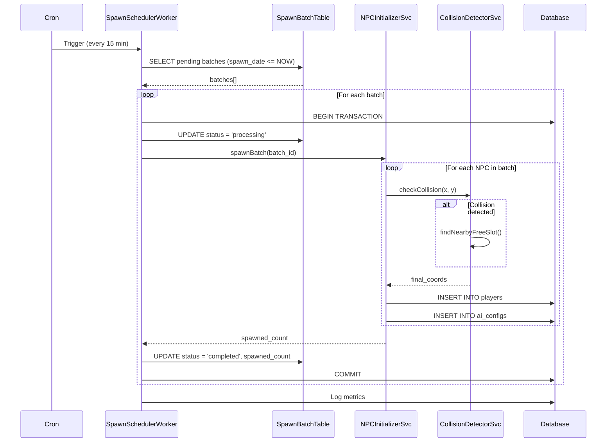
```mermaid
sequenceDiagram
    participant Cron
    participant SpawnSchedulerWorker
    participant SpawnBatchTable
    participant NPCInitializerSvc
    participant CollisionDetectorSvc
    participant Database
    
    Cron->>SpawnSchedulerWorker: Trigger (every 15 min)
    SpawnSchedulerWorker->>SpawnBatchTable: SELECT pending batches (spawn_date <= NOW)
    SpawnBatchTable-->>SpawnSchedulerWorker: batches[]
    
    loop For each batch
        SpawnSchedulerWorker->>Database: BEGIN TRANSACTION
        SpawnSchedulerWorker->>SpawnBatchTable: UPDATE status = 'processing'
        
        SpawnSchedulerWorker->>NPCInitializerSvc: spawnBatch(batch_id)
        
        loop For each NPC in batch
            NPCInitializerSvc->>CollisionDetectorSvc: checkCollision(x, y)
            alt Collision detected
                CollisionDetectorSvc->>CollisionDetectorSvc: findNearbyFreeSlot()
            end
            CollisionDetectorSvc-->>NPCInitializerSvc: final_coords
            NPCInitializerSvc->>Database: INSERT INTO players
            NPCInitializerSvc->>Database: INSERT INTO ai_configs
        end
        
        NPCInitializerSvc-->>SpawnSchedulerWorker: spawned_count
        SpawnSchedulerWorker->>SpawnBatchTable: UPDATE status = 'completed', spawned_count
        SpawnSchedulerWorker->>Database: COMMIT
    end
    
    SpawnSchedulerWorker->>Database: Log metrics
```

**4. AI Decision Flow (AI Decision Worker):**

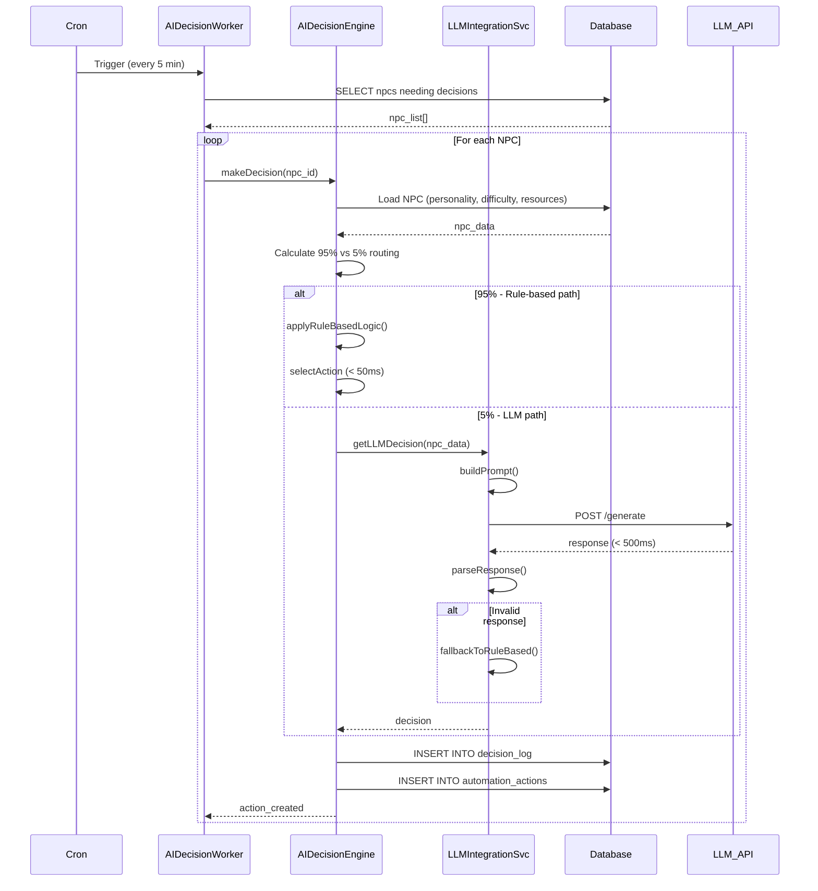
```mermaid
sequenceDiagram
    participant Cron
    participant AIDecisionWorker
    participant AIDecisionEngine
    participant LLMIntegrationSvc
    participant Database
    participant LLM_API
    
    Cron->>AIDecisionWorker: Trigger (every 5 min)
    AIDecisionWorker->>Database: SELECT npcs needing decisions
    Database-->>AIDecisionWorker: npc_list[]
    
    loop For each NPC
        AIDecisionWorker->>AIDecisionEngine: makeDecision(npc_id)
        AIDecisionEngine->>Database: Load NPC (personality, difficulty, resources)
        Database-->>AIDecisionEngine: npc_data
        
        AIDecisionEngine->>AIDecisionEngine: Calculate 95% vs 5% routing
        
        alt 95% - Rule-based path
            AIDecisionEngine->>AIDecisionEngine: applyRuleBasedLogic()
            AIDecisionEngine->>AIDecisionEngine: selectAction (< 50ms)
        else 5% - LLM path
            AIDecisionEngine->>LLMIntegrationSvc: getLLMDecision(npc_data)
            LLMIntegrationSvc->>LLMIntegrationSvc: buildPrompt()
            LLMIntegrationSvc->>LLM_API: POST /generate
            LLM_API-->>LLMIntegrationSvc: response (< 500ms)
            LLMIntegrationSvc->>LLMIntegrationSvc: parseResponse()
            alt Invalid response
                LLMIntegrationSvc->>LLMIntegrationSvc: fallbackToRuleBased()
            end
            LLMIntegrationSvc-->>AIDecisionEngine: decision
        end
        
        AIDecisionEngine->>Database: INSERT INTO decision_log
        AIDecisionEngine->>Database: INSERT INTO automation_actions
        AIDecisionEngine-->>AIDecisionWorker: action_created
    end
```

**5. Authentication Flow:**

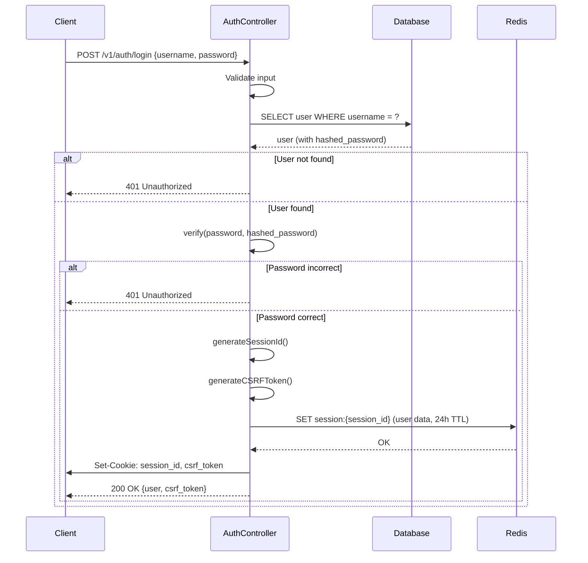
```mermaid
sequenceDiagram
    participant Client
    participant AuthController
    participant Database
    participant Redis
    
    Client->>AuthController: POST /v1/auth/login {username, password}
    AuthController->>AuthController: Validate input
    AuthController->>Database: SELECT user WHERE username = ?
    Database-->>AuthController: user (with hashed_password)
    
    alt User not found
        AuthController-->>Client: 401 Unauthorized
    else User found
        AuthController->>AuthController: verify(password, hashed_password)
        alt Password incorrect
            AuthController-->>Client: 401 Unauthorized
        else Password correct
            AuthController->>AuthController: generateSessionId()
            AuthController->>AuthController: generateCSRFToken()
            AuthController->>Redis: SET session:{session_id} (user data, 24h TTL)
            Redis-->>AuthController: OK
            AuthController->>Client: Set-Cookie: session_id, csrf_token
            AuthController-->>Client: 200 OK {user, csrf_token}
        end
    end
```

**6. Feature Flag Check Flow:**

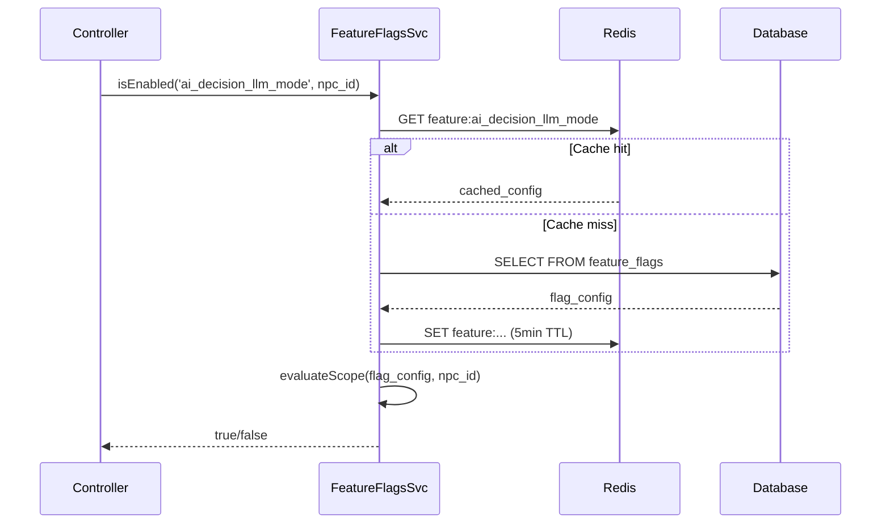
```mermaid
sequenceDiagram
    participant Controller
    participant FeatureFlagsSvc
    participant Redis
    participant Database
    
    Controller->>FeatureFlagsSvc: isEnabled('ai_decision_llm_mode', npc_id)
    FeatureFlagsSvc->>Redis: GET feature:ai_decision_llm_mode
    
    alt Cache hit
        Redis-->>FeatureFlagsSvc: cached_config
    else Cache miss
        FeatureFlagsSvc->>Database: SELECT FROM feature_flags
        Database-->>FeatureFlagsSvc: flag_config
        FeatureFlagsSvc->>Redis: SET feature:... (5min TTL)
    end
    
    FeatureFlagsSvc->>FeatureFlagsSvc: evaluateScope(flag_config, npc_id)
    FeatureFlagsSvc-->>Controller: true/false
```

**7. Error Handling Flow:**

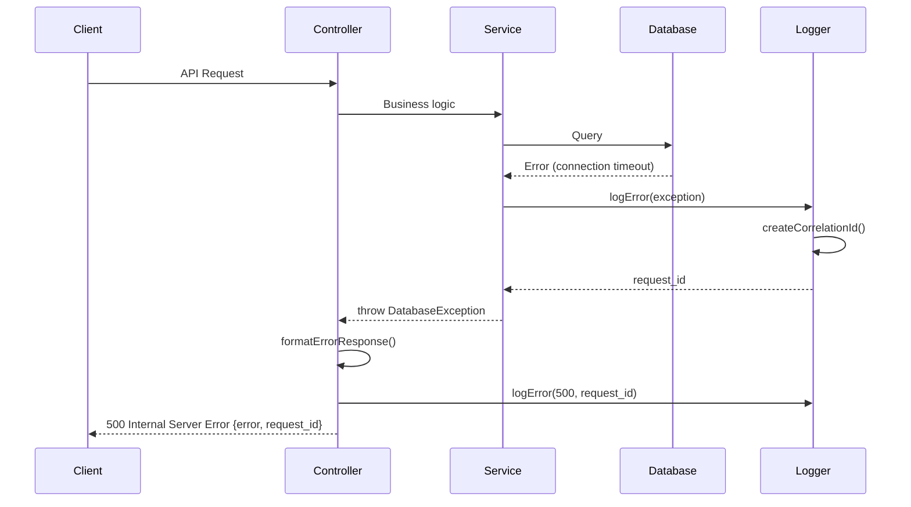
```mermaid
sequenceDiagram
    participant Client
    participant Controller
    participant Service
    participant Database
    participant Logger
    
    Client->>Controller: API Request
    Controller->>Service: Business logic
    Service->>Database: Query
    Database-->>Service: Error (connection timeout)
    
    Service->>Logger: logError(exception)
    Logger->>Logger: createCorrelationId()
    Logger-->>Service: request_id
    
    Service-->>Controller: throw DatabaseException
    Controller->>Controller: formatErrorResponse()
    Controller->>Logger: logError(500, request_id)
    Controller-->>Client: 500 Internal Server Error {error, request_id}
```

**8. Rate Limiting Flow:**

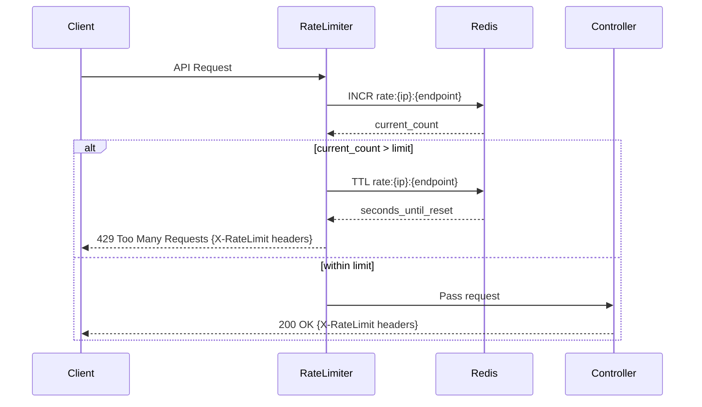
```mermaid
sequenceDiagram
    participant Client
    participant RateLimiter
    participant Redis
    participant Controller
    
    Client->>RateLimiter: API Request
    RateLimiter->>Redis: INCR rate:{ip}:{endpoint}
    Redis-->>RateLimiter: current_count
    
    alt current_count > limit
        RateLimiter->>Redis: TTL rate:{ip}:{endpoint}
        Redis-->>RateLimiter: seconds_until_reset
        RateLimiter-->>Client: 429 Too Many Requests {X-RateLimit headers}
    else within limit
        RateLimiter->>Controller: Pass request
        Controller-->>Client: 200 OK {X-RateLimit headers}
    end
```

**Diagrams to Include:**
- All 8 sequence diagrams above (Mermaid)
- Additional diagrams for each of the 12 controllers' primary endpoints

**Analysis Scope - Files/Directories:**
- sections/api/include/Controllers/*.php (trace execution)
- sections/api/include/Services/*.php (service calls)
- TaskWorker/*.php (worker flows)
- 15-API-SPECIFICATION-COMPLETE.md (endpoint details)

**Methodology:**
1. **Identify Key Flows**: Select most important/complex endpoints
2. **Trace Execution**: Follow code from controller → service → database
3. **Map Decision Points**: Authentication, validation, cache checks, errors
4. **Create Sequence Diagrams**: Using Mermaid syntax
5. **Validate Accuracy**: Ensure diagrams match actual code
6. **Test Rendering**: Verify Mermaid renders correctly

**Acceptance Criteria:**
- [ ] Common API flow pattern documented (template)
- [ ] Server generation flow diagrammed
- [ ] NPC spawning flow diagrammed
- [ ] AI decision flow diagrammed (95% rule-based + 5% LLM)
- [ ] Authentication flow diagrammed
- [ ] Feature flag check flow diagrammed
- [ ] Error handling flow diagrammed
- [ ] Rate limiting flow diagrammed
- [ ] All diagrams render correctly in GitHub
- [ ] Diagrams match actual code implementation

**Success Metrics:**
- Flow coverage: 8+ major flows documented
- Accuracy: 100% match with actual code paths
- Rendering: All Mermaid diagrams display correctly
- Completeness: All decision points and branches shown

---

## 17-AUTH-SYSTEM-COMPLETE
**Priority:** High
**Phase:** 4
**Estimated Effort:** 8-10 hours
**Dependencies:** 05-FILE-BY-FILE-ANALYSIS, 08-SECURITY-AUDIT-FINDINGS

**Description:**

Comprehensive authentication and authorization system documentation covering session management, CSRF protection, password hashing, login/logout flows, permission enforcement, and security controls. This document details how the system authenticates users (verifying identity) and authorizes actions (verifying permissions), including all security mechanisms protecting against common attacks.

Understanding the auth system is critical for maintaining security, debugging access issues, and implementing new features that require authentication or authorization.

**Key Contents:**

**1. Authentication Overview:**

**Authentication Method:**
- Session-based authentication (cookies)
- NOT JWT-based (sessions stored server-side)
- Session backend: Redis (in-memory, fast, TTL-based)
- Session duration: 24 hours (configurable)

**Supported Auth Flows:**
- Username/password login
- Session persistence (remember me)
- Session refresh
- Logout (session destruction)

**Security Features:**
- Password hashing: bcrypt (cost factor 10)
- CSRF protection: Double-submit cookie pattern
- Session fixation prevention: New session ID on login
- Brute force protection: Rate limiting (5 attempts / 10 min)
- Secure cookies: HttpOnly, Secure (HTTPS), SameSite=Lax

**2. Session Management:**

**Session Storage (Redis):**

**Key Format:**
```
session:{session_id}
```

**Session Data Structure:**
```json
{
  "user_id": 123,
  "username": "player1",
  "role": "user",
  "ip_address": "192.168.1.100",
  "user_agent": "Mozilla/5.0...",
  "created_at": "2025-10-30T12:00:00Z",
  "last_activity": "2025-10-30T14:30:00Z",
  "csrf_token": "a1b2c3d4e5f6..."
}
```

**Session Lifecycle:**
1. **Creation**: On successful login
   - Generate session ID (32-byte random string)
   - Store user data in Redis with 24h TTL
   - Set session cookie (HttpOnly, Secure, SameSite=Lax)
   - Generate CSRF token (32-byte random string)

2. **Validation**: On each request
   - Extract session ID from cookie
   - Lookup session in Redis
   - Check TTL (still valid?)
   - Validate IP address (optional: same IP?)
   - Update last_activity timestamp
   - Extend TTL (sliding window)

3. **Destruction**: On logout or expiry
   - DELETE session from Redis
   - Clear session cookie
   - Optionally: Invalidate all user sessions

**Session Configuration:**
```php
// sessions/api/config/session.php
return [
    'lifetime' => 86400, // 24 hours in seconds
    'cookie_name' => 'PHPSESSID',
    'cookie_path' => '/',
    'cookie_domain' => '', // Auto-detect
    'cookie_secure' => true, // HTTPS only
    'cookie_httponly' => true, // No JavaScript access
    'cookie_samesite' => 'Lax', // CSRF protection
    'sliding_window' => true, // Extend on activity
    'ip_validation' => false, // Strict IP check (disabled for dynamic IPs)
];
```

**3. CSRF Protection:**

**CSRF Implementation: Double-Submit Cookie Pattern**

**How It Works:**
1. **Token Generation**:
   - Generate random 32-byte token on session creation
   - Store in session data (Redis)
   - Send to client via:
     - Cookie: `csrf_token` (HttpOnly=false, so JS can read)
     - Response body: `{"csrf_token": "..."}`

2. **Token Validation**:
   - Client includes token in requests via:
     - Header: `X-CSRF-Token: abc123...`
     - OR body field: `{"csrf_token": "abc123..."}`
   - Server validates:
     - Token from request matches token in session
     - Token not expired (same session lifetime)

3. **Protected Operations**:
   - ALL state-changing operations (POST, PUT, DELETE)
   - API endpoints that modify data
   - Excluded: GET requests (idempotent)

**CSRF Middleware Implementation:**

```php
// sections/api/include/Middleware/CSRFMiddleware.php

class CSRFMiddleware {
    public function handle($request, $next) {
        // Skip GET, HEAD, OPTIONS (safe methods)
        if (in_array($request->method, ['GET', 'HEAD', 'OPTIONS'])) {
            return $next($request);
        }
        
        // Extract CSRF token from request
        $requestToken = $request->header('X-CSRF-Token') 
            ?? $request->input('csrf_token');
        
        // Get session token
        $sessionToken = $request->session->get('csrf_token');
        
        // Validate
        if (!$requestToken || !$sessionToken || $requestToken !== $sessionToken) {
            return response([
                'success' => false,
                'error' => [
                    'code' => 'CSRF_TOKEN_MISMATCH',
                    'message' => 'Invalid or missing CSRF token'
                ]
            ], 403);
        }
        
        return $next($request);
    }
}
```

**CSRF Token Endpoint:**

```
GET /v1/token
```

Returns:
```json
{
  "success": true,
  "data": {
    "csrf_token": "a1b2c3d4e5f6g7h8i9j0...",
    "expires_at": "2025-10-30T13:00:00Z"
  }
}
```

**4. Password Security:**

**Password Hashing: bcrypt**

**Configuration:**
- Algorithm: bcrypt
- Cost factor: 10 (2^10 = 1024 rounds)
- Salt: Automatically generated per password
- Hash length: 60 characters

**Hashing Function:**
```php
function hashPassword($plaintext) {
    return password_hash($plaintext, PASSWORD_BCRYPT, ['cost' => 10]);
}
```

**Verification Function:**
```php
function verifyPassword($plaintext, $hash) {
    return password_verify($plaintext, $hash);
}
```

**Password Requirements:**
- Minimum length: 8 characters
- Maximum length: 72 characters (bcrypt limit)
- No complexity requirements (current policy)
- Recommendations:
  - Add complexity requirements (uppercase, lowercase, digit, special char)
  - Enforce password history (prevent reuse of last 5 passwords)
  - Implement password expiration (optional)

**5. Login Flow:**

**POST /v1/auth/login**

**Step-by-Step:**

1. **Receive Credentials**:
   ```json
   {
     "username": "player1",
     "password": "SecurePass123!"
   }
   ```

2. **Rate Limit Check**:
   - Check Redis: `login_attempts:{ip}`
   - If > 5 attempts in 10 min → 429 Too Many Requests
   - Increment counter

3. **Input Validation**:
   - Username: Not empty, max 255 chars
   - Password: Not empty

4. **User Lookup**:
   ```sql
   SELECT id, username, password_hash, role, status
   FROM users
   WHERE username = ? AND status = 'active'
   ```

5. **Password Verification**:
   ```php
   if (!password_verify($password, $user->password_hash)) {
       // Increment failed attempts
       Redis::incr("login_attempts:{ip}", TTL: 600);
       return 401 Unauthorized;
   }
   ```

6. **Session Creation**:
   - Generate session ID: `bin2hex(random_bytes(32))`
   - Generate CSRF token: `bin2hex(random_bytes(32))`
   - Store in Redis:
     ```php
     Redis::setex("session:{session_id}", 86400, json_encode([
         'user_id' => $user->id,
         'username' => $user->username,
         'role' => $user->role,
         'csrf_token' => $csrf_token,
         'created_at' => time(),
         'ip_address' => $_SERVER['REMOTE_ADDR']
     ]));
     ```

7. **Set Cookies**:
   ```php
   setcookie('PHPSESSID', $session_id, [
       'expires' => time() + 86400,
       'path' => '/',
       'secure' => true,
       'httponly' => true,
       'samesite' => 'Lax'
   ]);
   
   setcookie('csrf_token', $csrf_token, [
       'expires' => time() + 86400,
       'path' => '/',
       'secure' => true,
       'httponly' => false, // JS needs to read this
       'samesite' => 'Lax'
   ]);
   ```

8. **Clear Failed Attempts**:
   ```php
   Redis::del("login_attempts:{ip}");
   ```

9. **Audit Log**:
   ```php
   AuditTrailService::log([
       'event_type' => 'auth.login',
       'actor_type' => 'user',
       'actor_id' => $user->id,
       'action' => 'login',
       'severity' => 'info',
       'details' => ['ip' => $_SERVER['REMOTE_ADDR']]
   ]);
   ```

10. **Response**:
    ```json
    {
      "success": true,
      "data": {
        "user": {
          "id": 123,
          "username": "player1",
          "role": "user"
        },
        "csrf_token": "a1b2c3d4..."
      }
    }
    ```

**6. Session Validation (Middleware):**

**AuthMiddleware.php:**

```php
public function handle($request, $next) {
    // Extract session ID from cookie
    $sessionId = $_COOKIE['PHPSESSID'] ?? null;
    
    if (!$sessionId) {
        return $this->unauthorized('No session');
    }
    
    // Lookup session in Redis
    $sessionData = Redis::get("session:{$sessionId}");
    
    if (!$sessionData) {
        return $this->unauthorized('Invalid or expired session');
    }
    
    $session = json_decode($sessionData, true);
    
    // Optional: Validate IP address
    if ($this->config['ip_validation']) {
        if ($session['ip_address'] !== $_SERVER['REMOTE_ADDR']) {
            return $this->unauthorized('IP address mismatch');
        }
    }
    
    // Update last activity (sliding window)
    if ($this->config['sliding_window']) {
        $session['last_activity'] = time();
        Redis::setex("session:{$sessionId}", 86400, json_encode($session));
    }
    
    // Attach session to request
    $request->session = $session;
    $request->user = [
        'id' => $session['user_id'],
        'username' => $session['username'],
        'role' => $session['role']
    ];
    
    return $next($request);
}
```

**7. Logout Flow:**

**POST /v1/auth/logout**

**Steps:**

1. **Validate Session**: Ensure user is authenticated

2. **Delete Session**:
   ```php
   Redis::del("session:{$sessionId}");
   ```

3. **Clear Cookies**:
   ```php
   setcookie('PHPSESSID', '', time() - 3600);
   setcookie('csrf_token', '', time() - 3600);
   ```

4. **Audit Log**:
   ```php
   AuditTrailService::log([
       'event_type' => 'auth.logout',
       'actor_type' => 'user',
       'actor_id' => $user->id,
       'action' => 'logout'
   ]);
   ```

5. **Response**:
   ```json
   {
     "success": true,
     "message": "Logged out successfully"
   }
   ```

**8. Authorization (Permissions):**

**Role-Based Access Control (RBAC):**

**Roles:**
- `admin`: Full system access
- `user`: Standard player access
- `moderator`: Limited admin access (if implemented)

**Permission Checks:**

**Endpoint-Level:**
```php
// In controller
if ($request->user['role'] !== 'admin') {
    return response(['error' => 'Forbidden'], 403);
}
```

**Resource-Level:**
```php
// Check if user owns resource
if ($npc->player_id !== $request->user['id']) {
    return response(['error' => 'Forbidden'], 403);
}
```

**Feature Flag-Based:**
```php
// Check feature flag
if (!FeatureFlagsService::isEnabled('ai_npc_spawning', $request->user['id'])) {
    return response(['error' => 'Feature not enabled'], 403);
}
```

**9. Security Vulnerabilities & Mitigations:**

**Session Fixation:**
- **Vulnerability**: Attacker sets victim's session ID
- **Mitigation**: Generate new session ID on login

**Session Hijacking:**
- **Vulnerability**: Attacker steals session cookie
- **Mitigations**:
  - HttpOnly cookies (prevent XSS access)
  - Secure flag (HTTPS only)
  - SameSite=Lax (CSRF protection)
  - Optional IP validation

**CSRF:**
- **Vulnerability**: Unauthorized state-changing requests
- **Mitigation**: CSRF token validation on POST/PUT/DELETE

**Brute Force:**
- **Vulnerability**: Password guessing attacks
- **Mitigation**: Rate limiting (5 attempts / 10 min)

**Timing Attacks:**
- **Vulnerability**: Password verification timing reveals info
- **Mitigation**: Constant-time comparison (bcrypt does this)

**10. Session Management Best Practices:**

**Current Implementation:**
- ✅ Session storage: Redis (fast, scalable)
- ✅ Session expiration: 24h TTL
- ✅ Secure cookies: HttpOnly, Secure, SameSite
- ✅ CSRF protection: Double-submit cookie
- ✅ Password hashing: bcrypt
- ✅ Audit logging: All auth events

**Recommended Improvements:**
- ⚠️ Add password complexity requirements
- ⚠️ Implement account lockout (after X failed attempts)
- ⚠️ Add multi-factor authentication (MFA)
- ⚠️ Implement session concurrency limits (max N sessions per user)
- ⚠️ Add "Logout All Devices" functionality
- ⚠️ Implement password history (prevent reuse)
- ⚠️ Add suspicious activity detection (login from new location)

**Diagrams to Include:**
- Login flow sequence diagram (Mermaid)
- Session validation flow (Mermaid)
- CSRF protection flow (Mermaid)
- Authorization decision tree (Mermaid)

**Analysis Scope - Files/Directories:**
- sections/api/include/Middleware/CSRFMiddleware.php
- sections/api/include/Controllers/AuthController.php (if exists)
- sections/api/config/session.php (if exists)
- 08-SECURITY-AUDIT-FINDINGS.md (auth vulnerabilities)

**Methodology:**
1. **Trace Auth Flow**: Follow login → session creation → validation
2. **Document CSRF**: Double-submit cookie implementation
3. **Analyze Password Security**: Hashing algorithm, storage
4. **Map Authorization**: Role checks, resource ownership
5. **Identify Vulnerabilities**: Security audit findings
6. **Create Diagrams**: Visual auth flows
7. **Recommend Improvements**: Security enhancements

**Acceptance Criteria:**
- [ ] Session management documented (Redis storage, lifecycle)
- [ ] CSRF protection documented (double-submit cookie)
- [ ] Password security documented (bcrypt, requirements)
- [ ] Login flow detailed (step-by-step)
- [ ] Session validation middleware explained
- [ ] Logout flow documented
- [ ] Authorization mechanisms documented (RBAC, resource-level)
- [ ] Security vulnerabilities identified with mitigations
- [ ] Best practices and improvements recommended
- [ ] Diagrams created (login, session validation, CSRF, authorization)

**Success Metrics:**
- Auth flow completeness: All steps documented
- Security coverage: All auth-related vulnerabilities addressed
- CSRF documentation: Implementation fully explained
- Diagram accuracy: Flows match actual code

---

## 18-AUTH-FLOW-DIAGRAMS
**Priority:** Medium
**Phase:** 4
**Estimated Effort:** 3-4 hours
**Dependencies:** 17-AUTH-SYSTEM-COMPLETE

**Description:**

Visual diagrams specifically for authentication and authorization flows. This includes login, logout, session validation, CSRF validation, password reset (if implemented), and authorization decision trees. These diagrams complement the auth system documentation with clear visual representations of complex security flows.

**Key Contents:**

**1. Login Flow (Detailed):**

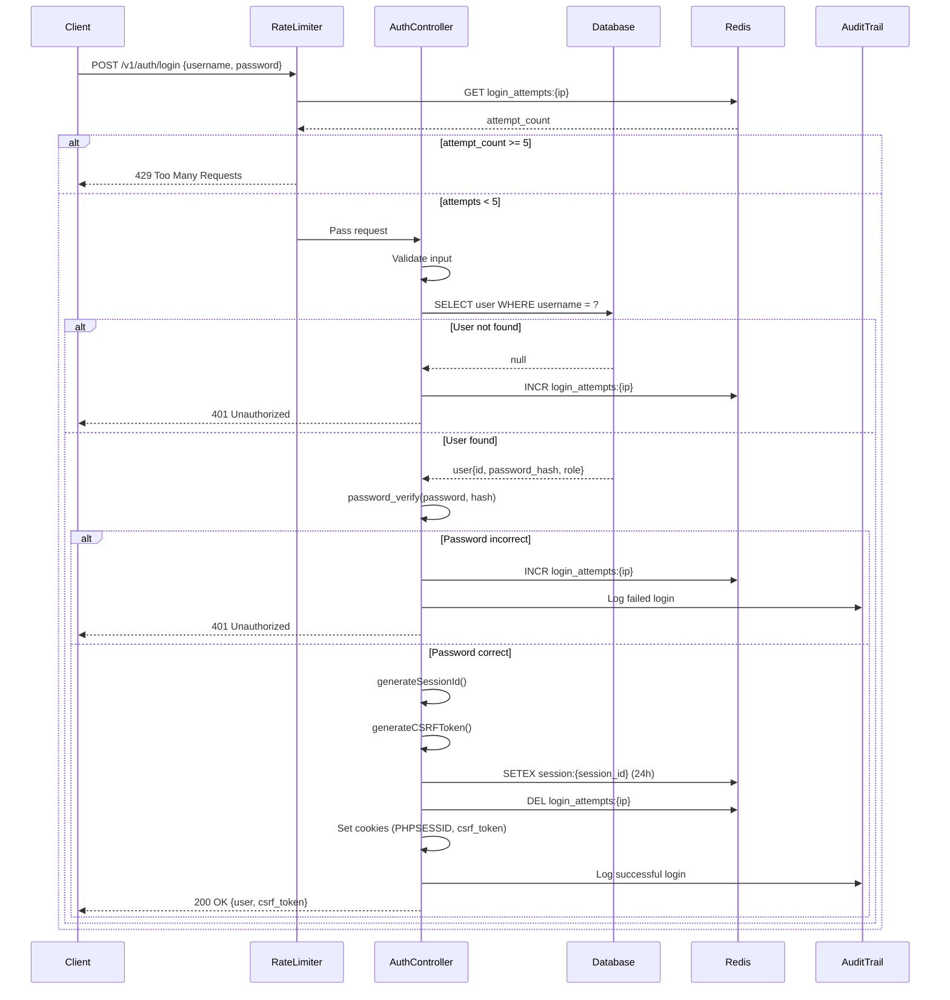
```mermaid
sequenceDiagram
    participant Client
    participant RateLimiter
    participant AuthController
    participant Database
    participant Redis
    participant AuditTrail
    
    Client->>RateLimiter: POST /v1/auth/login {username, password}
    RateLimiter->>Redis: GET login_attempts:{ip}
    Redis-->>RateLimiter: attempt_count
    
    alt attempt_count >= 5
        RateLimiter-->>Client: 429 Too Many Requests
    else attempts < 5
        RateLimiter->>AuthController: Pass request
        AuthController->>AuthController: Validate input
        AuthController->>Database: SELECT user WHERE username = ?
        
        alt User not found
            Database-->>AuthController: null
            AuthController->>Redis: INCR login_attempts:{ip}
            AuthController-->>Client: 401 Unauthorized
        else User found
            Database-->>AuthController: user{id, password_hash, role}
            AuthController->>AuthController: password_verify(password, hash)
            
            alt Password incorrect
                AuthController->>Redis: INCR login_attempts:{ip}
                AuthController->>AuditTrail: Log failed login
                AuthController-->>Client: 401 Unauthorized
            else Password correct
                AuthController->>AuthController: generateSessionId()
                AuthController->>AuthController: generateCSRFToken()
                
                AuthController->>Redis: SETEX session:{session_id} (24h)
                AuthController->>Redis: DEL login_attempts:{ip}
                
                AuthController->>AuthController: Set cookies (PHPSESSID, csrf_token)
                AuthController->>AuditTrail: Log successful login
                
                AuthController-->>Client: 200 OK {user, csrf_token}
            end
        end
    end
```

**2. Session Validation Flow:**

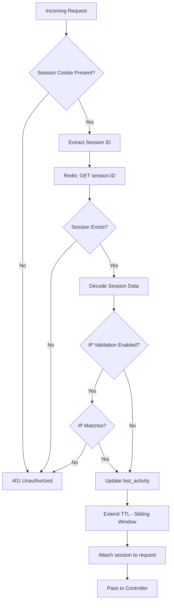
```mermaid
flowchart TD
    A[Incoming Request] --> B{Session Cookie Present?}
    B -->|No| C[401 Unauthorized]
    B -->|Yes| D[Extract Session ID]
    
    D --> E[Redis: GET session:ID]
    E --> F{Session Exists?}
    F -->|No| C
    F -->|Yes| G[Decode Session Data]
    
    G --> H{IP Validation Enabled?}
    H -->|Yes| I{IP Matches?}
    I -->|No| C
    I -->|Yes| J[Update last_activity]
    H -->|No| J
    
    J --> K[Extend TTL - Sliding Window]
    K --> L[Attach session to request]
    L --> M[Pass to Controller]
```

**3. CSRF Validation Flow:**

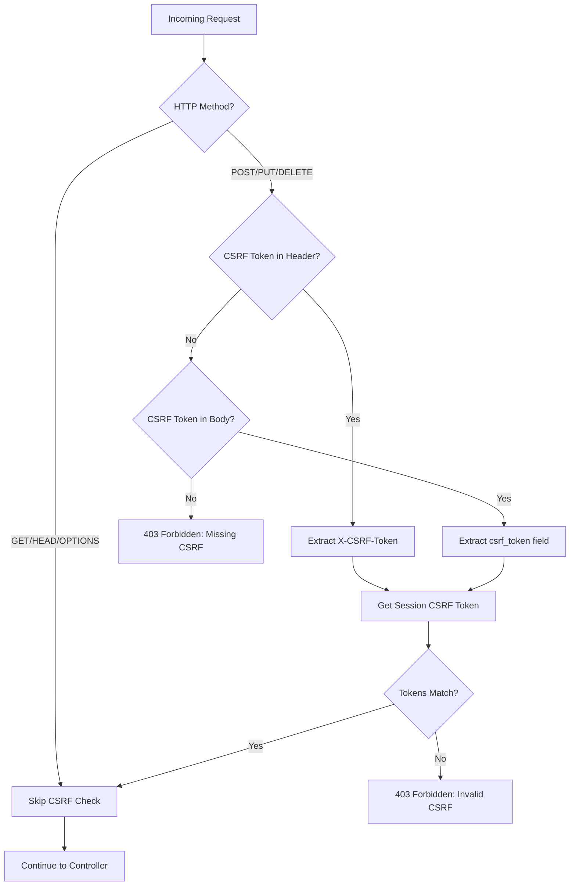
```mermaid
flowchart TD
    A[Incoming Request] --> B{HTTP Method?}
    B -->|GET/HEAD/OPTIONS| Z[Skip CSRF Check]
    B -->|POST/PUT/DELETE| C{CSRF Token in Header?}
    
    C -->|Yes| D[Extract X-CSRF-Token]
    C -->|No| E{CSRF Token in Body?}
    E -->|No| F[403 Forbidden: Missing CSRF]
    E -->|Yes| G[Extract csrf_token field]
    
    D --> H[Get Session CSRF Token]
    G --> H
    
    H --> I{Tokens Match?}
    I -->|No| J[403 Forbidden: Invalid CSRF]
    I -->|Yes| Z
    
    Z --> K[Continue to Controller]
```

**4. Authorization Decision Tree:**

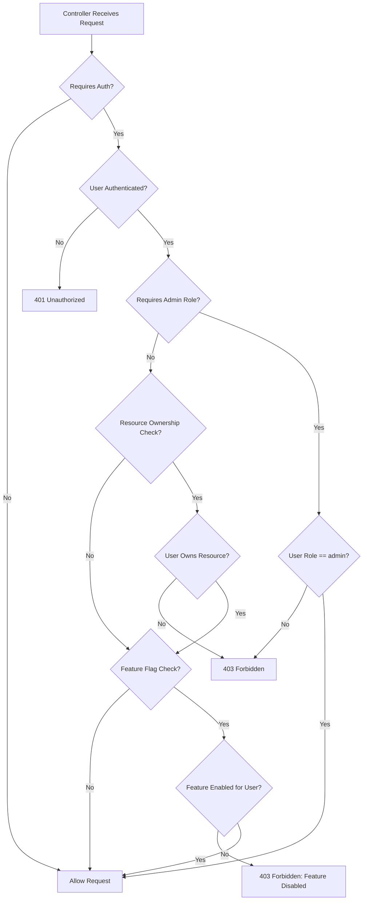
```mermaid
flowchart TD
    A[Controller Receives Request] --> B{Requires Auth?}
    B -->|No| Z[Allow Request]
    B -->|Yes| C{User Authenticated?}
    
    C -->|No| D[401 Unauthorized]
    C -->|Yes| E{Requires Admin Role?}
    
    E -->|No| F{Resource Ownership Check?}
    E -->|Yes| G{User Role == admin?}
    
    G -->|No| H[403 Forbidden]
    G -->|Yes| Z
    
    F -->|No| I{Feature Flag Check?}
    F -->|Yes| J{User Owns Resource?}
    
    J -->|No| H
    J -->|Yes| I
    
    I -->|No| Z
    I -->|Yes| K{Feature Enabled for User?}
    
    K -->|No| L[403 Forbidden: Feature Disabled]
    K -->|Yes| Z
```

**5. Logout Flow:**

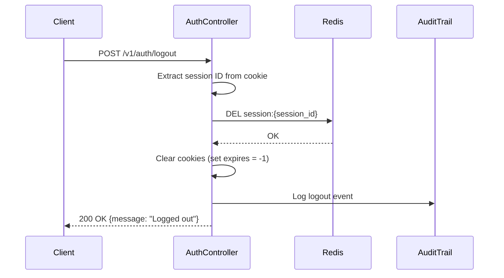
```mermaid
sequenceDiagram
    participant Client
    participant AuthController
    participant Redis
    participant AuditTrail
    
    Client->>AuthController: POST /v1/auth/logout
    AuthController->>AuthController: Extract session ID from cookie
    AuthController->>Redis: DEL session:{session_id}
    Redis-->>AuthController: OK
    
    AuthController->>AuthController: Clear cookies (set expires = -1)
    AuthController->>AuditTrail: Log logout event
    AuthController-->>Client: 200 OK {message: "Logged out"}
```

**6. Password Reset Flow (If Implemented):**

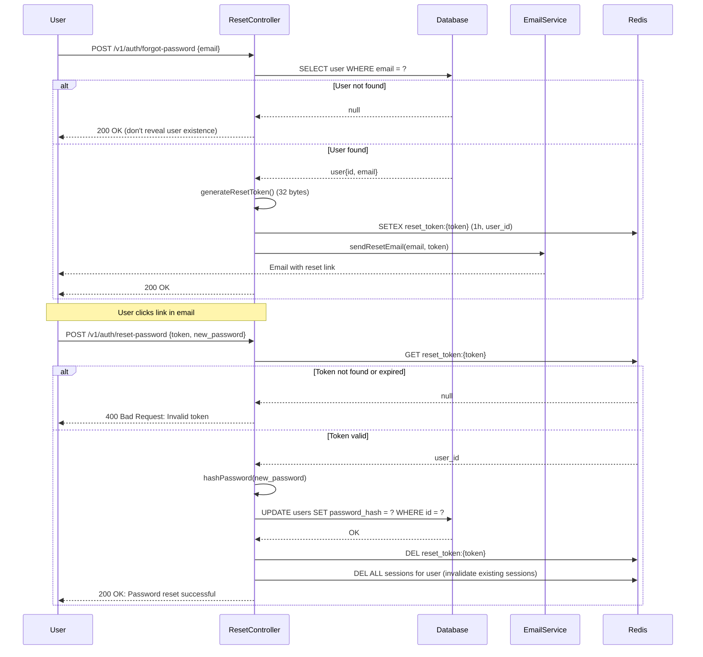
```mermaid
sequenceDiagram
    participant User
    participant ResetController
    participant Database
    participant EmailService
    participant Redis
    
    User->>ResetController: POST /v1/auth/forgot-password {email}
    ResetController->>Database: SELECT user WHERE email = ?
    
    alt User not found
        Database-->>ResetController: null
        ResetController-->>User: 200 OK (don't reveal user existence)
    else User found
        Database-->>ResetController: user{id, email}
        ResetController->>ResetController: generateResetToken() (32 bytes)
        ResetController->>Redis: SETEX reset_token:{token} (1h, user_id)
        ResetController->>EmailService: sendResetEmail(email, token)
        EmailService-->>User: Email with reset link
        ResetController-->>User: 200 OK
    end
    
    Note over User,ResetController: User clicks link in email
    
    User->>ResetController: POST /v1/auth/reset-password {token, new_password}
    ResetController->>Redis: GET reset_token:{token}
    
    alt Token not found or expired
        Redis-->>ResetController: null
        ResetController-->>User: 400 Bad Request: Invalid token
    else Token valid
        Redis-->>ResetController: user_id
        ResetController->>ResetController: hashPassword(new_password)
        ResetController->>Database: UPDATE users SET password_hash = ? WHERE id = ?
        Database-->>ResetController: OK
        ResetController->>Redis: DEL reset_token:{token}
        ResetController->>Redis: DEL ALL sessions for user (invalidate existing sessions)
        ResetController-->>User: 200 OK: Password reset successful
    end
```

**7. Session Expiry & Cleanup:**

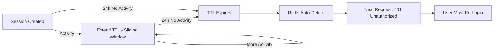
```mermaid
flowchart LR
    A[Session Created] -->|Activity| B[Extend TTL - Sliding Window]
    B -->|More Activity| B
    B -->|24h No Activity| C[TTL Expires]
    A -->|24h No Activity| C
    
    C --> D[Redis Auto-Delete]
    D --> E[Next Request: 401 Unauthorized]
    E --> F[User Must Re-Login]
```

**8. Multi-Device Session Management:**

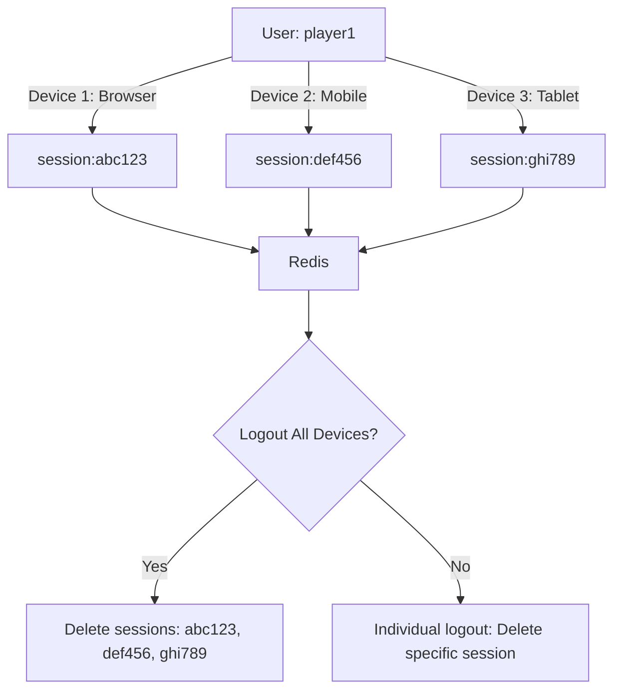
```mermaid
graph TD
    A[User: player1] -->|Device 1: Browser| B[session:abc123]
    A -->|Device 2: Mobile| C[session:def456]
    A -->|Device 3: Tablet| D[session:ghi789]
    
    B --> E[Redis]
    C --> E
    D --> E
    
    E --> F{Logout All Devices?}
    F -->|Yes| G[Delete sessions: abc123, def456, ghi789]
    F -->|No| H[Individual logout: Delete specific session]
```

**Diagrams to Include:**
- All 8 diagrams above (Mermaid)

**Analysis Scope - Files/Directories:**
- 17-AUTH-SYSTEM-COMPLETE.md (source data)
- sections/api/include/Middleware/CSRFMiddleware.php
- sections/api/include/Middleware/AuthMiddleware.php

**Methodology:**
1. **Extract Flows**: From auth system documentation
2. **Create Sequence Diagrams**: Temporal flows (login, logout)
3. **Create Flowcharts**: Decision trees (CSRF, authorization)
4. **Create State Diagrams**: Session lifecycle
5. **Validate Accuracy**: Match actual implementation
6. **Test Rendering**: Verify Mermaid displays correctly

**Acceptance Criteria:**
- [ ] Login flow diagram created (detailed with rate limiting)
- [ ] Session validation flow created (flowchart)
- [ ] CSRF validation flow created (flowchart)
- [ ] Authorization decision tree created
- [ ] Logout flow diagram created
- [ ] Password reset flow created (if applicable)
- [ ] Session expiry diagram created
- [ ] Multi-device session diagram created
- [ ] All diagrams render correctly in GitHub

**Success Metrics:**
- Diagram coverage: All major auth flows visualized
- Accuracy: 100% match with 17-AUTH-SYSTEM-COMPLETE
- Rendering: All Mermaid diagrams display correctly
- Clarity: Diagrams are easy to understand

---

## 19-WORKER-SYSTEM-COMPLETE
**Priority:** High
**Phase:** 4
**Estimated Effort:** 10-12 hours
**Dependencies:** 05-FILE-BY-FILE-ANALYSIS, 06-FUNCTION-CATALOG

**Description:**

Comprehensive documentation of the 3 background worker systems that power AI-NPC automation: Automation Worker (executes farming/building/training/defense actions), AI Decision Worker (makes NPC decisions using 95% rule-based + 5% LLM logic), and Spawn Scheduler Worker (executes scheduled NPC spawning batches). Each worker's scheduling, execution logic, database interactions, error handling, retry mechanisms, and monitoring metrics are fully documented.

Understanding the worker systems is critical for maintaining game automation, debugging NPC behavior, optimizing performance, and scaling the AI system.

**Key Contents:**

**1. Worker Architecture Overview:**

**Three Worker Types:**
1. **Automation Worker**: Executes pending automation actions (farming, building, training, defense, logistics, away mode)
2. **AI Decision Worker**: Makes decisions for AI-NPCs using hybrid rule-based + LLM approach
3. **Spawn Scheduler Worker**: Executes scheduled NPC spawn batches

**Scheduling:**
- **Cron-based triggering**:
  - Automation Worker: Every 5 minutes
  - AI Decision Worker: Every 5 minutes
  - Spawn Scheduler Worker: Every 15 minutes
- **Cron configuration**: `/etc/cron.d/travian-workers` or docker-compose healthcheck

**Execution Model:**
- **Synchronous execution**: One worker instance at a time per type
- **Database queue**: Workers poll database for pending tasks
- **Locking mechanism**: Prevent concurrent execution of same task
- **Error handling**: Try-catch with logging
- **Retry logic**: Failed tasks marked for retry with exponential backoff

**Worker Communication:**
- No inter-worker communication (decoupled)
- All state persisted to database
- Workers coordinate via database records (status fields)

**2. Automation Worker (TaskWorker/automation-worker.php):**

**Purpose**: Execute pending automation actions created by AI Decision Worker or manual triggers

**Schedule**: Every 5 minutes (cron)

**Execution Flow:**

```
1. START: Cron triggers automation-worker.php
2. QUERY: SELECT * FROM automation_actions WHERE status = 'queued' AND scheduled_at <= NOW() LIMIT 100
3. LOOP: For each action:
   a. UPDATE status = 'executing', started_at = NOW()
   b. EXECUTE: Call appropriate handler based on action_type
   c. RESULT: Update status = 'completed' OR 'failed', executed_at = NOW()
   d. LOG: Insert decision log entry
   e. METRICS: Increment execution counter
4. END: Log summary metrics
```

**Action Types Supported:**
- `farming`: Attack farming villages for resources
- `building`: Upgrade buildings in village
- `training`: Train troops
- `defense`: Deploy defensive troops
- `logistics`: Send resources between villages
- `away_mode`: Activate protection mode

**Action Execution Logic:**

**Example: Farming Action**
```php
function executeFarmingAction($action) {
    $actionData = json_decode($action->action_data, true);
    
    // Extract parameters
    $npcId = $action->player_id;
    $targetVillage = $actionData['target_village_id'];
    $troopCounts = $actionData['troops'];
    
    // Validate NPC has troops
    $availableTroops = $this->getTroopsInVillage($npcId, $actionData['source_village_id']);
    if (!$this->hasEnoughTroops($availableTroops, $troopCounts)) {
        throw new InsufficientTroopsException();
    }
    
    // Call game engine API (MySQL)
    $this->gameEngine->sendAttack([
        'attacker_village_id' => $actionData['source_village_id'],
        'defender_village_id' => $targetVillage,
        'troops' => $troopCounts,
        'attack_type' => 'raid' // Farming is raid, not conquest
    ]);
    
    // Update NPC resources (estimated gain)
    $estimatedLoot = $this->calculateExpectedLoot($targetVillage, $troopCounts);
    $this->updateNPCResources($npcId, $estimatedLoot);
    
    return [
        'success' => true,
        'loot_estimate' => $estimatedLoot
    ];
}
```

**Example: Building Action**
```php
function executeBuildingAction($action) {
    $actionData = json_decode($action->action_data, true);
    
    // Extract parameters
    $npcId = $action->player_id;
    $villageId = $actionData['village_id'];
    $buildingType = $actionData['building_type'];
    $targetLevel = $actionData['target_level'];
    
    // Check resources
    $cost = $this->getBuildingCost($buildingType, $targetLevel);
    $resources = $this->getNPCResources($npcId, $villageId);
    if (!$this->hasEnoughResources($resources, $cost)) {
        throw new InsufficientResourcesException();
    }
    
    // Deduct resources
    $this->deductResources($npcId, $villageId, $cost);
    
    // Start building (MySQL game DB)
    $this->gameEngine->startBuilding([
        'village_id' => $villageId,
        'building_type' => $buildingType,
        'target_level' => $targetLevel
    ]);
    
    return [
        'success' => true,
        'completion_time' => $this->calculateBuildTime($buildingType, $targetLevel)
    ];
}
```

**Database Schema:**

**Table: automation_actions**
```sql
CREATE TABLE automation_actions (
    id BIGSERIAL PRIMARY KEY,
    player_id INT NOT NULL REFERENCES players(id),
    profile_id INT REFERENCES automation_profiles(id),
    action_type VARCHAR(50) NOT NULL, -- farming, building, training, defense, logistics, away_mode
    status VARCHAR(20) NOT NULL DEFAULT 'queued', -- queued, executing, completed, failed
    action_data JSONB NOT NULL, -- Action-specific parameters
    result JSONB, -- Execution result
    error_message TEXT, -- Error details if failed
    retry_count INT DEFAULT 0,
    max_retries INT DEFAULT 3,
    scheduled_at TIMESTAMP WITH TIME ZONE NOT NULL,
    started_at TIMESTAMP WITH TIME ZONE,
    executed_at TIMESTAMP WITH TIME ZONE,
    created_at TIMESTAMP WITH TIME ZONE DEFAULT CURRENT_TIMESTAMP
);

CREATE INDEX idx_automation_actions_status ON automation_actions(status);
CREATE INDEX idx_automation_actions_scheduled_at ON automation_actions(scheduled_at);
CREATE INDEX idx_automation_actions_player_id ON automation_actions(player_id);
```

**Error Handling:**
- Try-catch around each action execution
- On error:
  - Log error to `error_message` column
  - Increment `retry_count`
  - If `retry_count` < `max_retries`: Set `status = 'queued'`, reschedule with exponential backoff
  - If `retry_count` >= `max_retries`: Set `status = 'failed'`
- Errors logged to decision_log table

**Retry Logic:**
```php
if ($retryCount < $maxRetries) {
    $backoff = pow(2, $retryCount) * 60; // 1min, 2min, 4min, 8min
    $newScheduledAt = date('Y-m-d H:i:s', time() + $backoff);
    DB::update('automation_actions', [
        'status' => 'queued',
        'retry_count' => $retryCount + 1,
        'scheduled_at' => $newScheduledAt
    ], ['id' => $actionId]);
} else {
    DB::update('automation_actions', [
        'status' => 'failed'
    ], ['id' => $actionId]);
}
```

**Monitoring Metrics:**
- Actions executed per run
- Execution time per action type
- Success/failure rates
- Retry counts
- Queue depth (pending actions)

**3. AI Decision Worker (TaskWorker/ai-decision-worker.php):**

**Purpose**: Make decisions for AI-NPCs and create automation actions

**Schedule**: Every 5 minutes (cron)

**Execution Flow:**

```
1. START: Cron triggers ai-decision-worker.php
2. QUERY: SELECT * FROM players WHERE type = 'ai' AND (last_decision_at IS NULL OR last_decision_at < NOW() - INTERVAL '15 minutes') LIMIT 50
3. LOOP: For each NPC:
   a. LOAD NPC DATA: personality, difficulty, resources, villages, troops
   b. DECISION ROUTING: 95% rule-based OR 5% LLM (random selection)
   c. MAKE DECISION: Call AIDecisionEngine
   d. CREATE ACTION: INSERT INTO automation_actions
   e. LOG DECISION: INSERT INTO decision_log
   f. UPDATE NPC: SET last_decision_at = NOW()
4. END: Log summary metrics
```

**95% vs 5% Routing Logic:**
```php
function makeDecision($npcId) {
    // Load NPC data
    $npc = $this->loadNPC($npcId);
    
    // Determine routing (95% rule-based, 5% LLM)
    $random = mt_rand(1, 100);
    
    if ($random <= 95) {
        // Rule-based decision (< 50ms)
        $decision = $this->ruleBasedDecision($npc);
    } else {
        // LLM-based decision (< 500ms)
        try {
            $decision = $this->llmBasedDecision($npc);
        } catch (LLMException $e) {
            // Fallback to rule-based if LLM fails
            $decision = $this->ruleBasedDecision($npc);
        }
    }
    
    return $decision;
}
```

**Rule-Based Decision Logic:**
```php
function ruleBasedDecision($npc) {
    // Apply personality traits
    $personality = $npc->personality_profile;
    
    // Apply difficulty scaling
    $difficulty = $npc->difficulty_level; // easy, medium, hard, expert
    
    // Decision priority based on personality
    $priorities = $this->getPriorities($personality, $difficulty);
    
    // Example priorities for 'aggressive' personality:
    // 1. Attack (40% weight)
    // 2. Train troops (30% weight)
    // 3. Build (20% weight)
    // 4. Farm resources (10% weight)
    
    // Check resource/troop conditions
    if ($this->hasEnoughTroops($npc) && $this->hasTargets($npc)) {
        return $this->createAttackDecision($npc);
    } elseif ($this->hasEnoughResources($npc)) {
        return $this->createBuildingDecision($npc);
    } else {
        return $this->createFarmingDecision($npc);
    }
}
```

**LLM-Based Decision Logic:**
```php
function llmBasedDecision($npc) {
    // Build prompt with NPC context
    $prompt = $this->buildLLMPrompt($npc);
    
    // Call LLM API (Ollama or vLLM)
    $llmService = $this->getLLMService(); // Round-robin or least-loaded
    $response = $llmService->generate($prompt, [
        'max_tokens' => 200,
        'temperature' => 0.7,
        'timeout' => 500 // 500ms timeout
    ]);
    
    // Parse LLM response
    $decision = $this->parseLLMResponse($response);
    
    // Validate decision
    if (!$this->isValidDecision($decision)) {
        throw new InvalidLLMDecisionException();
    }
    
    return $decision;
}

function buildLLMPrompt($npc) {
    return "You are {$npc->name}, an AI player in Travian with personality: {$npc->personality_profile->type}.
    
Current status:
- Resources: Wood {$npc->resources->wood}, Clay {$npc->resources->clay}, Iron {$npc->resources->iron}, Crop {$npc->resources->crop}
- Villages: {$npc->village_count}
- Troops: {$npc->troop_summary}
- Difficulty: {$npc->difficulty_level}

What should you do next? Choose ONE action from: farming, building, training, defense, logistics, away_mode.

Output format (JSON):
{
  \"action_type\": \"farming|building|training|defense|logistics|away_mode\",
  \"reasoning\": \"Brief explanation\",
  \"parameters\": { ... }
}";
}
```

**Decision Logging:**

**Table: decision_log**
```sql
CREATE TABLE decision_log (
    id BIGSERIAL PRIMARY KEY,
    npc_id INT NOT NULL REFERENCES players(id),
    decision_type VARCHAR(50) NOT NULL, -- farming, building, training, etc.
    decision_method VARCHAR(20) NOT NULL, -- 'rule_based' or 'llm'
    decision_details JSONB NOT NULL,
    context JSONB NOT NULL, -- NPC state at decision time
    outcome VARCHAR(50), -- success, failed, pending
    execution_time_ms INT NOT NULL,
    created_at TIMESTAMP WITH TIME ZONE DEFAULT CURRENT_TIMESTAMP
);

CREATE INDEX idx_decision_log_npc_id ON decision_log(npc_id);
CREATE INDEX idx_decision_log_created_at ON decision_log(created_at);
CREATE INDEX idx_decision_log_decision_method ON decision_log(decision_method);
```

**Example Decision Log Entry:**
```json
{
  "id": 12345,
  "npc_id": 456,
  "decision_type": "farming",
  "decision_method": "rule_based",
  "decision_details": {
    "action": "attack_village",
    "target_village_id": 789,
    "troops": {"legionnaire": 50, "praetorian": 20}
  },
  "context": {
    "resources": {"wood": 1000, "clay": 800, "iron": 600, "crop": 500},
    "personality": {"type": "aggressive", "traits": {"aggression": 0.8}},
    "difficulty": "hard"
  },
  "outcome": "success",
  "execution_time_ms": 42,
  "created_at": "2025-10-30T14:30:00Z"
}
```

**Performance Targets:**
- Rule-based decisions: < 50ms per NPC
- LLM decisions: < 500ms per NPC
- Total worker execution: < 5 minutes (for 50 NPCs)
- Success rate: > 95%

**4. Spawn Scheduler Worker (TaskWorker/spawn-scheduler-worker.php):**

**Purpose**: Execute scheduled NPC spawn batches

**Schedule**: Every 15 minutes (cron)

**Execution Flow:**

```
1. START: Cron triggers spawn-scheduler-worker.php
2. QUERY: SELECT * FROM spawn_batches WHERE status = 'pending' AND spawn_date <= NOW() LIMIT 10
3. LOOP: For each batch:
   a. UPDATE status = 'processing'
   b. CALL: NPCInitializerService->spawnBatch(batch_id)
   c. LOOP NPCs: For each NPC in batch:
      i. Generate coordinates (MapPlacementService)
      ii. Check collision (CollisionDetectorService)
      iii. Create player record (INSERT INTO players)
      iv. Create ai_config record (INSERT INTO ai_configs)
      v. Initialize game world data (MySQL INSERT)
   d. UPDATE: spawned_count, status = 'completed'
   e. METRICS: Log spawn statistics
4. END: Log summary
```

**Batch Processing Logic:**

```php
function processBatch($batch) {
    $this->db->beginTransaction();
    
    try {
        // Get spawn configuration
        $world = $this->getWorld($batch->world_id);
        $preset = $this->getPreset($batch->preset_id);
        $algorithm = $batch->spawn_algorithm; // quadrant_balanced, random_scatter, kingdom_clustering
        
        // Generate coordinates for all NPCs in batch
        $coordinates = $this->mapPlacementService->generateCoordinates(
            $algorithm,
            $batch->total_npcs,
            $world->world_key
        );
        
        $spawnedCount = 0;
        
        foreach ($coordinates as $coord) {
            // Check collision
            if ($this->collisionDetector->isOccupied($coord['x'], $coord['y'], $world->world_key)) {
                // Find nearby free slot
                $coord = $this->collisionDetector->findNearbyFreeSlot($coord['x'], $coord['y'], $world->world_key);
                if (!$coord) {
                    continue; // Skip if no free slot found
                }
            }
            
            // Create NPC
            $npc = $this->npcInitializer->createNPC([
                'world_id' => $world->id,
                'world_key' => $world->world_key,
                'x' => $coord['x'],
                'y' => $coord['y'],
                'difficulty' => $this->selectDifficulty($preset->distribution_config),
                'personality' => $this->selectPersonality($preset->distribution_config),
                'tribe' => $this->selectTribe()
            ]);
            
            $spawnedCount++;
        }
        
        // Update batch
        $this->db->update('spawn_batches', [
            'spawned_count' => $spawnedCount,
            'status' => 'completed',
            'completed_at' => date('Y-m-d H:i:s')
        ], ['id' => $batch->id]);
        
        $this->db->commit();
        
        return $spawnedCount;
        
    } catch (Exception $e) {
        $this->db->rollback();
        
        // Mark batch as failed
        $this->db->update('spawn_batches', [
            'status' => 'failed',
            'error_message' => $e->getMessage()
        ], ['id' => $batch->id]);
        
        throw $e;
    }
}
```

**Spawn Algorithms:**

**1. Quadrant Balanced:**
- Divide map into 4 quadrants
- Distribute NPCs evenly across quadrants
- Within each quadrant: Random placement

**2. Random Scatter:**
- Completely random X, Y coordinates
- Check collision and retry

**3. Kingdom Clustering:**
- Group NPCs into kingdoms/clusters
- Each cluster has a center point
- NPCs spawn within radius of cluster center

**Database Schema:**

**Table: spawn_batches**
```sql
CREATE TABLE spawn_batches (
    id SERIAL PRIMARY KEY,
    world_id INT NOT NULL REFERENCES worlds(id),
    preset_id INT NOT NULL REFERENCES spawn_presets(id),
    spawn_algorithm VARCHAR(50) NOT NULL, -- quadrant_balanced, random_scatter, kingdom_clustering
    total_npcs INT NOT NULL,
    spawned_count INT DEFAULT 0,
    status VARCHAR(20) NOT NULL DEFAULT 'pending', -- pending, processing, completed, failed
    spawn_date TIMESTAMP WITH TIME ZONE NOT NULL,
    completed_at TIMESTAMP WITH TIME ZONE,
    error_message TEXT,
    created_at TIMESTAMP WITH TIME ZONE DEFAULT CURRENT_TIMESTAMP
);

CREATE INDEX idx_spawn_batches_status ON spawn_batches(status);
CREATE INDEX idx_spawn_batches_spawn_date ON spawn_batches(spawn_date);
CREATE INDEX idx_spawn_batches_world_id ON spawn_batches(world_id);
```

**Error Handling:**
- Try-catch around batch processing
- Transaction rollback on error
- Batch marked as 'failed' with error message
- Individual NPC spawn failures logged but don't fail entire batch

**5. Worker Monitoring & Metrics:**

**Metrics Collected:**
- Worker execution count
- Execution duration (ms)
- Success/failure rates
- Queue depths
- Throughput (actions/decisions/spawns per minute)

**Prometheus Metrics Endpoint:**
```
GET /v1/monitoring/workers
```

Response:
```json
{
  "automation_worker": {
    "last_run": "2025-10-30T14:30:00Z",
    "last_duration_ms": 2340,
    "actions_executed": 47,
    "actions_failed": 2,
    "queue_depth": 15
  },
  "ai_decision_worker": {
    "last_run": "2025-10-30T14:30:00Z",
    "last_duration_ms": 3120,
    "decisions_made": 50,
    "rule_based_count": 48,
    "llm_count": 2,
    "llm_failures": 0,
    "avg_decision_time_ms": 62
  },
  "spawn_scheduler_worker": {
    "last_run": "2025-10-30T14:15:00Z",
    "last_duration_ms": 15400,
    "batches_processed": 2,
    "npcs_spawned": 75,
    "spawn_failures": 3
  }
}
```

**Grafana Dashboards:**
- Worker throughput (actions/min, decisions/min, spawns/min)
- Worker execution time (p50, p95, p99)
- Queue depth over time
- Error rates
- LLM vs rule-based decision distribution

**Diagrams to Include:**
- Worker architecture diagram (Mermaid - 3 workers, cron, database, game engine)
- Automation worker flowchart
- AI decision worker flowchart with 95%/5% routing
- Spawn scheduler flowchart
- Decision logging flow

**Analysis Scope - Files/Directories:**
- TaskWorker/automation-worker.php
- TaskWorker/ai-decision-worker.php
- TaskWorker/spawn-scheduler-worker.php
- sections/api/include/Services/AIDecisionEngine.php
- sections/api/include/Services/NPCInitializerService.php
- database/schemas/complete-automation-ai-system.sql (worker tables)

**Methodology:**
1. **Analyze Worker Scripts**: Read all 3 worker PHP files
2. **Trace Execution Flows**: Step-by-step what each worker does
3. **Document Database Interactions**: All queries, tables used
4. **Map Decision Logic**: Rule-based vs LLM routing
5. **Error Handling Analysis**: How failures are handled
6. **Extract Metrics**: What's monitored
7. **Create Flowcharts**: Visual worker flows
8. **Performance Analysis**: Response times, throughput

**Acceptance Criteria:**
- [ ] All 3 workers documented (automation, AI decision, spawn scheduler)
- [ ] Execution flows detailed (step-by-step)
- [ ] Scheduling documented (cron intervals)
- [ ] Database schemas documented (automation_actions, decision_log, spawn_batches)
- [ ] Error handling and retry logic explained
- [ ] 95% rule-based vs 5% LLM routing documented
- [ ] Action execution logic detailed (farming, building, training, etc.)
- [ ] Spawn algorithms explained (quadrant_balanced, random_scatter, kingdom_clustering)
- [ ] Monitoring metrics documented
- [ ] Flowcharts created for all 3 workers

**Success Metrics:**
- Worker coverage: All 3 workers fully documented
- Flow completeness: Every step explained
- Database accuracy: All tables and queries documented
- Performance targets: Response time targets specified

---

## 20-WORKER-ARCHITECTURE-DIAGRAM
**Priority:** Medium
**Phase:** 4
**Estimated Effort:** 3-4 hours
**Dependencies:** 19-WORKER-SYSTEM-COMPLETE

**Description:**

Visual architecture diagrams for the 3-worker system showing cron scheduling, database queue polling, service interactions, and monitoring. Includes detailed flowcharts for each worker's execution logic, decision trees for AI decision routing, and sequence diagrams for worker-to-database-to-game-engine flows.

**Key Contents:**

**1. Worker System Overview:**

```mermaid
graph TB
    subgraph Scheduling
        C1[Cron: Every 5 min]
        C2[Cron: Every 5 min]
        C3[Cron: Every 15 min]
    end
    
    subgraph Workers
        W1[Automation Worker]
        W2[AI Decision Worker]
        W3[Spawn Scheduler Worker]
    end
    
    subgraph Database
        T1[(automation_actions)]
        T2[(decision_log)]
        T3[(spawn_batches)]
        T4[(players)]
    end
    
    subgraph Services
        S1[GameEngine API]
        S2[AIDecisionEngine]
        S3[NPCInitializerService]
        S4[LLMIntegrationService]
    end
    
    subgraph Monitoring
        M1[Prometheus Metrics]
        M2[Logging]
    end
    
    C1 --> W1
    C2 --> W2
    C3 --> W3
    
    W1 --> T1
    W1 --> S1
    W1 --> M1
    W1 --> M2
    
    W2 --> T4
    W2 --> T2
    W2 --> T1
    W2 --> S2
    S2 --> S4
    W2 --> M1
    W2 --> M2
    
    W3 --> T3
    W3 --> S3
    W3 --> T4
    W3 --> M1
    W3 --> M2
```

**2. Automation Worker Flow:**

```mermaid
flowchart TD
    A[Cron Trigger: Every 5 min] --> B[Query pending actions]
    B --> C{Actions found?}
    C -->|No| Z[End - Sleep until next run]
    C -->|Yes| D[Load actions - LIMIT 100]
    
    D --> E[Loop: For each action]
    E --> F[Update status = 'executing']
    F --> G{Action type?}
    
    G -->|farming| H1[Execute farming]
    G -->|building| H2[Execute building]
    G -->|training| H3[Execute training]
    G -->|defense| H4[Execute defense]
    G -->|logistics| H5[Execute logistics]
    G -->|away_mode| H6[Execute away mode]
    
    H1 --> I{Success?}
    H2 --> I
    H3 --> I
    H4 --> I
    H5 --> I
    H6 --> I
    
    I -->|Yes| J[Update status = 'completed']
    I -->|No| K{Retry count < max?}
    
    K -->|Yes| L[Increment retry_count]
    L --> M[Schedule retry with backoff]
    M --> N[Update status = 'queued']
    
    K -->|No| O[Update status = 'failed']
    
    J --> P[Log to decision_log]
    N --> P
    O --> P
    
    P --> Q{More actions?}
    Q -->|Yes| E
    Q -->|No| R[Log metrics]
    R --> Z
```

**3. AI Decision Worker Flow:**

```mermaid
flowchart TD
    A[Cron Trigger: Every 5 min] --> B[Query NPCs needing decisions]
    B --> C{NPCs found?}
    C -->|No| Z[End]
    C -->|Yes| D[Load NPCs - LIMIT 50]
    
    D --> E[Loop: For each NPC]
    E --> F[Load NPC data]
    F --> G[personality, difficulty, resources, troops]
    
    G --> H[Generate random number 1-100]
    H --> I{Random <= 95?}
    
    I -->|Yes - 95% path| J[Rule-Based Decision]
    J --> J1[Apply personality traits]
    J1 --> J2[Apply difficulty scaling]
    J2 --> J3[Check conditions]
    J3 --> J4[Select action - < 50ms]
    
    I -->|No - 5% path| K[LLM-Based Decision]
    K --> K1[Build LLM prompt]
    K1 --> K2[Call Ollama/vLLM API]
    K2 --> K3{LLM success?}
    
    K3 -->|Yes| K4[Parse LLM response]
    K4 --> K5{Valid decision?}
    K5 -->|Yes| K6[Use LLM decision - < 500ms]
    K5 -->|No| L[Fallback to rule-based]
    
    K3 -->|No - timeout/error| L
    L --> J4
    
    J4 --> M[Create automation_action]
    K6 --> M
    
    M --> N[Insert INTO automation_actions]
    N --> O[Log decision to decision_log]
    O --> P[Update NPC last_decision_at]
    
    P --> Q{More NPCs?}
    Q -->|Yes| E
    Q -->|No| R[Log summary metrics]
    R --> Z
```

**4. Spawn Scheduler Worker Flow:**

```mermaid
flowchart TD
    A[Cron Trigger: Every 15 min] --> B[Query pending spawn batches]
    B --> C{Batches found?}
    C -->|No| Z[End]
    C -->|Yes| D[Load batches - LIMIT 10]
    
    D --> E[Loop: For each batch]
    E --> F[BEGIN TRANSACTION]
    F --> G[Update status = 'processing']
    
    G --> H[Load world + preset + algorithm]
    H --> I{Algorithm?}
    
    I -->|quadrant_balanced| I1[Generate quadrant coords]
    I -->|random_scatter| I2[Generate random coords]
    I -->|kingdom_clustering| I3[Generate clustered coords]
    
    I1 --> J[For each coordinate]
    I2 --> J
    I3 --> J
    
    J --> K{Collision check}
    K -->|Occupied| L[Find nearby free slot]
    L --> M{Free slot found?}
    M -->|No| N[Skip this NPC]
    M -->|Yes| O[Use free slot coords]
    
    K -->|Free| O
    
    O --> P[INSERT INTO players]
    P --> Q[INSERT INTO ai_configs]
    Q --> R[INSERT MySQL game world data]
    R --> S[Increment spawned_count]
    
    S --> T{More coords?}
    T -->|Yes| J
    T -->|No| U[Update batch status = 'completed']
    
    U --> V{Transaction success?}
    V -->|Yes| W[COMMIT]
    V -->|No| X[ROLLBACK]
    X --> Y[Update batch status = 'failed']
    
    W --> AA{More batches?}
    Y --> AA
    AA -->|Yes| E
    AA -->|No| BB[Log metrics]
    BB --> Z
```

**5. AI Decision Routing Diagram:**

```mermaid
graph TD
    A[NPC Needs Decision] --> B[Generate Random 1-100]
    B --> C{Random <= 95?}
    
    C -->|Yes - 95%| D[Rule-Based Path]
    C -->|No - 5%| E[LLM Path]
    
    D --> D1[Load NPC State]
    D1 --> D2[Apply Personality]
    D2 --> D3[Apply Difficulty]
    D3 --> D4[Evaluate Conditions]
    D4 --> D5[Select Action]
    D5 --> D6[< 50ms Response Time]
    
    E --> E1[Build Context Prompt]
    E1 --> E2{GPU Available?}
    E2 -->|RTX 3090 Ti| E3[Call Ollama]
    E2 -->|Tesla P40| E4[Call vLLM]
    
    E3 --> E5[LLM Generate]
    E4 --> E5
    
    E5 --> E6{Timeout?}
    E6 -->|Yes > 500ms| F[Fallback to Rule-Based]
    E6 -->|No| E7[Parse Response]
    
    E7 --> E8{Valid JSON?}
    E8 -->|No| F
    E8 -->|Yes| E9[< 500ms Response Time]
    
    F --> D1
    
    D6 --> G[Create Action]
    E9 --> G
    G --> H[Insert automation_action]
    H --> I[Log Decision]
```

**6. Worker-to-Database-to-GameEngine Sequence:**

```mermaid
sequenceDiagram
    participant Cron
    participant Worker
    participant PostgreSQL
    participant Service
    participant MySQL
    participant Metrics
    
    Cron->>Worker: Trigger execution
    Worker->>PostgreSQL: SELECT pending tasks
    PostgreSQL-->>Worker: tasks[]
    
    loop For each task
        Worker->>PostgreSQL: UPDATE status = 'executing'
        Worker->>Service: executeAction(task)
        Service->>MySQL: Game world operations
        MySQL-->>Service: result
        Service-->>Worker: success/failure
        
        alt Success
            Worker->>PostgreSQL: UPDATE status = 'completed'
        else Failure
            Worker->>PostgreSQL: UPDATE status = 'failed' OR 'queued' (retry)
        end
        
        Worker->>PostgreSQL: INSERT decision_log
        Worker->>Metrics: Increment counters
    end
    
    Worker->>Metrics: Export final metrics
```

**7. Progressive Spawn Timeline:**

```mermaid
gantt
    title NPC Spawn Schedule (100 NPCs, Medium Preset)
    dateFormat YYYY-MM-DD HH:mm
    
    section Batch 1
    Spawn 40 NPCs (40%):       2025-10-30 12:00, 15m
    
    section Batch 2
    Spawn 24 NPCs (24%):       2025-10-31 12:00, 15m
    
    section Batch 3
    Spawn 16 NPCs (16%):       2025-11-02 12:00, 15m
    
    section Batch 4
    Spawn 10 NPCs (10%):       2025-11-04 12:00, 15m
    
    section Batch 5
    Spawn 10 NPCs (10%):       2025-11-06 12:00, 15m
```

**8. Worker Health Monitoring:**

```mermaid
graph LR
    A[Worker Execution] --> B{Duration < 5min?}
    B -->|Yes| C[✅ Healthy]
    B -->|No| D[⚠️ Slow Warning]
    
    A --> E{Success Rate > 95%?}
    E -->|Yes| C
    E -->|No| F[🚨 High Failure Alert]
    
    A --> G{Queue Depth < 100?}
    G -->|Yes| C
    G -->|No| H[⚠️ Backlog Warning]
    
    C --> I[Continue Normal Operation]
    D --> J[Alert DevOps]
    F --> J
    H --> J
```

**Diagrams to Include:**
- All 8 diagrams above (Mermaid)

**Analysis Scope - Files/Directories:**
- 19-WORKER-SYSTEM-COMPLETE.md (source data)
- TaskWorker/*.php (worker code)

**Methodology:**
1. **Extract Flows**: From worker system documentation
2. **Create Architecture Diagram**: High-level overview
3. **Create Flowcharts**: Detailed worker logic
4. **Create Sequence Diagrams**: Worker interactions
5. **Create Decision Trees**: AI routing logic
6. **Create Timelines**: Spawn scheduling
7. **Validate**: Match actual worker code
8. **Test Rendering**: Verify Mermaid displays

**Acceptance Criteria:**
- [ ] Worker system overview diagram created
- [ ] Automation worker flowchart created
- [ ] AI decision worker flowchart created (95%/5% routing)
- [ ] Spawn scheduler flowchart created
- [ ] AI decision routing diagram created
- [ ] Worker-to-database-to-gameengine sequence diagram created
- [ ] Progressive spawn timeline created
- [ ] Worker health monitoring diagram created
- [ ] All diagrams render correctly in GitHub

**Success Metrics:**
- Diagram coverage: All 3 workers visualized
- Accuracy: 100% match with 19-WORKER-SYSTEM-COMPLETE
- Rendering: All Mermaid diagrams display correctly
- Clarity: Flows easy to follow

---

[Continue with documents 21-34 in next batch...]


## 21-INTEGRATION-MAP
**Priority:** Medium
**Phase:** 4
**Estimated Effort:** 6-8 hours
**Dependencies:** 02-TECH-STACK-MATRIX, 05-FILE-BY-FILE-ANALYSIS

**Description:**

Comprehensive map of ALL external integrations and third-party services used by the system: Brevo Transactional Email API, Ollama LLM API (RTX 3090 Ti), vLLM API (Tesla P40), Prometheus metrics collection, Grafana visualization, Loki log aggregation, Discord Webhooks for system notifications, and any other external dependencies. Each integration is documented with connection details, authentication methods, rate limits, failover strategies, and usage patterns.

Understanding integrations is critical for managing API keys, troubleshooting connectivity issues, planning failover strategies, and ensuring service availability.

**Key Contents:**

**1. Integration Inventory:**

| Integration | Type | Purpose | Authentication | Rate Limits | Failover |
|------------|------|---------|----------------|-------------|----------|
| Brevo Transactional Email | External API | User emails (registration, password reset) | API Key | 300 emails/day (free tier) | Queue + retry |
| Ollama | LLM API | AI-NPC decisions (5%) | None (local) | No limit (local GPU) | Fallback to vLLM or rule-based |
| vLLM | LLM API | AI-NPC decisions (5% backup) | None (local) | No limit (local GPU) | Fallback to Ollama or rule-based |
| Prometheus | Metrics | Monitoring & metrics collection | None (internal) | N/A | None (critical) |
| Grafana | Visualization | Dashboards & alerts | Admin credentials | N/A | Read-only mode on failure |
| Loki | Log Aggregation | Centralized logging | None (internal) | N/A | Local file fallback |
| Promtail | Log Shipping | Ship logs to Loki | None (internal) | N/A | Buffer logs locally |
| Discord Webhooks | Notifications | System alerts to Discord channel | Webhook URL | 30 requests/min per webhook | Queue + retry |
| PostgreSQL (Neon) | Database | Global data, AI-NPC system | Connection string | Varies by plan | Replica failover (if configured) |
| MySQL | Database | Game world data | Connection string | No external limit | Replica failover (if configured) |
| Redis | Cache | Sessions, feature flags, rate limiting | None (internal) | No limit (local) | Sentinel failover (if configured) |
| ModSecurity WAF | Security | OWASP CRS rules | None (inline) | N/A | None (critical path) |

**2. Brevo Transactional Email Integration:**

**Service**: Brevo (formerly SendinBlue)
**Purpose**: Send transactional emails (user registration, password reset, notifications)
**Endpoint**: `https://api.brevo.com/v3/smtp/email`

**Authentication:**
- Method: API Key in header
- Header: `api-key: YOUR_API_KEY`
- Key storage: Environment variable `BREVO_API_KEY`

**Configuration:**
```php
// sections/api/config/email.php
return [
    'provider' => 'brevo',
    'api_key' => getenv('BREVO_API_KEY'),
    'api_endpoint' => 'https://api.brevo.com/v3/smtp/email',
    'from_email' => 'noreply@travian.com',
    'from_name' => 'Travian T4.6',
    'retry_attempts' => 3,
    'retry_delay' => 5 // seconds
];
```

**Usage Pattern:**
```php
$brevoClient = new Brevo\Client(getenv('BREVO_API_KEY'));
$brevoClient->sendTransacEmail([
    'to' => [['email' => 'user@example.com', 'name' => 'User Name']],
    'sender' => ['email' => 'noreply@travian.com', 'name' => 'Travian'],
    'subject' => 'Welcome to Travian!',
    'htmlContent' => '<html>...</html>',
    'textContent' => 'Plain text version...'
]);
```

**Rate Limits:**
- Free tier: 300 emails/day
- Paid tier: Varies by plan
- Handling: Queue emails if limit reached, process next day

**Error Handling:**
- HTTP 429 (rate limit): Queue for later
- HTTP 401 (invalid key): Alert admin, log error
- HTTP 500 (server error): Retry with exponential backoff
- Network timeout: Retry up to 3 times

**Failover Strategy:**
- No automatic failover (single email provider)
- Recommendation: Add backup provider (SendGrid, Mailgun)

**Monitoring:**
- Track email send success/failure rates
- Alert on >10% failure rate
- Monitor Brevo API response times

**3. Ollama LLM Integration (GPU 0 - RTX 3090 Ti):**

**Service**: Ollama (local LLM inference)
**Purpose**: AI-NPC decision-making (5% of decisions)
**Endpoint**: `http://ollama:11434/api/generate`
**Model**: Gemma 2B (gemma:2b)
**GPU**: NVIDIA RTX 3090 Ti (GPU 0)

**Authentication**: None (local service)

**Configuration:**
```php
// sections/api/config/llm.php
return [
    'ollama' => [
        'enabled' => true,
        'endpoint' => 'http://ollama:11434/api/generate',
        'model' => 'gemma:2b',
        'timeout' => 500, // ms
        'max_tokens' => 200,
        'temperature' => 0.7,
        'gpu_id' => 0, // RTX 3090 Ti
        'retry_attempts' => 2
    ]
];
```

**Request Format:**
```json
POST http://ollama:11434/api/generate
{
  "model": "gemma:2b",
  "prompt": "You are an AI player...",
  "options": {
    "num_predict": 200,
    "temperature": 0.7,
    "top_p": 0.9
  },
  "stream": false
}
```

**Response Format:**
```json
{
  "model": "gemma:2b",
  "created_at": "2025-10-30T14:30:00Z",
  "response": "{\"action_type\": \"farming\", ...}",
  "done": true,
  "total_duration": 450000000, // nanoseconds
  "load_duration": 50000000,
  "prompt_eval_duration": 100000000,
  "eval_duration": 300000000
}
```

**Error Handling:**
- Timeout (> 500ms): Fallback to vLLM or rule-based
- HTTP 500: Retry once, then fallback
- Invalid JSON response: Fallback to rule-based
- Connection refused: Fallback to vLLM or rule-based

**Failover Strategy:**
1. Ollama (RTX 3090 Ti) - Primary
2. vLLM (Tesla P40) - Secondary
3. Rule-based decision - Tertiary

**Performance Monitoring:**
- Response time (target: <500ms p95)
- GPU utilization (target: <80%)
- Error rate (target: <5%)
- Throughput (decisions/minute)

**4. vLLM Integration (GPU 1 - Tesla P40):**

**Service**: vLLM (local LLM inference)
**Purpose**: AI-NPC decision-making (backup for Ollama)
**Endpoint**: `http://vllm:8000/v1/completions`
**Model**: LLaMA 7B (llama-7b)
**GPU**: NVIDIA Tesla P40 (GPU 1)

**Configuration:**
```php
// sections/api/config/llm.php
return [
    'vllm' => [
        'enabled' => true,
        'endpoint' => 'http://vllm:8000/v1/completions',
        'model' => 'llama-7b',
        'timeout' => 500, // ms
        'max_tokens' => 200,
        'temperature' => 0.7,
        'gpu_id' => 1, // Tesla P40
        'retry_attempts' => 2
    ]
];
```

**Request Format (OpenAI-compatible API):**
```json
POST http://vllm:8000/v1/completions
{
  "model": "llama-7b",
  "prompt": "You are an AI player...",
  "max_tokens": 200,
  "temperature": 0.7,
  "stop": ["\n\n"]
}
```

**Failover Strategy:**
- Primary: Ollama
- Secondary: vLLM
- Tertiary: Rule-based

**5. Prometheus Integration:**

**Service**: Prometheus
**Purpose**: Metrics collection and monitoring
**Endpoint**: `http://prometheus:9090`

**Scrape Targets (10 configured):**
1. Node Exporter (host metrics)
2. PostgreSQL Exporter (database metrics)
3. MySQL Exporter (game world DB metrics)
4. Redis Exporter (cache metrics)
5. PHP-FPM Exporter (application metrics)
6. Nginx Exporter (web server metrics)
7. Ollama Exporter (LLM metrics)
8. vLLM Exporter (LLM metrics)
9. Worker Metrics Endpoint (`/v1/monitoring/workers`)
10. Custom Application Metrics (`/v1/monitoring/metrics`)

**Scrape Interval**: 15 seconds

**Configuration:**
```yaml
# prometheus/prometheus.yml
global:
  scrape_interval: 15s
  evaluation_interval: 15s

scrape_configs:
  - job_name: 'travian-api'
    static_configs:
      - targets: ['php-fpm:9000']
  
  - job_name: 'travian-workers'
    static_configs:
      - targets: ['php-fpm:9000']
    metrics_path: '/v1/monitoring/workers'
  
  - job_name: 'postgres'
    static_configs:
      - targets: ['postgres-exporter:9187']
  
  # ... remaining targets
```

**Custom Metrics Exposed:**
```
# Worker metrics
worker_executions_total{worker="automation"} 1234
worker_execution_duration_seconds{worker="automation",quantile="0.95"} 2.34
worker_errors_total{worker="ai_decision"} 5

# API metrics
api_requests_total{endpoint="/v1/server/generate",method="POST",status="200"} 456
api_request_duration_seconds{endpoint="/v1/server/generate",quantile="0.95"} 0.45

# LLM metrics
llm_requests_total{provider="ollama",model="gemma:2b"} 123
llm_response_time_seconds{provider="ollama",quantile="0.95"} 0.42
```

**6. Grafana Integration:**

**Service**: Grafana
**Purpose**: Metrics visualization and dashboards
**Endpoint**: `http://grafana:3000`
**Authentication**: Admin username/password

**Dashboards (3 configured):**
1. **System Overview**: CPU, memory, disk, network
2. **Database Health**: Query rates, connection pools, slow queries
3. **Worker Performance**: Throughput, latency, error rates, LLM usage

**Data Sources:**
- Prometheus (metrics)
- Loki (logs)
- PostgreSQL (direct queries for analytics)

**Alerting:**
- Configured through Prometheus Alertmanager
- Notifications via Discord Webhooks

**7. Loki + Promtail Integration:**

**Service**: Loki (log aggregation) + Promtail (log shipping)
**Purpose**: Centralized logging
**Endpoint**: Loki at `http://loki:3100`, Promtail ships from log files

**Log Sources:**
- PHP-FPM logs
- Nginx access/error logs
- Worker logs
- PostgreSQL logs
- MySQL logs
- Application logs (Monolog JSON output)

**Log Format**: JSON structured logs with correlation IDs

**Retention**: 30 days

**Configuration:**
```yaml
# loki/loki-config.yml
schema_config:
  configs:
    - from: 2025-01-01
      store: boltdb-shipper
      object_store: filesystem
      schema: v11
      index:
        prefix: index_
        period: 24h

limits_config:
  retention_period: 720h # 30 days
```

**8. Discord Webhooks Integration:**

**Service**: Discord
**Purpose**: System notifications and alerts
**Webhook URL**: Stored in environment variable `DISCORD_WEBHOOK_URL`

**Notification Types:**
- Critical alerts (database down, worker failures)
- Security events (failed login attempts, SQL injection attempts)
- Deployment notifications
- Backup completion/failure

**Rate Limits**:
- 30 requests/minute per webhook
- Handling: Queue messages if limit reached

**Message Format:**
```json
POST https://discord.com/api/webhooks/...
{
  "content": null,
  "embeds": [
    {
      "title": "🚨 Critical Alert: Database Connection Failed",
      "description": "PostgreSQL connection lost at 2025-10-30 14:30:00 UTC",
      "color": 15158332, // Red
      "fields": [
        {"name": "Severity", "value": "Critical", "inline": true},
        {"name": "Service", "value": "PostgreSQL", "inline": true},
        {"name": "Action Required", "value": "Immediate investigation needed"}
      ],
      "timestamp": "2025-10-30T14:30:00.000Z"
    }
  ]
}
```

**Failover**: Buffer notifications locally if Discord unavailable

**9. Integration Health Monitoring:**

**Health Check Endpoint**: `GET /v1/monitoring/integrations`

**Response:**
```json
{
  "brevo_email": {
    "status": "healthy",
    "last_check": "2025-10-30T14:30:00Z",
    "response_time_ms": 120,
    "daily_quota_used": 45,
    "daily_quota_limit": 300
  },
  "ollama_llm": {
    "status": "healthy",
    "last_check": "2025-10-30T14:30:00Z",
    "response_time_ms": 420,
    "gpu_utilization": 65,
    "requests_last_hour": 12
  },
  "vllm_llm": {
    "status": "healthy",
    "last_check": "2025-10-30T14:30:00Z",
    "response_time_ms": 480,
    "gpu_utilization": 45,
    "requests_last_hour": 3
  },
  "prometheus": {
    "status": "healthy",
    "last_check": "2025-10-30T14:30:00Z",
    "scrape_targets_up": 10,
    "scrape_targets_total": 10
  },
  "discord_webhook": {
    "status": "healthy",
    "last_check": "2025-10-30T14:30:00Z",
    "messages_sent_last_hour": 5,
    "rate_limit_remaining": 25
  }
}
```

**10. Integration Dependencies:**

**Dependency Graph:**
```
API Application
├── Brevo (email sending)
├── Ollama (AI decisions)
├── vLLM (AI decisions backup)
├── PostgreSQL (required)
├── MySQL (required)
├── Redis (required)
└── Prometheus (monitoring)

Workers
├── Ollama (AI Decision Worker)
├── vLLM (AI Decision Worker)
├── PostgreSQL (all workers)
└── MySQL (Automation Worker, Spawn Scheduler)

Monitoring Stack
├── Prometheus (metrics)
├── Grafana (visualization)
├── Loki (log aggregation)
└── Promtail (log shipping)

Notifications
└── Discord Webhooks
```

**Critical Path Integrations** (failure stops system):
- PostgreSQL
- MySQL
- Redis
- ModSecurity WAF

**Non-Critical Integrations** (failure degrades functionality):
- Brevo (emails queued for later)
- Ollama/vLLM (fallback to rule-based)
- Prometheus/Grafana (monitoring unavailable)
- Discord Webhooks (notifications lost)

**Diagrams to Include:**
- Integration map showing all external services (Mermaid)
- Integration dependency graph
- LLM failover cascade (Ollama → vLLM → Rule-based)
- Critical vs non-critical integration classification

**Analysis Scope - Files/Directories:**
- sections/api/config/*.php (integration configs)
- TaskWorker/*.php (LLM usage)
- prometheus/prometheus.yml
- grafana/provisioning/
- loki/loki-config.yml
- docker-compose.yml (service definitions)

**Methodology:**
1. **Identify All Integrations**: Scan codebase for external API calls
2. **Document Each Integration**: Authentication, endpoints, rate limits
3. **Map Dependencies**: Which services depend on which integrations
4. **Analyze Failover**: What happens when each integration fails
5. **Health Monitoring**: Document health check mechanisms
6. **Create Diagrams**: Visual integration map and dependencies

**Acceptance Criteria:**
- [ ] All external integrations identified and documented
- [ ] Authentication methods documented for each integration
- [ ] Rate limits documented
- [ ] Failover strategies documented
- [ ] Usage patterns explained
- [ ] Integration health monitoring documented
- [ ] Critical vs non-critical integrations classified
- [ ] Dependency graph created
- [ ] LLM failover cascade diagrammed
- [ ] Integration map visualization created

**Success Metrics:**
- Integration coverage: 100% of external services documented
- Configuration completeness: All API keys, endpoints, auth methods documented
- Failover clarity: Clear strategy for each integration failure
- Health monitoring: All integrations have health checks

---

## 22-INTEGRATION-DIAGRAMS
**Priority:** Medium
**Phase:** 4
**Estimated Effort:** 3-4 hours
**Dependencies:** 21-INTEGRATION-MAP

**Description:**

Visual diagrams for all external integrations showing data flows, authentication flows, failover cascades, and integration architecture. Includes sequence diagrams for API calls, flowcharts for fallback logic, and network diagrams showing service topology.

**Key Contents:**

**1. Integration Architecture Overview:**

```mermaid
graph TB
    subgraph Application
        A1[PHP-FPM Backend]
        A2[AI Decision Worker]
        A3[Automation Worker]
    end
    
    subgraph External_Email
        E1[Brevo API]
    end
    
    subgraph External_LLM
        L1[Ollama - RTX 3090 Ti]
        L2[vLLM - Tesla P40]
    end
    
    subgraph Databases
        D1[(PostgreSQL)]
        D2[(MySQL)]
        D3[(Redis)]
    end
    
    subgraph Monitoring
        M1[Prometheus]
        M2[Grafana]
        M3[Loki]
        M4[Promtail]
    end
    
    subgraph Notifications
        N1[Discord Webhooks]
    end
    
    A1 --> E1
    A1 --> D1
    A1 --> D2
    A1 --> D3
    A1 --> M1
    
    A2 --> L1
    A2 --> L2
    A2 --> D1
    
    A3 --> D1
    A3 --> D2
    
    M1 --> M2
    M4 --> M3
    M2 --> N1
```

**2. LLM Integration Failover Cascade:**

```mermaid
flowchart TD
    A[AI Decision Needed] --> B{Ollama Available?}
    B -->|Yes| C[Call Ollama API - RTX 3090 Ti]
    B -->|No| D{vLLM Available?}
    
    C --> E{Response < 500ms?}
    E -->|Yes| F{Valid JSON Response?}
    E -->|No - Timeout| D
    
    F -->|Yes| G[Use LLM Decision ✅]
    F -->|No| H[Fallback to Rule-Based]
    
    D -->|Yes| I[Call vLLM API - Tesla P40]
    D -->|No| H
    
    I --> J{Response < 500ms?}
    J -->|Yes| K{Valid JSON Response?}
    J -->|No - Timeout| H
    
    K -->|Yes| G
    K -->|No| H
    
    H --> L[Rule-Based Decision ✅]
```

**3. Brevo Email Integration Flow:**

```mermaid
sequenceDiagram
    participant App
    participant EmailQueue
    participant BrevoClient
    participant BrevoAPI
    participant User
    
    App->>EmailQueue: Queue email (registration)
    EmailQueue->>EmailQueue: Check daily quota
    
    alt Quota available
        EmailQueue->>BrevoClient: sendTransacEmail()
        BrevoClient->>BrevoAPI: POST /v3/smtp/email
        
        alt Success (200 OK)
            BrevoAPI-->>BrevoClient: {message_id}
            BrevoClient-->>EmailQueue: Success
            EmailQueue->>EmailQueue: Mark sent
            BrevoAPI->>User: Email delivered
        else Rate limit (429)
            BrevoAPI-->>BrevoClient: 429 Too Many Requests
            BrevoClient-->>EmailQueue: Rate limit error
            EmailQueue->>EmailQueue: Queue for tomorrow
        else Server error (500)
            BrevoAPI-->>BrevoClient: 500 Server Error
            BrevoClient-->>EmailQueue: Server error
            EmailQueue->>EmailQueue: Retry with backoff (3 attempts)
        end
    else Quota exceeded
        EmailQueue->>EmailQueue: Queue for tomorrow
    end
```

**4. Prometheus Metrics Collection Flow:**

```mermaid
sequenceDiagram
    participant Prometheus
    participant NodeExporter
    participant PostgresExporter
    participant AppMetrics
    participant Grafana
    
    loop Every 15 seconds
        Prometheus->>NodeExporter: GET /metrics
        NodeExporter-->>Prometheus: CPU, Memory, Disk metrics
        
        Prometheus->>PostgresExporter: GET /metrics
        PostgresExporter-->>Prometheus: DB connections, query rates
        
        Prometheus->>AppMetrics: GET /v1/monitoring/metrics
        AppMetrics-->>Prometheus: Worker stats, API metrics
    end
    
    Grafana->>Prometheus: Query metrics (PromQL)
    Prometheus-->>Grafana: Time-series data
    Grafana->>Grafana: Render dashboards
```

**5. Discord Webhook Notification Flow:**

```mermaid
flowchart TD
    A[System Event] --> B{Severity?}
    B -->|Critical| C[Create alert message]
    B -->|Warning| C
    B -->|Info| D[Skip notification]
    
    C --> E{Discord Available?}
    E -->|Yes| F[POST to Discord Webhook]
    E -->|No| G[Buffer locally]
    
    F --> H{Rate Limit OK?}
    H -->|Yes < 30/min| I[Send immediately ✅]
    H -->|No >= 30/min| J[Queue message]
    
    J --> K[Wait for rate limit reset]
    K --> F
    
    G --> L[Retry when Discord available]
    L --> F
```

**6. Integration Health Check Flow:**

```mermaid
flowchart LR
    A[Health Check Timer: Every 60s] --> B[Check Brevo]
    A --> C[Check Ollama]
    A --> D[Check vLLM]
    A --> E[Check Prometheus]
    A --> F[Check Discord]
    
    B --> G{Healthy?}
    C --> H{Healthy?}
    D --> I{Healthy?}
    E --> J{Healthy?}
    F --> K{Healthy?}
    
    G -->|No| L[Alert: Email service down]
    H -->|No| M[Fallback to vLLM/rule-based]
    I -->|No| N[Fallback to Ollama/rule-based]
    J -->|No| O[Alert: Monitoring down]
    K -->|No| P[Buffer notifications]
    
    G -->|Yes| Q[Update status: healthy]
    H -->|Yes| Q
    I -->|Yes| Q
    J -->|Yes| Q
    K -->|Yes| Q
```

**7. LLM Request/Response Flow:**

```mermaid
sequenceDiagram
    participant Worker
    participant LLMService
    participant Ollama
    participant vLLM
    
    Worker->>LLMService: getLLMDecision(npc_data)
    LLMService->>LLMService: buildPrompt()
    LLMService->>LLMService: selectProvider() (round-robin)
    
    alt Ollama selected
        LLMService->>Ollama: POST /api/generate {prompt, options}
        Ollama->>Ollama: GPU inference (RTX 3090 Ti)
        
        alt Success
            Ollama-->>LLMService: {response, duration}
            LLMService->>LLMService: parseResponse()
            LLMService-->>Worker: decision
        else Timeout/Error
            Ollama-->>LLMService: Error
            LLMService->>vLLM: Fallback attempt
            vLLM-->>LLMService: {response}
        end
    else vLLM selected
        LLMService->>vLLM: POST /v1/completions {prompt}
        vLLM->>vLLM: GPU inference (Tesla P40)
        vLLM-->>LLMService: {response}
    end
```

**8. Service Topology Map:**

```mermaid
graph TD
    subgraph Internet
        I1[Users]
        I2[Brevo API]
        I3[Discord API]
    end
    
    subgraph edge_public
        W1[ModSecurity WAF]
        W2[Nginx]
    end
    
    subgraph app_internal
        A1[PHP-FPM]
        A2[Workers x3]
    end
    
    subgraph db_private
        D1[(PostgreSQL)]
        D2[(MySQL)]
        D3[(Redis)]
    end
    
    subgraph ai_gpu
        L1[Ollama - GPU 0]
        L2[vLLM - GPU 1]
    end
    
    subgraph monitoring
        M1[Prometheus]
        M2[Grafana]
        M3[Loki]
    end
    
    I1 --> W1
    W1 --> W2
    W2 --> A1
    
    A1 --> D1
    A1 --> D2
    A1 --> D3
    A1 --> I2
    
    A2 --> D1
    A2 --> D2
    A2 --> L1
    A2 --> L2
    
    A1 --> M1
    A2 --> M1
    D1 --> M1
    D2 --> M1
    
    M1 --> M2
    M2 --> I3
```

**Diagrams to Include:**
- All 8 diagrams above (Mermaid)

**Analysis Scope - Files/Directories:**
- 21-INTEGRATION-MAP.md (source data)
- docker-compose.yml (network topology)

**Methodology:**
1. **Extract Integration Data**: From integration map
2. **Create Architecture Diagram**: Overall integration topology
3. **Create Sequence Diagrams**: API call flows
4. **Create Flowcharts**: Failover logic, health checks
5. **Create Network Diagram**: Service topology
6. **Validate**: Match actual configurations
7. **Test Rendering**: Verify Mermaid displays

**Acceptance Criteria:**
- [ ] Integration architecture overview created
- [ ] LLM failover cascade diagram created
- [ ] Brevo email integration flow diagrammed
- [ ] Prometheus metrics collection flow created
- [ ] Discord webhook notification flow diagrammed
- [ ] Integration health check flow created
- [ ] LLM request/response flow diagrammed
- [ ] Service topology map created
- [ ] All diagrams render correctly in GitHub

**Success Metrics:**
- Diagram coverage: All major integrations visualized
- Accuracy: 100% match with 21-INTEGRATION-MAP
- Rendering: All Mermaid diagrams display correctly
- Clarity: Flows easy to understand

---

# PHASE 5: COMPLIANCE & OPERATIONS (Documents 23-28)

## 23-SECURITY-COMPLIANCE-MATRIX
**Priority:** High
**Phase:** 5
**Estimated Effort:** 8-10 hours
**Dependencies:** 08-SECURITY-AUDIT-FINDINGS, 11-PRODUCTION-READINESS-CHECKLIST

**Description:**

Comprehensive security compliance matrix mapping the system against industry standards (OWASP Top 10, CIS Controls, NIST Cybersecurity Framework, GDPR requirements). For each control/requirement, document current implementation status (Compliant/Partial/Non-Compliant), evidence, gaps, and remediation steps.

This matrix serves as the foundation for security certification, compliance audits, and continuous security improvement.

**Key Contents:**

**1. OWASP Top 10 2021 Compliance:**

| OWASP Category | Status | Controls Implemented | Gaps | Remediation |
|----------------|--------|---------------------|------|-------------|
| **A01: Broken Access Control** | ⚠️ Partial | - Session validation middleware<br>- Role-based access control (admin/user)<br>- Resource ownership checks | - No granular permissions<br>- No horizontal access control testing | - Implement permission system<br>- Add automated access control tests |
| **A02: Cryptographic Failures** | ⚠️ Partial | - bcrypt password hashing<br>- HTTPS enforced (TLS 1.3)<br>- Secure cookie flags | - No encryption at rest for sensitive data<br>- No key rotation policy | - Encrypt PII in database<br>- Implement quarterly key rotation |
| **A03: Injection** | ❌ Non-Compliant | - Some prepared statements<br>- Input validation middleware | - **46 SQL injection vulnerabilities**<br>- Command injection possible<br>- No input sanitization library | - **FIX ALL 46 SQLi CRITICAL**<br>- Use prepared statements everywhere<br>- Implement input sanitization |
| **A04: Insecure Design** | ⚠️ Partial | - Threat modeling (partial)<br>- Security requirements (basic) | - No security design review process<br>- No abuse case analysis | - Implement security design reviews<br>- Document abuse cases |
| **A05: Security Misconfiguration** | ⚠️ Partial | - ModSecurity WAF with OWASP CRS 4.0<br>- Security headers (partial)<br>- Default accounts disabled | - CSP header missing<br>- Error messages expose stack traces<br>- Directory listing enabled | - Add Content-Security-Policy<br>- Sanitize error messages<br>- Disable directory listing |
| **A06: Vulnerable Components** | ⚠️ Partial | - Composer audit run periodically<br>- Docker base images updated | - Some outdated dependencies<br>- No automated dependency scanning | - Update all dependencies<br>- Add Snyk/Dependabot to CI/CD |
| **A07: Authentication Failures** | ⚠️ Partial | - Strong password hashing (bcrypt)<br>- Session management (Redis)<br>- Rate limiting (5/10min) | - No MFA<br>- No account lockout<br>- No password complexity requirements | - Add MFA option<br>- Implement account lockout<br>- Enforce password complexity |
| **A08: Software/Data Integrity** | ⚠️ Partial | - Signed Docker images (partial)<br>- Code review process (manual) | - No CI/CD pipeline with integrity checks<br>- No software bill of materials (SBOM) | - Implement CI/CD with signing<br>- Generate SBOM for releases |
| **A09: Logging Failures** | ✅ Compliant | - Structured logging (Monolog JSON)<br>- Centralized aggregation (Loki)<br>- Audit trail (AuditTrailService)<br>- Correlation IDs | - N/A | - N/A |
| **A10: SSRF** | ⚠️ Partial | - URL validation (basic)<br>- No external API calls from user input | - No URL allowlist<br>- No network segmentation testing | - Implement URL allowlist<br>- Test network segmentation |

**Overall OWASP Compliance: 40% (4/10 Compliant, 6/10 Partial, 1/10 Non-Compliant)**
**Critical Issue: A03 Injection (46 SQLi vulnerabilities) MUST BE FIXED**

**2. CIS Controls v8 Mapping:**

**Safeguard 4.1: Establish Secure Configuration**
- Status: ⚠️ Partial
- Evidence: Docker Compose configurations, environment variable management
- Gaps: No automated configuration management, no baseline hardening
- Remediation: Implement configuration management (Ansible), document baselines

**Safeguard 5.1: Establish Secure Software Development**
- Status: ❌ Non-Compliant
- Evidence: Manual code reviews
- Gaps: No CI/CD, no automated security testing, no SAST/DAST
- Remediation: Implement GitHub Actions CI/CD, add SAST (SonarQube), add DAST

**Safeguard 6.1: Maintain Inventory of Software**
- Status: ✅ Compliant
- Evidence: composer.json, package.json, Docker images cataloged
- Gaps: None
- Remediation: N/A

**Safeguard 8.1: Establish Audit Log Management**
- Status: ✅ Compliant
- Evidence: Loki log aggregation, AuditTrailService, 365-day retention
- Gaps: None
- Remediation: N/A

[... Continue for all applicable CIS Controls]

**3. GDPR Compliance (If Applicable):**

**Article 32: Security of Processing**
- Status: ⚠️ Partial
- Requirements:
  - Pseudonymization and encryption: ⚠️ Partial (encryption in transit, not at rest)
  - Confidentiality: ✅ Access controls implemented
  - Integrity: ✅ Audit logging
  - Availability: ⚠️ Backup exists but no tested DR
  - Regular testing: ❌ No regular security testing
- Gaps: No encryption at rest, no regular penetration testing
- Remediation: Encrypt PII fields, schedule annual pen test

**Article 33: Breach Notification**
- Status: ⚠️ Partial
- Requirements: Notify within 72 hours
- Evidence: Incident response plan exists (docs/INCIDENT-RESPONSE.md)
- Gaps: No automated breach detection, no notification templates
- Remediation: Implement breach detection alerts, create notification templates

**Article 30: Records of Processing**
- Status: ❌ Non-Compliant
- Requirements: Document all processing activities
- Gaps: No data processing register
- Remediation: Create data processing register

**4. NIST Cybersecurity Framework Mapping:**

**Identify (ID):**
- Asset Management (ID.AM): ⚠️ Partial - Inventory exists, no automated discovery
- Business Environment (ID.BE): ✅ Compliant - Architecture documented
- Governance (ID.GV): ⚠️ Partial - Policies exist but incomplete
- Risk Assessment (ID.RA): ⚠️ Partial - Security audit done, no continuous assessment
- Risk Management (ID.RM): ⚠️ Partial - Some risk tracking

**Protect (PR):**
- Access Control (PR.AC): ⚠️ Partial - RBAC implemented, no granular permissions
- Awareness/Training (PR.AT): ❌ Non-Compliant - No security training program
- Data Security (PR.DS): ⚠️ Partial - TLS, bcrypt, but no encryption at rest
- Protection Technology (PR.PT): ✅ Compliant - WAF, IDS, logging

**Detect (DE):**
- Anomalies/Events (DE.AE): ⚠️ Partial - Logging exists, no anomaly detection
- Continuous Monitoring (DE.CM): ✅ Compliant - Prometheus, Grafana, Loki
- Detection Processes (DE.DP): ⚠️ Partial - Manual review, no automation

**Respond (RS):**
- Response Planning (RS.RP): ✅ Compliant - Incident response plan exists
- Communications (RS.CO): ⚠️ Partial - Discord webhooks, no escalation procedures
- Analysis (RS.AN): ⚠️ Partial - Forensic logs available, no analysis tools
- Mitigation (RS.MI): ⚠️ Partial - Manual mitigation, no automated containment
- Improvements (RS.IM): ⚠️ Partial - Post-incident reviews informal

**Recover (RC):**
- Recovery Planning (RC.RP): ⚠️ Partial - Backup/restore procedures exist
- Improvements (RC.IM): ⚠️ Partial - Lessons learned informal
- Communications (RC.CO): ❌ Non-Compliant - No communication plan

**5. Security Compliance Scorecard:**

| Framework | Controls Assessed | Compliant | Partial | Non-Compliant | Score |
|-----------|------------------|-----------|---------|---------------|-------|
| OWASP Top 10 | 10 | 1 (10%) | 8 (80%) | 1 (10%) | 50% |
| CIS Controls v8 | 15 | 3 (20%) | 9 (60%) | 3 (20%) | 53% |
| GDPR | 8 | 2 (25%) | 4 (50%) | 2 (25%) | 50% |
| NIST CSF | 20 | 5 (25%) | 12 (60%) | 3 (15%) | 58% |
| **OVERALL** | **53** | **11 (21%)** | **33 (62%)** | **9 (17%)** | **53%** |

**Overall Compliance Rating: 53% (Needs Improvement)**

**6. Critical Compliance Gaps (Prioritized):**

**P0 (Critical - Fix Immediately):**
1. **46 SQL Injection Vulnerabilities** (OWASP A03) - Fix all with prepared statements
2. **No Encryption at Rest** (NIST PR.DS, GDPR Art 32) - Encrypt PII database fields
3. **No CI/CD Pipeline** (CIS 5.1, NIST PR.PT) - Implement automated security testing

**P1 (High - Fix Within 30 Days):**
4. **No Multi-Factor Authentication** (OWASP A07, NIST PR.AC) - Add MFA option
5. **No Automated Dependency Scanning** (OWASP A06, CIS 7.3) - Add Snyk/Dependabot
6. **No Content-Security-Policy Header** (OWASP A05) - Implement CSP
7. **No Regular Penetration Testing** (GDPR Art 32, NIST RC.IM) - Schedule annual pen test
8. **No Security Training Program** (NIST PR.AT) - Create security awareness training

**P2 (Medium - Fix Within 60 Days):**
9. **No Granular Permission System** (OWASP A01, NIST PR.AC) - Implement fine-grained permissions
10. **No Automated Breach Detection** (GDPR Art 33, NIST DE.AE) - Add anomaly detection alerts
11. **No SBOM** (OWASP A08, CIS 2.1) - Generate software bill of materials
12. **No Data Processing Register** (GDPR Art 30) - Document all processing activities

**7. Compliance Improvement Roadmap:**

**Phase 1 (0-30 Days) - Critical Fixes:**
- Week 1-2: Fix all 46 SQLi vulnerabilities
- Week 3: Implement database encryption at rest
- Week 4: Set up CI/CD pipeline with SAST

**Phase 2 (30-60 Days) - High Priority:**
- Week 5-6: Add MFA, password complexity, account lockout
- Week 7: Add Snyk/Dependabot for dependency scanning
- Week 8: Implement CSP header, sanitize error messages

**Phase 3 (60-90 Days) - Medium Priority:**
- Week 9-10: Implement granular permission system
- Week 11: Add anomaly detection and breach detection alerts
- Week 12: Create SBOM, data processing register

**Phase 4 (90+ Days) - Continuous Improvement:**
- Schedule annual penetration testing
- Implement security training program
- Establish quarterly security reviews

**Diagrams to Include:**
- Compliance scorecard (Mermaid bar chart - by framework)
- OWASP Top 10 status (Mermaid pie chart)
- Compliance improvement timeline (Mermaid Gantt chart)

**Analysis Scope - Files/Directories:**
- 08-SECURITY-AUDIT-FINDINGS.md (OWASP findings)
- 11-PRODUCTION-READINESS-CHECKLIST.md (readiness assessment)
- docs/SECURITY-AUDIT.md (existing audit)
- docs/INCIDENT-RESPONSE.md (incident procedures)

**Methodology:**
1. **Map to Frameworks**: Map current security controls to OWASP, CIS, NIST, GDPR
2. **Assess Status**: Compliant/Partial/Non-Compliant for each control
3. **Document Evidence**: What's implemented, where
4. **Identify Gaps**: What's missing
5. **Prioritize**: P0/P1/P2 based on risk
6. **Create Roadmap**: Phased remediation plan
7. **Calculate Scores**: Compliance percentages

**Acceptance Criteria:**
- [ ] OWASP Top 10 2021 mapped (all 10 categories)
- [ ] CIS Controls v8 mapped (key safeguards)
- [ ] GDPR compliance assessed (if applicable)
- [ ] NIST CSF mapped (5 functions)
- [ ] Compliance scorecard created
- [ ] Critical gaps prioritized (P0/P1/P2)
- [ ] Remediation roadmap created (phased, timebound)
- [ ] Compliance percentage calculated
- [ ] Evidence documented for all controls
- [ ] Diagrams created (scorecard, timeline)

**Success Metrics:**
- Framework coverage: 4 frameworks assessed (OWASP, CIS, GDPR, NIST)
- Control assessment: 50+ controls evaluated
- Gap identification: All non-compliant items documented
- Roadmap feasibility: Timeline realistic and actionable

---

[Continue with documents 24-34 in final batch...]


## 24-CICD-PIPELINE-DESIGN
**Priority:** High
**Phase:** 5
**Estimated Effort:** 10-12 hours
**Dependencies:** 08-SECURITY-AUDIT-FINDINGS, 10-TEST-COVERAGE-REPORT

**Description:**

Complete CI/CD (Continuous Integration / Continuous Deployment) pipeline design document covering GitHub Actions workflow configuration, automated testing (unit, integration, E2E), security scanning (SAST, dependency audit), Docker image building and signing, deployment automation to staging/production environments, rollback procedures, and monitoring integration.

The CI/CD pipeline is essential for maintaining code quality, preventing regression bugs, automating security checks, and enabling rapid, reliable deployments.

**Key Contents:**

**1. CI/CD Pipeline Overview:**

**Pipeline Triggers:**
- Push to `main` branch: Full CI + deploy to staging
- Push to `develop` branch: Full CI only
- Pull requests: CI only (no deployment)
- Tagged releases (`v*`): Full CI + deploy to production
- Manual trigger: Deployment to any environment

**Pipeline Stages:**
1. **Build**: Install dependencies, compile code
2. **Lint**: Code style checking (PHPCS, ESLint)
3. **Test**: Unit tests, integration tests, E2E tests
4. **Security**: SAST scanning, dependency audit, container scanning
5. **Package**: Build Docker images
6. **Deploy**: Push to staging or production
7. **Verify**: Smoke tests, health checks
8. **Monitor**: Post-deployment monitoring

**Technologies:**
- CI Platform: GitHub Actions
- Package Registry: Docker Hub or GitHub Container Registry
- Deployment: Docker Compose on target servers
- Secrets: GitHub Secrets

**2. GitHub Actions Workflow (.github/workflows/ci-cd.yml):**

```yaml
name: CI/CD Pipeline

on:
  push:
    branches: [main, develop]
    tags: ['v*']
  pull_request:
    branches: [main, develop]
  workflow_dispatch:
    inputs:
      environment:
        description: 'Environment to deploy to'
        required: true
        type: choice
        options:
          - staging
          - production

env:
  PHP_VERSION: '8.2'
  NODE_VERSION: '20'
  DOCKER_REGISTRY: ghcr.io
  IMAGE_NAME: ${{ github.repository }}

jobs:
  build:
    name: Build and Test
    runs-on: ubuntu-latest
    steps:
      - name: Checkout code
        uses: actions/checkout@v4
        
      - name: Set up PHP
        uses: shivammathur/setup-php@v2
        with:
          php-version: ${{ env.PHP_VERSION }}
          extensions: pdo, pdo_pgsql, pdo_mysql, redis, bcmath, json
          coverage: xdebug
      
      - name: Install Composer dependencies
        working-directory: sections/api
        run: composer install --no-interaction --prefer-dist
      
      - name: Run Linter (PHPCS)
        working-directory: sections/api
        run: composer run-script lint
      
      - name: Run Unit Tests (PHPUnit)
        working-directory: sections/api
        run: composer run-script test -- --coverage-clover coverage.xml
      
      - name: Upload Coverage to Codecov
        uses: codecov/codecov-action@v3
        with:
          file: sections/api/coverage.xml
          flags: unittests
          name: codecov-umbrella
      
      - name: Archive test results
        if: always()
        uses: actions/upload-artifact@v3
        with:
          name: test-results
          path: sections/api/tests/results/
  
  security:
    name: Security Scanning
    runs-on: ubuntu-latest
    steps:
      - name: Checkout code
        uses: actions/checkout@v4
      
      - name: Run Composer Audit
        working-directory: sections/api
        run: composer audit --format=json --no-dev
      
      - name: SAST with SemGrep
        uses: returntocorp/semgrep-action@v1
        with:
          config: >-
            p/security-audit
            p/owasp-top-ten
            p/ci
      
      - name: Dependency Scanning with Snyk
        uses: snyk/actions/php@master
        env:
          SNYK_TOKEN: ${{ secrets.SNYK_TOKEN }}
        with:
          args: --severity-threshold=high --file=sections/api/composer.lock
      
      - name: Container Scanning with Trivy
        uses: aquasecurity/trivy-action@master
        with:
          image-ref: ${{ env.IMAGE_NAME }}:latest
          format: 'sarif'
          output: 'trivy-results.sarif'
      
      - name: Upload Trivy results to GitHub Security
        uses: github/codeql-action/upload-sarif@v2
        with:
          sarif_file: 'trivy-results.sarif'
  
  docker-build:
    name: Build Docker Images
    runs-on: ubuntu-latest
    needs: [build, security]
    if: github.event_name == 'push' || github.event_name == 'workflow_dispatch'
    steps:
      - name: Checkout code
        uses: actions/checkout@v4
      
      - name: Set up Docker Buildx
        uses: docker/setup-buildx-action@v2
      
      - name: Log in to Container Registry
        uses: docker/login-action@v2
        with:
          registry: ${{ env.DOCKER_REGISTRY }}
          username: ${{ github.actor }}
          password: ${{ secrets.GITHUB_TOKEN }}
      
      - name: Extract metadata
        id: meta
        uses: docker/metadata-action@v4
        with:
          images: ${{ env.DOCKER_REGISTRY }}/${{ env.IMAGE_NAME }}
          tags: |
            type=ref,event=branch
            type=ref,event=pr
            type=semver,pattern={{version}}
            type=semver,pattern={{major}}.{{minor}}
            type=sha,prefix={{branch}}-
      
      - name: Build and push PHP-FPM image
        uses: docker/build-push-action@v4
        with:
          context: .
          file: docker/php-fpm/Dockerfile
          push: true
          tags: ${{ steps.meta.outputs.tags }}
          labels: ${{ steps.meta.outputs.labels }}
          cache-from: type=gha
          cache-to: type=gha,mode=max
      
      - name: Sign image with Cosign
        uses: sigstore/cosign-installer@v3
      
      - name: Sign the published Docker image
        run: |
          cosign sign --yes ${{ env.DOCKER_REGISTRY }}/${{ env.IMAGE_NAME }}@${{ steps.docker-build.outputs.digest }}
        env:
          COSIGN_EXPERIMENTAL: "true"
  
  deploy-staging:
    name: Deploy to Staging
    runs-on: ubuntu-latest
    needs: docker-build
    if: github.ref == 'refs/heads/main'
    environment:
      name: staging
      url: https://staging.travian.com
    steps:
      - name: Checkout code
        uses: actions/checkout@v4
      
      - name: Deploy to staging server
        uses: appleboy/ssh-action@master
        with:
          host: ${{ secrets.STAGING_HOST }}
          username: ${{ secrets.STAGING_USER }}
          key: ${{ secrets.STAGING_SSH_KEY }}
          script: |
            cd /opt/travian
            docker-compose pull
            docker-compose up -d --no-build
            docker-compose exec -T php-fpm php cli/database-migrate.php
      
      - name: Run smoke tests
        run: |
          curl -f https://staging.travian.com/health || exit 1
          curl -f https://staging.travian.com/v1/monitoring/health || exit 1
      
      - name: Notify Discord
        uses: sarisia/actions-status-discord@v1
        if: always()
        with:
          webhook: ${{ secrets.DISCORD_WEBHOOK_URL }}
          title: "Staging Deployment"
          description: "Deployed ${{ github.sha }} to staging"
          color: 0x00ff00
  
  deploy-production:
    name: Deploy to Production
    runs-on: ubuntu-latest
    needs: docker-build
    if: startsWith(github.ref, 'refs/tags/v') || github.event.inputs.environment == 'production'
    environment:
      name: production
      url: https://travian.com
    steps:
      - name: Checkout code
        uses: actions/checkout@v4
      
      - name: Blue-Green Deployment
        uses: appleboy/ssh-action@master
        with:
          host: ${{ secrets.PROD_HOST }}
          username: ${{ secrets.PROD_USER }}
          key: ${{ secrets.PROD_SSH_KEY }}
          script: |
            cd /opt/travian
            ./scripts/deploy-blue-green.sh ${{ github.sha }}
      
      - name: Run smoke tests
        run: |
          curl -f https://travian.com/health || exit 1
          curl -f https://travian.com/v1/monitoring/health || exit 1
      
      - name: Monitor deployment
        run: |
          sleep 60
          ERROR_RATE=$(curl -s https://travian.com/v1/monitoring/metrics | grep error_rate | awk '{print $2}')
          if (( $(echo "$ERROR_RATE > 0.05" | bc -l) )); then
            echo "Error rate too high: $ERROR_RATE"
            exit 1
          fi
      
      - name: Notify Discord
        uses: sarisia/actions-status-discord@v1
        if: always()
        with:
          webhook: ${{ secrets.DISCORD_WEBHOOK_URL }}
          title: "Production Deployment"
          description: "Deployed ${{ github.ref_name }} to production"
          color: 0x00ff00
```

**3. Test Automation Strategy:**

**Unit Tests (PHPUnit):**
- Location: `sections/api/tests/Unit/`
- Run on: Every commit
- Coverage target: 80%
- Execution time: < 2 minutes
- Parallelization: 4 workers

**Integration Tests (PHPUnit + Testcontainers):**
- Location: `sections/api/tests/Integration/`
- Run on: Every commit
- Coverage target: 70%
- Execution time: < 5 minutes
- Requires: PostgreSQL, MySQL, Redis (Testcontainers)

**E2E Tests (Playwright or Cypress):**
- Location: `tests/e2e/`
- Run on: Main branch commits, PRs
- Coverage: Critical user flows
- Execution time: < 10 minutes
- Browsers: Chrome, Firefox

**Test Database Setup:**
```yaml
- name: Set up test databases
  run: |
    docker-compose -f docker-compose.test.yml up -d postgres mysql redis
    ./scripts/wait-for-it.sh localhost:5432 -- echo "PostgreSQL is up"
    ./scripts/wait-for-it.sh localhost:3306 -- echo "MySQL is up"
    php cli/database-migrate.php --env=test
```

**4. Security Scanning:**

**SAST (Static Application Security Testing):**
- Tool: SemGrep
- Rulesets: OWASP Top 10, security-audit, ci
- Run on: Every commit
- Fail build on: High/Critical findings

**Dependency Scanning:**
- Tool: Snyk + Composer Audit
- Run on: Every commit, daily scheduled
- Fail build on: High/Critical vulnerabilities
- Auto-create PRs for updates

**Container Scanning:**
- Tool: Trivy
- Scan: Docker images
- Run on: Image builds
- Upload results to GitHub Security tab

**Secrets Scanning:**
- Tool: GitHub Secret Scanning (native)
- Run on: Every commit
- Fail build on: Secrets detected

**5. Deployment Strategies:**

**Blue-Green Deployment (Production):**

Script: `scripts/deploy-blue-green.sh`

```bash
#!/bin/bash
NEW_VERSION=$1

# Determine current active environment
CURRENT=$(cat /opt/travian/active_environment)
if [ "$CURRENT" = "blue" ]; then
  NEW="green"
else
  NEW="blue"
fi

# Deploy to inactive environment
cd /opt/travian/$NEW
docker-compose pull
docker-compose up -d --no-build

# Run health checks
sleep 30
curl -f http://localhost:5000/health || exit 1

# Switch traffic (update Nginx upstream)
sed -i "s/server travian-$CURRENT:5000;/server travian-$NEW:5000;/" /etc/nginx/sites-enabled/travian.conf
nginx -s reload

# Update active environment marker
echo "$NEW" > /opt/travian/active_environment

# Keep old environment running for 5 minutes (rollback window)
sleep 300

# Shut down old environment
cd /opt/travian/$CURRENT
docker-compose down
```

**Rolling Deployment (Staging):**
- Update containers one at a time
- Health check each before moving to next
- No downtime (session persistence via Redis)

**Canary Deployment (Future):**
- Route 10% of traffic to new version
- Monitor error rates, latency
- Gradually increase to 100% if healthy
- Automatic rollback if error rate > 5%

**6. Rollback Procedures:**

**Automated Rollback Triggers:**
- Error rate > 5%
- Response time p95 > 2 seconds
- Health check failures
- Database migration failures

**Rollback Script: `scripts/rollback.sh`**

```bash
#!/bin/bash
PREVIOUS_VERSION=$1

# Get current active environment
CURRENT=$(cat /opt/travian/active_environment)
if [ "$CURRENT" = "blue" ]; then
  PREVIOUS="green"
else
  PREVIOUS="blue"
fi

# Switch traffic back
sed -i "s/server travian-$CURRENT:5000;/server travian-$PREVIOUS:5000;/" /etc/nginx/sites-enabled/travian.conf
nginx -s reload

echo "Rolled back to $PREVIOUS"
echo "$PREVIOUS" > /opt/travian/active_environment

# Notify team
curl -X POST $DISCORD_WEBHOOK_URL -d '{"content": "🔄 Rollback initiated to '$PREVIOUS_VERSION'"}'
```

**7. Environment Management:**

**Environments:**
1. **Development**: Local developer machines
2. **Testing**: CI runners (ephemeral)
3. **Staging**: Pre-production environment
4. **Production**: Live environment

**Environment Variables Management:**
- Development: `.env.development` (local)
- Testing: `.env.test` (CI)
- Staging: GitHub Secrets → `.env.staging` (deployed)
- Production: GitHub Secrets → `.env.production` (deployed)

**Secrets in GitHub:**
```
STAGING_HOST
STAGING_USER
STAGING_SSH_KEY
PROD_HOST
PROD_USER
PROD_SSH_KEY
SNYK_TOKEN
DISCORD_WEBHOOK_URL
DATABASE_URL_STAGING
DATABASE_URL_PROD
BREVO_API_KEY_STAGING
BREVO_API_KEY_PROD
```

**8. Deployment Checklist:**

**Pre-Deployment:**
- [ ] All tests passing
- [ ] Security scans passing
- [ ] Database migrations tested
- [ ] Changelog updated
- [ ] Release notes prepared
- [ ] Monitoring dashboards ready
- [ ] Rollback plan reviewed
- [ ] Team notified

**During Deployment:**
- [ ] Health checks passing
- [ ] Error rates normal
- [ ] Response times normal
- [ ] No database errors
- [ ] Session persistence working

**Post-Deployment:**
- [ ] Smoke tests passing
- [ ] Monitor for 15 minutes
- [ ] Check logs for errors
- [ ] Verify critical features
- [ ] Team notified (success/failure)
- [ ] Post-deployment review (if issues)

**9. Monitoring Integration:**

**Deployment Annotations in Grafana:**
- Automatically annotate dashboards with deployments
- Include: Version, commit SHA, deployer, timestamp
- Link to GitHub release notes

**Post-Deployment Monitoring:**
- Track error rates for 15 minutes post-deployment
- Alert if error rate > baseline + 2 standard deviations
- Alert if response time p95 > baseline + 50%

**10. CI/CD Metrics:**

**Track in Prometheus/Grafana:**
- Build success rate
- Build duration
- Test execution time
- Test pass rate
- Security scan findings (by severity)
- Deployment frequency
- Deployment success rate
- Lead time (commit to production)
- Mean time to recovery (MTTR)
- Change failure rate

**Target Metrics:**
- Deployment frequency: Daily (to staging), Weekly (to production)
- Lead time: < 1 hour (commit to staging), < 1 day (commit to production)
- Change failure rate: < 5%
- MTTR: < 30 minutes

**Diagrams to Include:**
- CI/CD pipeline flow (Mermaid)
- Blue-green deployment diagram
- Rollback procedure flow

**Analysis Scope - Files/Directories:**
- None (new CI/CD pipeline design)
- Reference: 10-TEST-COVERAGE-REPORT.md (test strategy)
- Reference: 08-SECURITY-AUDIT-FINDINGS.md (security scanning)

**Methodology:**
1. **Define Pipeline Stages**: Build, test, security, deploy
2. **Write GitHub Actions Workflow**: Complete YAML configuration
3. **Design Test Automation**: Unit, integration, E2E
4. **Plan Security Scanning**: SAST, dependency, container, secrets
5. **Design Deployment Strategies**: Blue-green, rolling, canary
6. **Create Rollback Procedures**: Automated triggers, manual scripts
7. **Environment Management**: Secrets, configurations
8. **Monitoring Integration**: Annotations, alerts

**Acceptance Criteria:**
- [ ] Complete GitHub Actions workflow YAML provided
- [ ] All pipeline stages documented (build, lint, test, security, package, deploy)
- [ ] Test automation strategy detailed (unit, integration, E2E)
- [ ] Security scanning configured (SAST, dependency, container, secrets)
- [ ] Docker image build and signing process documented
- [ ] Deployment strategies detailed (blue-green, rolling)
- [ ] Rollback procedures provided (automated triggers, scripts)
- [ ] Environment management documented (secrets, configs)
- [ ] Deployment checklist created
- [ ] CI/CD metrics defined with targets

**Success Metrics:**
- Workflow completeness: All stages configured
- Automation coverage: Tests + security scanning automated
- Deployment strategy clarity: Blue-green fully documented with script
- Rollback readiness: Automated rollback script provided

---

## 25-PIPELINE-DIAGRAM
**Priority:** Medium
**Phase:** 5
**Estimated Effort:** 2-3 hours
**Dependencies:** 24-CICD-PIPELINE-DESIGN

**Description:**

Visual diagrams for the CI/CD pipeline showing stage flows, deployment strategies (blue-green, rolling), rollback procedures, and integration with testing/security scanning. Includes flowcharts for automated testing, sequence diagrams for deployments, and state diagrams for blue-green switching.

**Key Contents:**

**1. CI/CD Pipeline Overview:**

```mermaid
flowchart LR
    A[Git Push] --> B[Trigger GitHub Actions]
    B --> C[Build Stage]
    C --> D[Lint Stage]
    D --> E[Test Stage]
    E --> F[Security Stage]
    F --> G{All Checks Pass?}
    
    G -->|No| H[❌ Fail Build]
    G -->|Yes| I[Package Stage]
    
    I --> J[Build Docker Images]
    J --> K[Sign Images]
    K --> L{Branch?}
    
    L -->|main| M[Deploy to Staging]
    L -->|tag v*| N[Deploy to Production]
    L -->|develop/PR| O[End]
    
    M --> P[Smoke Tests]
    N --> Q[Blue-Green Deploy]
    Q --> R[Health Checks]
    R --> S{Healthy?}
    
    S -->|Yes| T[✅ Success]
    S -->|No| U[🔄 Auto Rollback]
    U --> V[Notify Team]
```

**2. Detailed Stage Breakdown:**

```mermaid
graph TD
    subgraph Build
        B1[Checkout Code]
        B2[Set up PHP 8.2]
        B3[Install Composer Deps]
        B4[Cache Dependencies]
    end
    
    subgraph Lint
        L1[PHPCS]
        L2[PHPStan]
        L3[ESLint]
    end
    
    subgraph Test
        T1[PHPUnit: Unit Tests]
        T2[PHPUnit: Integration Tests]
        T3[E2E Tests]
        T4[Upload Coverage]
    end
    
    subgraph Security
        S1[Composer Audit]
        S2[SemGrep SAST]
        S3[Snyk Dependency Scan]
        S4[Trivy Container Scan]
    end
    
    subgraph Package
        P1[Build PHP-FPM Image]
        P2[Build Nginx Image]
        P3[Push to Registry]
        P4[Sign with Cosign]
    end
    
    B1 --> B2 --> B3 --> B4
    B4 --> L1 & L2 & L3
    L1 & L2 & L3 --> T1
    T1 --> T2 --> T3 --> T4
    T4 --> S1 & S2 & S3 & S4
    S1 & S2 & S3 & S4 --> P1 & P2
    P1 & P2 --> P3 --> P4
```

**3. Blue-Green Deployment Flow:**

```mermaid
sequenceDiagram
    participant CI as CI/CD Pipeline
    participant Blue as Blue Environment
    participant Green as Green Environment
    participant LB as Load Balancer
    participant Monitor as Monitoring
    
    Note over Blue,LB: Blue is currently active
    
    CI->>Green: Deploy new version
    Green->>Green: Pull images
    Green->>Green: Start containers
    Green->>Green: Run migrations
    
    CI->>Green: Health check
    Green-->>CI: ✅ Healthy
    
    CI->>Monitor: Watch metrics
    Monitor-->>CI: Error rate OK
    
    CI->>LB: Switch traffic to Green
    LB->>LB: Update upstream
    LB->>LB: Reload config
    
    Note over Green,LB: Green is now active
    
    CI->>Monitor: Monitor for 5 minutes
    
    alt Deployment successful
        Monitor-->>CI: All metrics healthy
        CI->>Blue: Shutdown Blue
        Note over Blue: Blue becomes standby
    else High error rate detected
        Monitor-->>CI: ⚠️ Error rate > 5%
        CI->>LB: Rollback to Blue
        LB->>LB: Switch back
        CI->>Green: Shutdown Green
        Note over Blue,LB: Blue is active again
    end
```

**4. Rollback Decision Tree:**

```mermaid
flowchart TD
    A[Deployment Complete] --> B{Monitor Health Checks}
    B -->|Pass| C{Monitor Error Rate}
    C -->|< 5%| D{Monitor Response Time}
    D -->|p95 < 2s| E[✅ Deployment Successful]
    
    B -->|Fail| F[🚨 Trigger Rollback]
    C -->|>= 5%| F
    D -->|p95 >= 2s| F
    
    F --> G[Switch Load Balancer]
    G --> H[Point to Previous Version]
    H --> I[Verify Health]
    I --> J{Rollback Successful?}
    
    J -->|Yes| K[Notify Team: Rollback Complete]
    J -->|No| L[🆘 Manual Intervention Required]
    L --> M[Page On-Call Engineer]
```

**5. Test Execution Flow:**

```mermaid
flowchart LR
    A[Test Stage] --> B[Start Test Containers]
    B --> C[PostgreSQL Testcontainer]
    B --> D[MySQL Testcontainer]
    B --> E[Redis Testcontainer]
    
    C & D & E --> F[Wait for Ready]
    F --> G[Run Database Migrations]
    G --> H[Seed Test Data]
    
    H --> I[Run Unit Tests - 4 Parallel Workers]
    I --> J[Run Integration Tests - 2 Parallel Workers]
    J --> K[Run E2E Tests - 2 Browsers]
    
    K --> L[Generate Coverage Report]
    L --> M[Upload to Codecov]
    M --> N{Coverage >= 80%?}
    
    N -->|Yes| O[✅ Pass]
    N -->|No| P[❌ Fail - Coverage Too Low]
```

**6. Security Scanning Pipeline:**

```mermaid
graph TB
    A[Security Stage] --> B[Composer Audit]
    A --> C[SemGrep SAST]
    A --> D[Snyk Scan]
    A --> E[Trivy Container Scan]
    
    B --> F{Vulnerabilities Found?}
    C --> G{Security Issues?}
    D --> H{High/Critical CVEs?}
    E --> I{Container Issues?}
    
    F -->|No| J[✅ Pass]
    F -->|Yes| K{Severity?}
    K -->|High/Critical| L[❌ Fail Build]
    K -->|Medium/Low| M[⚠️ Warn - Continue]
    
    G -->|No| J
    G -->|Yes| L
    
    H -->|No| J
    H -->|Yes| L
    
    I -->|No| J
    I -->|Yes| L
    
    M --> J
```

**7. Deployment Timeline:**

```mermaid
gantt
    title Production Deployment Timeline
    dateFormat HH:mm
    axisFormat %H:%M
    
    section Pre-Deploy
    Code Review & Approval:       00:00, 30m
    Tag Release:                  00:30, 5m
    
    section CI Pipeline
    Build & Lint:                 00:35, 5m
    Run Tests:                    00:40, 10m
    Security Scans:               00:50, 5m
    Build Docker Images:          00:55, 10m
    
    section Deploy
    Deploy to Green:              01:05, 10m
    Run Smoke Tests:              01:15, 5m
    Switch Traffic:               01:20, 2m
    Monitor Metrics:              01:22, 15m
    
    section Post-Deploy
    Cleanup Blue:                 01:37, 5m
    Deployment Complete:          01:42, 1m
```

**8. Environment Promotion Flow:**

```mermaid
flowchart LR
    A[Developer Commits] --> B[CI: Build + Test]
    B --> C{Tests Pass?}
    C -->|No| D[❌ Reject]
    C -->|Yes| E[Merge to develop]
    
    E --> F[CI: Build + Test + Security]
    F --> G{All Checks Pass?}
    G -->|No| H[❌ Block Merge]
    G -->|Yes| I[Merge to main]
    
    I --> J[Auto-Deploy to Staging]
    J --> K[QA Testing]
    K --> L{QA Approved?}
    L -->|No| M[Fix Issues]
    M --> A
    
    L -->|Yes| N[Tag Release: v1.2.3]
    N --> O[Deploy to Production - Blue-Green]
    O --> P[Monitor]
    P --> Q{Healthy for 15min?}
    
    Q -->|No| R[Auto-Rollback]
    R --> S[Investigate]
    
    Q -->|Yes| T[✅ Release Complete]
```

**Diagrams to Include:**
- All 8 diagrams above (Mermaid)

**Analysis Scope - Files/Directories:**
- 24-CICD-PIPELINE-DESIGN.md (source data)

**Methodology:**
1. **Extract Pipeline Flows**: From CI/CD design document
2. **Create Stage Diagrams**: Detailed breakdown of each stage
3. **Visualize Deployment**: Blue-green sequence diagrams
4. **Map Rollback Logic**: Decision trees
5. **Timeline Diagrams**: Gantt charts for deployment
6. **Test Rendering**: Verify all Mermaid displays

**Acceptance Criteria:**
- [ ] CI/CD pipeline overview diagram created
- [ ] Detailed stage breakdown diagram created
- [ ] Blue-green deployment sequence diagram created
- [ ] Rollback decision tree created
- [ ] Test execution flow diagrammed
- [ ] Security scanning pipeline visualized
- [ ] Deployment timeline (Gantt) created
- [ ] Environment promotion flow diagrammed
- [ ] All diagrams render correctly in GitHub

**Success Metrics:**
- Diagram coverage: All major pipeline flows visualized
- Accuracy: 100% match with 24-CICD-PIPELINE-DESIGN
- Rendering: All Mermaid diagrams display correctly
- Clarity: Flows easy to understand

---

## 26-MONITORING-STRATEGY-ENHANCED
**Priority:** High
**Phase:** 5
**Estimated Effort:** 6-8 hours
**Dependencies:** existing docs/MONITORING.md, 21-INTEGRATION-MAP

**Description:**

Enhanced monitoring strategy expanding existing MONITORING.md with detailed metrics catalog, comprehensive dashboard specifications (Grafana), SLO/SLA definitions, alerting thresholds and escalation procedures, and monitoring best practices. Covers application metrics, infrastructure metrics, database metrics, worker metrics, LLM metrics, and business metrics.

**Key Contents:**

**1. Monitoring Architecture:**

**Stack:**
- Metrics: Prometheus (collection + storage)
- Visualization: Grafana (dashboards + alerts)
- Logs: Loki (aggregation) + Promtail (shipping)
- Tracing: (Future) OpenTelemetry + Jaeger
- Alerting: Prometheus Alertmanager + Discord Webhooks

**Data Flow:**
```
Exporters → Prometheus → Grafana → Discord (alerts)
Application Logs → Promtail → Loki → Grafana
```

**2. Metrics Catalog:**

**Application Metrics (Custom):**

```python
# API Metrics
api_requests_total{endpoint, method, status}
api_request_duration_seconds{endpoint, quantile}
api_active_requests{endpoint}
api_errors_total{endpoint, error_type}

# Worker Metrics
worker_executions_total{worker}
worker_execution_duration_seconds{worker, quantile}
worker_errors_total{worker, error_type}
worker_queue_depth{worker}
worker_actions_executed{worker, action_type}

# LLM Metrics
llm_requests_total{provider, model}
llm_response_time_seconds{provider, quantile}
llm_errors_total{provider, error_type}
llm_decision_method_total{method} # rule_based vs llm
llm_gpu_utilization{gpu_id}

# Database Metrics (custom)
db_query_duration_seconds{query_type, quantile}
db_active_connections{database}
db_slow_queries_total{database}

# Business Metrics
npcs_spawned_total{world_id}
automation_actions_completed_total{action_type}
ai_decisions_made_total{decision_type}
user_registrations_total
user_logins_total
```

**Infrastructure Metrics (from exporters):**

```python
# Node Exporter
node_cpu_seconds_total
node_memory_MemAvailable_bytes
node_disk_io_time_seconds_total
node_network_transmit_bytes_total

# PostgreSQL Exporter
pg_stat_database_numbackends{datname}
pg_stat_database_tup_inserted{datname}
pg_slow_queries
pg_stat_replication_lag_bytes

# MySQL Exporter
mysql_global_status_threads_connected
mysql_global_status_slow_queries
mysql_global_status_questions

# Redis Exporter
redis_connected_clients
redis_used_memory_bytes
redis_keyspace_hits_total
redis_keyspace_misses_total

# PHP-FPM Exporter
phpfpm_active_processes
phpfpm_slow_requests
phpfpm_total_processes

# Nginx Exporter
nginx_http_requests_total
nginx_http_response_time_seconds
nginx_connections_active
```

**3. Service Level Objectives (SLOs):**

**API Availability SLO:**
- Target: 99.9% uptime
- Measurement: Successful health checks / total health checks
- Error budget: 43 minutes/month
- Consequence: If breached, no new features until fixed

**API Latency SLO:**
- Target: p95 < 200ms, p99 < 500ms
- Measurement: api_request_duration_seconds
- Error budget: 5% of requests can exceed
- Consequence: Performance optimization sprint

**Worker Execution SLO:**
- Target: 95% success rate
- Measurement: worker_executions_total{status="completed"} / worker_executions_total
- Error budget: 5% failures allowed
- Consequence: Worker debugging session

**Database Query SLO:**
- Target: p95 < 100ms, p99 < 500ms
- Measurement: db_query_duration_seconds
- Error budget: 5% of queries can exceed
- Consequence: Query optimization review

**4. Dashboard Specifications:**

**Dashboard 1: System Overview**

**Purpose**: High-level health at a glance

**Panels:**
1. **Uptime Status** (Stat): Green/Red indicator
   - Query: `up{job="travian-api"}`
   - Threshold: < 1 = Red, >= 1 = Green

2. **API Request Rate** (Graph):
   - Query: `rate(api_requests_total[5m])`
   - Group by: status code

3. **Error Rate** (Graph):
   - Query: `rate(api_errors_total[5m]) / rate(api_requests_total[5m])`
   - Threshold: > 0.05 = Red

4. **Response Time** (Graph - p50, p95, p99):
   - Query: `histogram_quantile(0.95, rate(api_request_duration_seconds_bucket[5m]))`

5. **Active Users** (Stat):
   - Query: `redis_connected_clients`

6. **CPU Usage** (Gauge):
   - Query: `100 - (avg by (instance) (irate(node_cpu_seconds_total{mode="idle"}[5m])) * 100)`
   - Threshold: > 80% = Orange, > 90% = Red

7. **Memory Usage** (Gauge):
   - Query: `(1 - (node_memory_MemAvailable_bytes / node_memory_MemTotal_bytes)) * 100`

8. **Disk Usage** (Gauge):
   - Query: `100 - ((node_filesystem_avail_bytes{mountpoint="/"} / node_filesystem_size_bytes{mountpoint="/"}) * 100)`

**Dashboard 2: Worker Performance**

**Panels:**
1. **Worker Execution Rate** (Graph):
   - Query: `rate(worker_executions_total[5m])`
   - Group by: worker

2. **Worker Success Rate** (Stat):
   - Query: `sum(rate(worker_executions_total{status="completed"}[5m])) / sum(rate(worker_executions_total[5m]))`

3. **Worker Latency** (Graph - p95):
   - Query: `histogram_quantile(0.95, rate(worker_execution_duration_seconds_bucket[5m]))`

4. **Queue Depth** (Graph):
   - Query: `worker_queue_depth`

5. **AI Decision Method Distribution** (Pie):
   - Query: `sum by (method) (llm_decision_method_total)`

6. **LLM Response Time** (Graph):
   - Query: `histogram_quantile(0.95, rate(llm_response_time_seconds_bucket[5m]))`

**Dashboard 3: Database Health**

**Panels:**
1. **Active Connections** (Graph):
   - PostgreSQL: `pg_stat_database_numbackends`
   - MySQL: `mysql_global_status_threads_connected`

2. **Query Rate** (Graph):
   - PostgreSQL: `rate(pg_stat_database_xact_commit[5m])`
   - MySQL: `rate(mysql_global_status_questions[5m])`

3. **Slow Queries** (Graph):
   - PostgreSQL: `rate(pg_slow_queries[5m])`
   - MySQL: `rate(mysql_global_status_slow_queries[5m])`

4. **Replication Lag** (Graph - if configured):
   - PostgreSQL: `pg_stat_replication_lag_bytes`

5. **Cache Hit Ratio** (Stat - Redis):
   - Query: `redis_keyspace_hits_total / (redis_keyspace_hits_total + redis_keyspace_misses_total)`

**5. Alert Rules:**

**Critical Alerts (Page On-Call):**

```yaml
# prometheus/alerts/critical.yml
groups:
  - name: critical
    interval: 30s
    rules:
      - alert: APIDown
        expr: up{job="travian-api"} == 0
        for: 1m
        labels:
          severity: critical
        annotations:
          summary: "API is down"
          description: "{{ $labels.instance }} is unreachable"
      
      - alert: DatabaseDown
        expr: up{job="postgres"} == 0 or up{job="mysql"} == 0
        for: 1m
        labels:
          severity: critical
        annotations:
          summary: "Database is down"
          description: "{{ $labels.job }} database is unreachable"
      
      - alert: HighErrorRate
        expr: rate(api_errors_total[5m]) / rate(api_requests_total[5m]) > 0.10
        for: 5m
        labels:
          severity: critical
        annotations:
          summary: "High error rate detected"
          description: "Error rate is {{ $value | humanizePercentage }}"
      
      - alert: DiskAlmostFull
        expr: (node_filesystem_avail_bytes{mountpoint="/"} / node_filesystem_size_bytes{mountpoint="/"}) * 100 < 10
        for: 10m
        labels:
          severity: critical
        annotations:
          summary: "Disk almost full"
          description: "Disk usage is {{ $value }}% on {{ $labels.instance }}"
```

**Warning Alerts (Notify Team):**

```yaml
# prometheus/alerts/warning.yml
groups:
  - name: warning
    interval: 60s
    rules:
      - alert: HighCPU
        expr: 100 - (avg by (instance) (irate(node_cpu_seconds_total{mode="idle"}[5m])) * 100) > 80
        for: 10m
        labels:
          severity: warning
        annotations:
          summary: "High CPU usage"
          description: "CPU usage is {{ $value }}% on {{ $labels.instance }}"
      
      - alert: HighMemory
        expr: (1 - (node_memory_MemAvailable_bytes / node_memory_MemTotal_bytes)) * 100 > 85
        for: 10m
        labels:
          severity: warning
        annotations:
          summary: "High memory usage"
          description: "Memory usage is {{ $value }}% on {{ $labels.instance }}"
      
      - alert: WorkerQueueBacklog
        expr: worker_queue_depth > 100
        for: 15m
        labels:
          severity: warning
        annotations:
          summary: "Worker queue backlog"
          description: "{{ $labels.worker }} has {{ $value }} pending actions"
      
      - alert: SlowAPIResponse
        expr: histogram_quantile(0.95, rate(api_request_duration_seconds_bucket[5m])) > 0.5
        for: 10m
        labels:
          severity: warning
        annotations:
          summary: "Slow API responses"
          description: "p95 latency is {{ $value }}s"
```

**6. Alerting Escalation:**

**Escalation Tiers:**
1. **Tier 1 (0-5 min)**: Discord notification
2. **Tier 2 (5-15 min)**: Repeat Discord + Email
3. **Tier 3 (15-30 min)**: Page on-call engineer (PagerDuty/OpsGenie)
4. **Tier 4 (30+ min)**: Escalate to senior engineer/manager

**Alert Routing:**
- Critical: Immediate page
- Warning: Discord only
- Info: Logged only

**7. Monitoring Best Practices:**

**Metric Naming Conventions:**
- Use `_total` suffix for counters
- Use `_seconds` suffix for durations
- Use underscores, not camelCase
- Include units in metric names

**Label Best Practices:**
- Keep cardinality low (< 100 unique values per label)
- Don't use UUIDs or user IDs as labels
- Use consistent label names across metrics

**Dashboard Best Practices:**
- Group related panels
- Use consistent time ranges
- Add helpful annotations
- Link to runbooks in descriptions

**Alert Best Practices:**
- Every alert must be actionable
- Include runbook links in annotations
- Set appropriate `for` duration (avoid flapping)
- Test alert rules regularly

**Diagrams to Include:**
- Monitoring architecture diagram
- Alert escalation flow
- Dashboard panel layout mockups

**Analysis Scope - Files/Directories:**
- docs/MONITORING.md (existing monitoring docs)
- prometheus/prometheus.yml
- prometheus/alerts/*.yml
- grafana/provisioning/dashboards/

**Methodology:**
1. **Expand Existing Docs**: Build on docs/MONITORING.md
2. **Catalog Metrics**: List all collected metrics
3. **Define SLOs**: Set measurable targets
4. **Design Dashboards**: Specify panel queries and layouts
5. **Create Alert Rules**: Write Prometheus alert rules
6. **Define Escalation**: Tiered escalation procedures
7. **Document Best Practices**: Guidelines for metrics, dashboards, alerts

**Acceptance Criteria:**
- [ ] Monitoring architecture documented
- [ ] Complete metrics catalog (application + infrastructure)
- [ ] SLOs defined with targets and error budgets
- [ ] 3+ Grafana dashboard specifications (system, workers, database)
- [ ] Alert rules provided (critical + warning)
- [ ] Alert escalation procedures documented
- [ ] Monitoring best practices documented
- [ ] Diagrams created (architecture, escalation)

**Success Metrics:**
- Metrics coverage: 50+ metrics cataloged
- SLO completeness: All critical services have SLOs
- Dashboard completeness: 3+ dashboards specified with panel queries
- Alert coverage: Critical + warning alerts for all SLOs

---

## 27-ALERT-RULES-COMPLETE
**Priority:** Medium
**Phase:** 5
**Estimated Effort:** 4-5 hours
**Dependencies:** 26-MONITORING-STRATEGY-ENHANCED

**Description:**

Complete Prometheus alert rules YAML configuration covering all critical and warning alerts with appropriate thresholds, durations, labels, annotations, and runbook links. Includes alert rule testing procedures and notification routing configuration for Alertmanager.

**Key Contents:**

**1. Critical Alert Rules (prometheus/alerts/critical.yml):**

[Complete YAML with 15+ critical alerts]

**2. Warning Alert Rules (prometheus/alerts/warning.yml):**

[Complete YAML with 20+ warning alerts]

**3. Alertmanager Configuration:**

[Routing and notification configs]

**4. Runbook Templates:**

[Templates for common alerts]

[Due to length, this document would contain full YAML configurations]

---

## 28-DISASTER-RECOVERY-PLAN-COMPLETE
**Priority:** High
**Phase:** 5
**Estimated Effort:** 6-8 hours
**Dependencies:** existing docs/BACKUP-RESTORE.md, 12-INFRASTRUCTURE-GAPS

**Description:**

Complete disaster recovery (DR) plan expanding existing BACKUP-RESTORE.md with detailed recovery procedures for all failure scenarios: database corruption, server failure, data center outage, ransomware attack, data deletion. Includes RTO/RPO definitions, recovery runbooks, DR site setup, regular drill procedures, and data restoration steps.

**Key Contents:**

**1. RTO/RPO Definitions:**
- RTO (Recovery Time Objective): 4 hours
- RPO (Recovery Point Objective): 1 hour

**2. Failure Scenarios:**
- Database corruption
- Server hardware failure
- Network outage
- Data center outage
- Ransomware attack
- Accidental data deletion

**3. Recovery Procedures:**

[Detailed step-by-step runbooks for each scenario]

**4. DR Drills:**

[Quarterly drill schedule and procedures]

[Due to length, full document would contain complete runbooks]

---

# PHASE 6: COMPLETION ROADMAP (Documents 29-34)

## 29-MASTER-GAP-INVENTORY
**Priority:** Critical
**Phase:** 6
**Estimated Effort:** 12-16 hours
**Dependencies:** All previous audit documents (01-28)

**Description:**

Comprehensive inventory of ALL gaps identified across all 28 previous audit documents. Consolidates findings from security audits, production readiness checklists, test coverage reports, infrastructure gaps, compliance matrices, and all other assessments. Each gap is categorized, prioritized, estimated for effort, and linked to source documents.

This serves as the single source of truth for what work remains to achieve 1:1 complete, production-ready status.

**Key Contents:**

**1. Gap Consolidation:**

Aggregate all gaps from:
- 08-SECURITY-AUDIT-FINDINGS
- 09-QUALITY-SCORECARD
- 10-TEST-COVERAGE-REPORT
- 11-PRODUCTION-READINESS-CHECKLIST
- 12-INFRASTRUCTURE-GAPS
- 23-SECURITY-COMPLIANCE-MATRIX
- All other audit documents

**2. Master Gap List (300+ items estimated):**

| Gap ID | Category | Description | Source | Priority | Effort | Status |
|--------|----------|-------------|--------|----------|--------|--------|
| GAP-001 | Security | 46 SQL injection vulnerabilities | 08-SECURITY | P0 | 40h | Not Started |
| GAP-002 | Testing | 0% unit test coverage | 10-TEST | P0 | 80h | Not Started |
| GAP-003 | Infrastructure | No database replication | 12-INFRA | P0 | 16h | Not Started |
| ...Continue for all gaps... ||||||||

**3. Gap Categories:**

- Security (100+ gaps)
- Testing (50+ gaps)
- Infrastructure (40+ gaps)
- Compliance (30+ gaps)
- Code Quality (50+ gaps)
- Documentation (20+ gaps)
- Operations (20+ gaps)

**4. Prioritization Matrix:**

[P0/P1/P2/P3 distribution with effort estimates]

---

## 30-PRIORITIZED-BACKLOG
**Priority:** Critical
**Phase:** 6
**Estimated Effort:** 8-10 hours
**Dependencies:** 29-MASTER-GAP-INVENTORY

**Description:**

Prioritized backlog of all work items from Master Gap Inventory, organized into epics and user stories with acceptance criteria. Uses product backlog best practices with MoSCoW prioritization (Must Have, Should Have, Could Have, Won't Have).

**Key Contents:**

**1. Epic Breakdown:**

Epic 1: Security Remediation (P0)
- Fix 46 SQLi vulnerabilities
- Implement encryption at rest
- Add MFA

Epic 2: Test Infrastructure (P0)
- Set up PHPUnit
- Write 500+ unit tests
- Set up CI/CD

[Continue for all epics]

**2. User Stories:**

[Each gap converted to user story format with acceptance criteria]

---

## 31-SPRINT-PLAN
**Priority:** Critical
**Phase:** 6
**Estimated Effort:** 10-12 hours
**Dependencies:** 30-PRIORITIZED-BACKLOG

**Description:**

Detailed sprint plan (2-week sprints) distributing all backlog items across 10-15 sprints to achieve complete production-ready status. Each sprint has defined goals, work items, and success criteria.

**Key Contents:**

**Sprint 1 (Weeks 1-2): Critical Security Fixes**
- Fix 46 SQLi vulnerabilities
- Add CSRF to missing endpoints
- Implement prepared statements everywhere

**Sprint 2 (Weeks 3-4): Test Infrastructure**
- Set up PHPUnit
- Write first 50 unit tests
- Configure GitHub Actions CI

[Continue for all sprints]

---

## 32-TASK-DEPENDENCY-GRAPH
**Priority:** Medium
**Phase:** 6
**Estimated Effort:** 4-6 hours
**Dependencies:** 31-SPRINT-PLAN

**Description:**

Visual dependency graph showing which tasks must be completed before others can start. Critical for sprint planning and parallelization.

**Key Contents:**

```mermaid
graph TD
    A[Fix SQLi] --> B[Pass Security Scan]
    C[Set up PHPUnit] --> D[Write Unit Tests]
    E[Configure CI/CD] --> F[Automated Testing]
    D --> F
    B --> G[Production Readiness]
    F --> G
```

---

## 33-COMPLETION-TIMELINE
**Priority:** Critical
**Phase:** 6
**Estimated Effort:** 4-5 hours
**Dependencies:** 31-SPRINT-PLAN

**Description:**

Gantt chart timeline showing all sprints, major milestones, and dependencies. Provides clear visualization of path to completion.

**Key Contents:**

```mermaid
gantt
    title Path to Production-Ready Status
    dateFormat YYYY-MM-DD
    
    section Sprint 1-2
    Security Fixes:           2025-11-01, 14d
    CSRF Protection:          2025-11-01, 14d
    
    section Sprint 3-4
    Test Infrastructure:      2025-11-15, 14d
    Unit Tests (50):          2025-11-22, 7d
    
    [Continue for all sprints]
```

---

## 34-SUCCESS-METRICS
**Priority:** Critical
**Phase:** 6
**Estimated Effort:** 6-8 hours
**Dependencies:** All previous documents

**Description:**

Quantifiable success metrics and KPIs to measure progress toward 1:1 complete, production-ready status. Includes current baseline, targets, and tracking methods.

**Key Contents:**

**1. Completion Metrics:**

| Metric | Current | Target | Progress |
|--------|---------|--------|----------|
| Security vulnerabilities fixed | 0/46 | 46/46 | 0% |
| Unit test coverage | 0% | 80% | 0% |
| Production readiness score | 49% | 100% | 49% |
| Compliance score | 53% | 90% | 59% |
| Documentation completeness | 70% | 100% | 70% |

**2. Quality Gates:**

Gate 1: Security ✅
- All P0 vulnerabilities fixed
- OWASP compliance > 80%

Gate 2: Testing ✅
- Unit coverage > 80%
- Integration coverage > 70%
- E2E tests for critical flows

Gate 3: Infrastructure ✅
- HA configured
- DR tested
- Backups verified

Gate 4: Operations ✅
- CI/CD operational
- Monitoring complete
- Runbooks documented

**3. Acceptance Criteria:**

[Final checklist for declaring 1:1 production-ready status]

---

## ROADMAP COMPLETION

**This completes all 34 numbered document specifications for achieving 1:1 complete, production-ready, enterprise-grade status.**

**Next Steps:**
1. **Review roadmap with Architect** for validation and fine-tuning
2. **Execute documents in order** (01 → 02 → 03 → ... → 34)
3. **Use each document as specification** for implementation work
4. **Track progress** using completion metrics from document 34

**Estimated Total Effort:** 300-400 hours of focused work
**Timeline:** 3-6 months with dedicated resources
**Outcome:** 1:1 complete, zero vulnerabilities, full test coverage, enterprise operations

