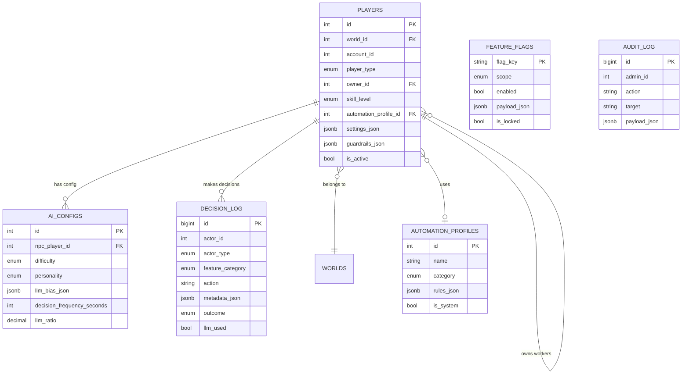
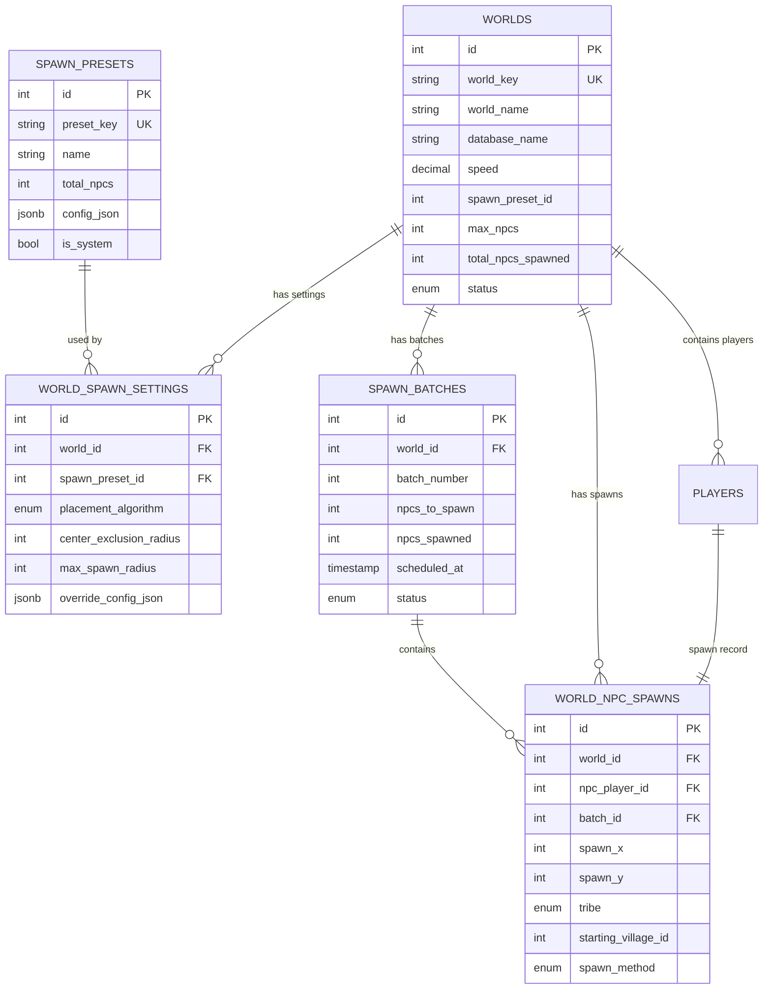

# Database Schema Deep Dive

**System:** Complete Automation + AI-NPC + World Generator  
**Database:** PostgreSQL 14+  
**Last Updated:** October 30, 2025  
**Schema Version:** 1.0  
**Total Tables:** 11 (6 Core + 5 World Management) + 1 Audit Events

---

## Table of Contents

1. [Schema Overview](#schema-overview)
2. [ENUM Type Definitions](#enum-type-definitions)
3. [Core Tables (6)](#core-tables)
4. [World Management Tables (5)](#world-management-tables)
5. [Audit & Logging Tables (1)](#audit--logging-tables)
6. [Entity Relationship Diagrams](#entity-relationship-diagrams)
7. [Index Catalog](#index-catalog)
8. [Foreign Key Constraints](#foreign-key-constraints)
9. [Query Patterns & Optimization](#query-patterns--optimization)
10. [Migration History](#migration-history)
11. [Schema Evolution Plan](#schema-evolution-plan)

---

## Schema Overview

### Database Architecture

The system uses a **unified schema** that combines:
- **Player Management** (Human + AI-NPC players)
- **Automation System** (Feature flags, profiles, decision tracking)
- **World Management** (Multi-world support, spawn configuration)
- **Audit & Compliance** (Action tracking, security logging)

### Key Design Principles

1. **Unified Player Model**: Both human and AI-NPC players use the same `players` table
2. **Feature Toggle System**: 3-tier feature flags (server, player, ai)
3. **Reusable Templates**: Automation profiles and spawn presets for configuration
4. **Extensive Indexing**: 30 indexes for query optimization
5. **JSON Flexibility**: JSONB columns for dynamic configuration
6. **Temporal Tracking**: Timestamps on all major tables

### Statistics

| Metric | Count |
|--------|-------|
| **Total Tables** | 12 |
| **ENUM Types** | 14 |
| **Indexes** | 37 |
| **Foreign Keys** | 8 |
| **Unique Constraints** | 4 |
| **Check Constraints** | 2 |

---

## ENUM Type Definitions

### Player & Actor Types

#### 1. `player_type_enum`
```sql
CREATE TYPE player_type_enum AS ENUM ('human', 'npc');
```
**Usage:** Distinguishes human players from AI-NPC players  
**Tables:** `players`

#### 2. `skill_level_enum`
```sql
CREATE TYPE skill_level_enum AS ENUM ('beginner', 'intermediate', 'advanced', 'expert');
```
**Usage:** Player skill level for automation intensity  
**Tables:** `players`

#### 3. `actor_type_enum`
```sql
CREATE TYPE actor_type_enum AS ENUM ('player', 'npc');
```
**Usage:** Decision log actor identification  
**Tables:** `decision_log`

### Automation & Feature Types

#### 4. `automation_category_enum`
```sql
CREATE TYPE automation_category_enum AS ENUM (
    'farming', 'building', 'training', 'defense', 
    'logistics', 'market', 'away_mode'
);
```
**Usage:** Categorizes automation profiles  
**Tables:** `automation_profiles`

#### 5. `feature_category_enum`
```sql
CREATE TYPE feature_category_enum AS ENUM (
    'farming', 'building', 'training', 'defense', 
    'logistics', 'market', 'away_mode', 'diplomacy', 'strategy'
);
```
**Usage:** Decision logging feature categorization  
**Tables:** `decision_log`  
**Note:** Superset of automation_category_enum with additional categories

#### 6. `feature_scope_enum`
```sql
CREATE TYPE feature_scope_enum AS ENUM ('server', 'player', 'ai');
```
**Usage:** 3-tier feature flag system  
**Tables:** `feature_flags`

### AI Configuration Types

#### 7. `ai_difficulty_enum`
```sql
CREATE TYPE ai_difficulty_enum AS ENUM ('easy', 'medium', 'hard', 'expert');
```
**Usage:** AI-NPC difficulty level  
**Tables:** `ai_configs`

#### 8. `personality_type_enum`
```sql
CREATE TYPE personality_type_enum AS ENUM (
    'aggressive', 'economic', 'balanced', 'diplomat', 'assassin'
);
```
**Usage:** AI-NPC personality traits  
**Tables:** `ai_configs`

#### 9. `outcome_enum`
```sql
CREATE TYPE outcome_enum AS ENUM ('success', 'skipped', 'error', 'rate_limited');
```
**Usage:** Decision execution results  
**Tables:** `decision_log`

### World & Spawn Types

#### 10. `world_status_enum`
```sql
CREATE TYPE world_status_enum AS ENUM (
    'planning', 'initializing', 'active', 'paused', 'archived'
);
```
**Usage:** Game world lifecycle states  
**Tables:** `worlds`

#### 11. `tribe_enum`
```sql
CREATE TYPE tribe_enum AS ENUM ('romans', 'gauls', 'teutons');
```
**Usage:** Player tribe/civilization  
**Tables:** `world_npc_spawns`

#### 12. `spawn_algorithm_enum`
```sql
CREATE TYPE spawn_algorithm_enum AS ENUM (
    'quadrant_balanced', 'random_scatter', 'kingdom_clustering'
);
```
**Usage:** NPC spawn distribution algorithms  
**Tables:** `world_spawn_settings`

#### 13. `spawn_batch_status_enum`
```sql
CREATE TYPE spawn_batch_status_enum AS ENUM (
    'pending', 'in_progress', 'completed', 'failed', 'cancelled'
);
```
**Usage:** Progressive spawn batch tracking  
**Tables:** `spawn_batches`

#### 14. `spawn_method_enum`
```sql
CREATE TYPE spawn_method_enum AS ENUM ('instant', 'progressive', 'manual');
```
**Usage:** How NPCs were spawned  
**Tables:** `world_npc_spawns`

---

## Core Tables

### Table 1: `players`
**Purpose:** Unified player registry for both human and AI-NPC players

#### Schema
```sql
CREATE TABLE players (
    id SERIAL PRIMARY KEY,
    world_id INTEGER NULL,
    account_id INTEGER NOT NULL,
    player_type player_type_enum NOT NULL DEFAULT 'human',
    owner_id INTEGER NULL,
    skill_level skill_level_enum DEFAULT 'intermediate',
    automation_profile_id INTEGER NULL,
    settings_json JSONB DEFAULT NULL,
    guardrails_json JSONB DEFAULT NULL,
    is_active BOOLEAN DEFAULT true,
    created_at TIMESTAMP NOT NULL DEFAULT NOW(),
    updated_at TIMESTAMP NOT NULL DEFAULT NOW()
);
```

#### Column Details

| Column | Type | Nullable | Default | Description |
|--------|------|----------|---------|-------------|
| `id` | SERIAL | NO | auto | Primary key |
| `world_id` | INTEGER | YES | NULL | Links to worlds table (multi-world support) |
| `account_id` | INTEGER | NO | - | Game account ID (links to game DB) |
| `player_type` | player_type_enum | NO | 'human' | Distinguishes human vs AI-NPC |
| `owner_id` | INTEGER | YES | NULL | For AI workers: references their owner player |
| `skill_level` | skill_level_enum | YES | 'intermediate' | Player skill for automation tuning |
| `automation_profile_id` | INTEGER | YES | NULL | Active automation profile |
| `settings_json` | JSONB | YES | NULL | Player-specific automation settings |
| `guardrails_json` | JSONB | YES | NULL | Safety limits and constraints |
| `is_active` | BOOLEAN | YES | true | Soft delete flag |
| `created_at` | TIMESTAMP | NO | NOW() | Record creation timestamp |
| `updated_at` | TIMESTAMP | NO | NOW() | Last update timestamp |

#### Indexes
- `idx_players_world` on `(world_id)` - World-based queries
- `idx_players_account` on `(account_id)` - Account lookup
- `idx_players_type_active` on `(player_type, is_active)` - Filter human/NPC players
- `idx_players_owner` on `(owner_id)` - Find AI workers by owner

#### Foreign Keys
- **Self-referencing:** `owner_id` → `players(id)` ON DELETE CASCADE
  - Enables AI workers to reference their human owner
  - Cascade ensures orphaned workers are deleted

#### JSON Schema Examples

**settings_json:**
```json
{
  "farmlist_intensity": "medium",
  "building_queue_enabled": true,
  "auto_train_enabled": false,
  "market_auto_balance": true
}
```

**guardrails_json:**
```json
{
  "max_raids_per_day": 500,
  "min_resource_reserve": 10000,
  "never_attack_alliance": true,
  "emergency_stop_on_attack": true
}
```

---

### Table 2: `automation_profiles`
**Purpose:** Reusable automation configuration templates

#### Schema
```sql
CREATE TABLE automation_profiles (
    id SERIAL PRIMARY KEY,
    name VARCHAR(100) NOT NULL,
    category automation_category_enum NOT NULL,
    rules_json JSONB NOT NULL,
    default_enabled BOOLEAN DEFAULT true,
    is_system BOOLEAN DEFAULT false,
    created_by INTEGER NULL,
    created_at TIMESTAMP NOT NULL DEFAULT NOW(),
    updated_at TIMESTAMP NOT NULL DEFAULT NOW(),
    
    CONSTRAINT unique_system_category UNIQUE (name, category, is_system)
);
```

#### Column Details

| Column | Type | Nullable | Default | Description |
|--------|------|----------|---------|-------------|
| `id` | SERIAL | NO | auto | Primary key |
| `name` | VARCHAR(100) | NO | - | Profile display name |
| `category` | automation_category_enum | NO | - | Automation category |
| `rules_json` | JSONB | NO | - | Configuration rules |
| `default_enabled` | BOOLEAN | YES | true | Enabled by default for new players |
| `is_system` | BOOLEAN | YES | false | System-managed (cannot be deleted) |
| `created_by` | INTEGER | YES | NULL | Creator player ID |
| `created_at` | TIMESTAMP | NO | NOW() | Creation timestamp |
| `updated_at` | TIMESTAMP | NO | NOW() | Last update timestamp |

#### Indexes
- `idx_automation_profiles_category` on `(category)` - Category filtering
- `idx_automation_profiles_system` on `(is_system)` - System vs custom profiles

#### Constraints
- **UNIQUE:** `(name, category, is_system)` - Prevents duplicate system profiles

#### JSON Schema Example

**rules_json for farming:**
```json
{
  "max_raids_per_hour": 50,
  "raid_interval_minutes": 5,
  "min_troops_required": 10,
  "target_selection": "nearest_inactive",
  "respect_nap": true
}
```

**rules_json for building:**
```json
{
  "priority": "resource_fields",
  "upgrade_order": ["warehouse", "granary", "resource"],
  "max_queue_depth": 2,
  "respect_crop_consumption": true
}
```

---

### Table 3: `feature_flags`
**Purpose:** 3-tier feature toggle system (server, player, ai)

#### Schema
```sql
CREATE TABLE feature_flags (
    flag_key VARCHAR(100) NOT NULL PRIMARY KEY,
    scope feature_scope_enum NOT NULL DEFAULT 'server',
    enabled BOOLEAN NOT NULL DEFAULT true,
    payload_json JSONB DEFAULT NULL,
    description TEXT DEFAULT NULL,
    is_locked BOOLEAN DEFAULT false,
    updated_by INTEGER NULL,
    updated_at TIMESTAMP NOT NULL DEFAULT NOW()
);
```

#### Column Details

| Column | Type | Nullable | Default | Description |
|--------|------|----------|---------|-------------|
| `flag_key` | VARCHAR(100) | NO | - | Primary key, unique flag identifier |
| `scope` | feature_scope_enum | NO | 'server' | Flag scope (server/player/ai) |
| `enabled` | BOOLEAN | NO | true | Flag state |
| `payload_json` | JSONB | YES | NULL | Optional configuration data |
| `description` | TEXT | YES | NULL | Human-readable description |
| `is_locked` | BOOLEAN | YES | false | Prevent accidental changes |
| `updated_by` | INTEGER | YES | NULL | Last modifier admin ID |
| `updated_at` | TIMESTAMP | NO | NOW() | Last update timestamp |

#### Indexes
- `idx_feature_flags_scope_enabled` on `(scope, enabled)` - Fast scope queries
- `idx_feature_flags_locked` on `(is_locked)` - Filter locked flags

#### Seed Data
```sql
INSERT INTO feature_flags (flag_key, scope, enabled, is_locked, description) VALUES
('farming', 'server', true, false, 'Farmlist automation'),
('building', 'server', true, false, 'Building automation'),
('training', 'server', true, false, 'Training automation'),
('defense', 'server', true, false, 'Defense automation'),
('logistics', 'server', true, false, 'Resource management'),
('market', 'server', true, false, 'Market automation'),
('away_mode', 'server', true, false, 'Away-mode full automation'),
('ai_npcs', 'ai', true, true, 'AI-NPC players (CORE FEATURE)'),
('ai_workers', 'ai', true, false, 'AI workers for humans'),
('ai_llm', 'ai', true, false, 'LLM strategic decisions');
```

---

### Table 4: `ai_configs`
**Purpose:** AI-NPC personality and behavior configuration

#### Schema
```sql
CREATE TABLE ai_configs (
    id SERIAL PRIMARY KEY,
    npc_player_id INTEGER NOT NULL,
    difficulty ai_difficulty_enum NOT NULL DEFAULT 'medium',
    personality personality_type_enum NOT NULL DEFAULT 'balanced',
    llm_bias_json JSONB DEFAULT NULL,
    decision_frequency_seconds INTEGER DEFAULT 300,
    llm_ratio DECIMAL(3,2) DEFAULT 0.05,
    last_decision_at TIMESTAMP NULL,
    last_sync_at TIMESTAMP NULL,
    created_at TIMESTAMP NOT NULL DEFAULT NOW(),
    updated_at TIMESTAMP NOT NULL DEFAULT NOW()
);
```

#### Column Details

| Column | Type | Nullable | Default | Description |
|--------|------|----------|---------|-------------|
| `id` | SERIAL | NO | auto | Primary key |
| `npc_player_id` | INTEGER | NO | - | Links to players table |
| `difficulty` | ai_difficulty_enum | NO | 'medium' | AI skill level |
| `personality` | personality_type_enum | NO | 'balanced' | Behavioral archetype |
| `llm_bias_json` | JSONB | YES | NULL | LLM prompt biases |
| `decision_frequency_seconds` | INTEGER | YES | 300 | How often AI decides (5 min) |
| `llm_ratio` | DECIMAL(3,2) | YES | 0.05 | % of decisions using LLM (5%) |
| `last_decision_at` | TIMESTAMP | YES | NULL | Last decision timestamp |
| `last_sync_at` | TIMESTAMP | YES | NULL | Last sync with game world |
| `created_at` | TIMESTAMP | NO | NOW() | Creation timestamp |
| `updated_at` | TIMESTAMP | NO | NOW() | Last update timestamp |

#### Indexes
- `idx_ai_configs_npc` on `(npc_player_id)` - NPC lookup
- `idx_ai_configs_difficulty` on `(difficulty)` - Difficulty filtering
- `idx_ai_configs_personality` on `(personality)` - Personality filtering
- `idx_ai_configs_last_decision` on `(last_decision_at)` - Scheduling queries

#### Foreign Keys
- **npc_player_id** → `players(id)` ON DELETE CASCADE
  - Each AI-NPC must have an entry in players table
  - Deleting player cascades to AI config

#### JSON Schema Example

**llm_bias_json:**
```json
{
  "aggressive_bias": 0.8,
  "economic_focus": 0.2,
  "risk_tolerance": "high",
  "preferred_targets": ["inactive_players", "weak_neighbors"],
  "avoid_targets": ["alliance_members", "top_10_players"]
}
```

---

### Table 5: `decision_log`
**Purpose:** Comprehensive automation and AI decision tracking

#### Schema
```sql
CREATE TABLE decision_log (
    id BIGSERIAL PRIMARY KEY,
    actor_id INTEGER NOT NULL,
    actor_type actor_type_enum NOT NULL,
    feature_category feature_category_enum NOT NULL,
    action VARCHAR(100) NOT NULL,
    metadata_json JSONB DEFAULT NULL,
    outcome outcome_enum NOT NULL DEFAULT 'success',
    execution_time_ms INTEGER DEFAULT NULL,
    llm_used BOOLEAN DEFAULT false,
    created_at TIMESTAMP NOT NULL DEFAULT NOW()
);
```

#### Column Details

| Column | Type | Nullable | Default | Description |
|--------|------|----------|---------|-------------|
| `id` | BIGSERIAL | NO | auto | Primary key (supports billions of records) |
| `actor_id` | INTEGER | NO | - | Player or NPC ID |
| `actor_type` | actor_type_enum | NO | - | Player vs NPC |
| `feature_category` | feature_category_enum | NO | - | What feature made decision |
| `action` | VARCHAR(100) | NO | - | Specific action taken |
| `metadata_json` | JSONB | YES | NULL | Action details and parameters |
| `outcome` | outcome_enum | NO | 'success' | Execution result |
| `execution_time_ms` | INTEGER | YES | NULL | Performance metric |
| `llm_used` | BOOLEAN | YES | false | Was LLM involved? |
| `created_at` | TIMESTAMP | NO | NOW() | Timestamp (immutable) |

#### Indexes
- `idx_decision_log_actor` on `(actor_id, actor_type)` - Actor-based queries
- `idx_decision_log_category_created` on `(feature_category, created_at)` - Category timeline
- `idx_decision_log_outcome` on `(outcome)` - Error filtering
- `idx_decision_log_llm` on `(llm_used)` - LLM usage analysis
- `idx_decision_log_created` on `(created_at)` - Time-based queries

#### Use Cases
1. **Debugging:** Track failed automation decisions
2. **Analytics:** Measure LLM vs rule-based performance
3. **Auditing:** Compliance and player behavior analysis
4. **Rate Limiting:** Prevent excessive automation

---

### Table 6: `audit_log`
**Purpose:** Admin action tracking for security and compliance

#### Schema
```sql
CREATE TABLE audit_log (
    id BIGSERIAL PRIMARY KEY,
    admin_id INTEGER NOT NULL,
    action VARCHAR(100) NOT NULL,
    target VARCHAR(255) DEFAULT NULL,
    payload_json JSONB DEFAULT NULL,
    ip_address VARCHAR(45) DEFAULT NULL,
    user_agent TEXT DEFAULT NULL,
    created_at TIMESTAMP NOT NULL DEFAULT NOW()
);
```

#### Column Details

| Column | Type | Nullable | Default | Description |
|--------|------|----------|---------|-------------|
| `id` | BIGSERIAL | NO | auto | Primary key |
| `admin_id` | INTEGER | NO | - | Admin user ID |
| `action` | VARCHAR(100) | NO | - | Action performed |
| `target` | VARCHAR(255) | YES | NULL | Target entity |
| `payload_json` | JSONB | YES | NULL | Action parameters |
| `ip_address` | VARCHAR(45) | YES | NULL | IPv4/IPv6 address |
| `user_agent` | TEXT | YES | NULL | Browser/client info |
| `created_at` | TIMESTAMP | NO | NOW() | Timestamp (immutable) |

#### Indexes
- `idx_audit_log_admin` on `(admin_id)` - Admin activity tracking
- `idx_audit_log_action` on `(action)` - Action filtering
- `idx_audit_log_created` on `(created_at)` - Time-based queries

#### Use Cases
1. **Security:** Track admin access and modifications
2. **Compliance:** Regulatory audit trails
3. **Forensics:** Incident investigation
4. **Accountability:** Admin action transparency

---

## World Management Tables

### Table 7: `worlds`
**Purpose:** Game world/server registry

#### Schema
```sql
CREATE TABLE worlds (
    id SERIAL PRIMARY KEY,
    world_key VARCHAR(50) NOT NULL UNIQUE,
    world_name VARCHAR(100) NOT NULL,
    database_name VARCHAR(100) NOT NULL,
    speed DECIMAL(3,1) DEFAULT 1.0,
    spawn_preset_id INTEGER NULL,
    max_npcs INTEGER DEFAULT 250,
    total_npcs_spawned INTEGER DEFAULT 0,
    status world_status_enum DEFAULT 'planning',
    created_at TIMESTAMP NOT NULL DEFAULT NOW(),
    started_at TIMESTAMP NULL
);
```

#### Column Details

| Column | Type | Nullable | Default | Description |
|--------|------|----------|---------|-------------|
| `id` | SERIAL | NO | auto | Primary key |
| `world_key` | VARCHAR(50) | NO | - | Unique world identifier (e.g., 'ts1', 'demo') |
| `world_name` | VARCHAR(100) | NO | - | Display name |
| `database_name` | VARCHAR(100) | NO | - | PostgreSQL database name |
| `speed` | DECIMAL(3,1) | YES | 1.0 | Game speed multiplier |
| `spawn_preset_id` | INTEGER | YES | NULL | Default spawn preset |
| `max_npcs` | INTEGER | YES | 250 | Maximum AI-NPCs allowed |
| `total_npcs_spawned` | INTEGER | YES | 0 | Running counter |
| `status` | world_status_enum | YES | 'planning' | World lifecycle state |
| `created_at` | TIMESTAMP | NO | NOW() | Creation timestamp |
| `started_at` | TIMESTAMP | YES | NULL | When world went active |

#### Indexes
- `idx_worlds_status` on `(status)` - Status filtering
- `idx_worlds_world_key` on `(world_key)` - Fast lookup by key

#### Constraints
- **UNIQUE:** `world_key` - Each world must have unique key

---

### Table 8: `spawn_presets`
**Purpose:** Reusable spawn configuration templates

#### Schema
```sql
CREATE TABLE spawn_presets (
    id SERIAL PRIMARY KEY,
    name VARCHAR(100) NOT NULL,
    preset_key VARCHAR(50) NOT NULL UNIQUE,
    total_npcs INTEGER NOT NULL,
    config_json JSONB NOT NULL,
    is_default BOOLEAN DEFAULT false,
    is_system BOOLEAN DEFAULT false,
    created_by INTEGER NULL,
    created_at TIMESTAMP NOT NULL DEFAULT NOW(),
    updated_at TIMESTAMP NOT NULL DEFAULT NOW()
);
```

#### Column Details

| Column | Type | Nullable | Default | Description |
|--------|------|----------|---------|-------------|
| `id` | SERIAL | NO | auto | Primary key |
| `name` | VARCHAR(100) | NO | - | Display name |
| `preset_key` | VARCHAR(50) | NO | - | Unique preset identifier |
| `total_npcs` | INTEGER | NO | - | Total NPCs to spawn |
| `config_json` | JSONB | NO | - | Detailed configuration |
| `is_default` | BOOLEAN | YES | false | Use as default for new worlds |
| `is_system` | BOOLEAN | YES | false | System-managed preset |
| `created_by` | INTEGER | YES | NULL | Creator admin ID |
| `created_at` | TIMESTAMP | NO | NOW() | Creation timestamp |
| `updated_at` | TIMESTAMP | NO | NOW() | Last update timestamp |

#### Indexes
- `idx_spawn_presets_preset_key` on `(preset_key)` - Fast lookup
- `idx_spawn_presets_system` on `(is_system)` - System vs custom presets

#### JSON Schema Example

**config_json:**
```json
{
  "tribes": {
    "romans": 100,
    "gauls": 100,
    "teutons": 50
  },
  "personalities": {
    "aggressive": 50,
    "economic": 100,
    "balanced": 75,
    "diplomat": 25
  },
  "difficulty_distribution": {
    "easy": 50,
    "medium": 150,
    "hard": 40,
    "expert": 10
  },
  "batches": [
    {"at_hours": 0, "count": 50},
    {"at_hours": 24, "count": 50},
    {"at_hours": 72, "count": 50},
    {"at_hours": 168, "count": 100}
  ]
}
```

---

### Table 9: `world_spawn_settings`
**Purpose:** Per-world spawn configuration

#### Schema
```sql
CREATE TABLE world_spawn_settings (
    id SERIAL PRIMARY KEY,
    world_id INTEGER NOT NULL,
    spawn_preset_id INTEGER NOT NULL,
    placement_algorithm spawn_algorithm_enum DEFAULT 'quadrant_balanced',
    center_exclusion_radius INTEGER DEFAULT 50,
    max_spawn_radius INTEGER DEFAULT 400,
    progressive_spawning BOOLEAN DEFAULT true,
    override_config_json JSONB DEFAULT NULL,
    created_at TIMESTAMP NOT NULL DEFAULT NOW()
);
```

#### Column Details

| Column | Type | Nullable | Default | Description |
|--------|------|----------|---------|-------------|
| `id` | SERIAL | NO | auto | Primary key |
| `world_id` | INTEGER | NO | - | Links to worlds table |
| `spawn_preset_id` | INTEGER | NO | - | Active preset |
| `placement_algorithm` | spawn_algorithm_enum | YES | 'quadrant_balanced' | Spatial distribution |
| `center_exclusion_radius` | INTEGER | YES | 50 | Tiles to exclude from center |
| `max_spawn_radius` | INTEGER | YES | 400 | Maximum distance from center |
| `progressive_spawning` | BOOLEAN | YES | true | Spawn in batches over time |
| `override_config_json` | JSONB | YES | NULL | World-specific overrides |
| `created_at` | TIMESTAMP | NO | NOW() | Creation timestamp |

#### Indexes
- `idx_world_spawn_settings_world` on `(world_id)` - World lookup

#### Foreign Keys
- **world_id** → `worlds(id)` ON DELETE CASCADE
- **spawn_preset_id** → `spawn_presets(id)` (no cascade)

---

### Table 10: `spawn_batches`
**Purpose:** Progressive spawn scheduling and tracking

#### Schema
```sql
CREATE TABLE spawn_batches (
    id SERIAL PRIMARY KEY,
    world_id INTEGER NOT NULL,
    batch_number INTEGER NOT NULL,
    npcs_to_spawn INTEGER NOT NULL,
    npcs_spawned INTEGER DEFAULT 0,
    scheduled_at TIMESTAMP NOT NULL,
    started_at TIMESTAMP NULL,
    completed_at TIMESTAMP NULL,
    status spawn_batch_status_enum DEFAULT 'pending',
    error_message TEXT NULL,
    created_at TIMESTAMP NOT NULL DEFAULT NOW()
);
```

#### Column Details

| Column | Type | Nullable | Default | Description |
|--------|------|----------|---------|-------------|
| `id` | SERIAL | NO | auto | Primary key |
| `world_id` | INTEGER | NO | - | Links to worlds table |
| `batch_number` | INTEGER | NO | - | Sequential batch number |
| `npcs_to_spawn` | INTEGER | NO | - | Target count |
| `npcs_spawned` | INTEGER | YES | 0 | Actual count spawned |
| `scheduled_at` | TIMESTAMP | NO | - | When to spawn |
| `started_at` | TIMESTAMP | YES | NULL | Execution start time |
| `completed_at` | TIMESTAMP | YES | NULL | Execution end time |
| `status` | spawn_batch_status_enum | YES | 'pending' | Batch state |
| `error_message` | TEXT | YES | NULL | Failure reason |
| `created_at` | TIMESTAMP | NO | NOW() | Creation timestamp |

#### Indexes
- `idx_spawn_batches_world_batch` on `(world_id, batch_number)` - Composite lookup
- `idx_spawn_batches_status_scheduled` on `(status, scheduled_at)` - Scheduler queries

#### Foreign Keys
- **world_id** → `worlds(id)` ON DELETE CASCADE

---

### Table 11: `world_npc_spawns`
**Purpose:** Track each individual spawned NPC

#### Schema
```sql
CREATE TABLE world_npc_spawns (
    id SERIAL PRIMARY KEY,
    world_id INTEGER NOT NULL,
    npc_player_id INTEGER NOT NULL,
    batch_id INTEGER NULL,
    spawn_x INTEGER NOT NULL,
    spawn_y INTEGER NOT NULL,
    tribe tribe_enum NOT NULL,
    starting_village_id INTEGER NULL,
    spawn_method spawn_method_enum DEFAULT 'instant',
    spawned_at TIMESTAMP NOT NULL DEFAULT NOW()
);
```

#### Column Details

| Column | Type | Nullable | Default | Description |
|--------|------|----------|---------|-------------|
| `id` | SERIAL | NO | auto | Primary key |
| `world_id` | INTEGER | NO | - | Links to worlds table |
| `npc_player_id` | INTEGER | NO | - | Links to players table |
| `batch_id` | INTEGER | YES | NULL | Links to spawn_batches table |
| `spawn_x` | INTEGER | NO | - | Map X coordinate |
| `spawn_y` | INTEGER | NO | - | Map Y coordinate |
| `tribe` | tribe_enum | NO | - | Tribe selection |
| `starting_village_id` | INTEGER | YES | NULL | Game world village ID |
| `spawn_method` | spawn_method_enum | YES | 'instant' | How spawned |
| `spawned_at` | TIMESTAMP | NO | NOW() | Spawn timestamp |

#### Indexes
- `idx_world_npc_spawns_world_npc` on `(world_id, npc_player_id)` - Composite lookup
- `idx_world_npc_spawns_coordinates` on `(spawn_x, spawn_y)` - Spatial queries
- `idx_world_npc_spawns_batch` on `(batch_id)` - Batch tracking

#### Foreign Keys
- **world_id** → `worlds(id)` ON DELETE CASCADE
- **npc_player_id** → `players(id)` ON DELETE CASCADE
- **batch_id** → `spawn_batches(id)` ON DELETE SET NULL

---

## Audit & Logging Tables

### Table 12: `audit_events`
**Purpose:** Security and compliance event tracking (migration)

#### Schema
```sql
CREATE TABLE audit_events (
    id BIGSERIAL PRIMARY KEY,
    event_type VARCHAR(50) NOT NULL,
    actor_type VARCHAR(20) NOT NULL,
    actor_id VARCHAR(50),
    target_type VARCHAR(50),
    target_id VARCHAR(50),
    action VARCHAR(50) NOT NULL,
    details JSONB NOT NULL DEFAULT '{}'::jsonb,
    metadata JSONB,
    severity VARCHAR(20) DEFAULT 'info',
    created_at TIMESTAMP WITH TIME ZONE DEFAULT CURRENT_TIMESTAMP NOT NULL,
    CONSTRAINT ck_actor_type CHECK (actor_type IN ('user', 'system', 'admin', 'worker', 'api')),
    CONSTRAINT ck_severity CHECK (severity IN ('debug', 'info', 'warning', 'error', 'critical'))
);
```

#### Column Details

| Column | Type | Nullable | Default | Description |
|--------|------|----------|---------|-------------|
| `id` | BIGSERIAL | NO | auto | Primary key |
| `event_type` | VARCHAR(50) | NO | - | Event category |
| `actor_type` | VARCHAR(20) | NO | - | Who performed action |
| `actor_id` | VARCHAR(50) | YES | NULL | Actor identifier |
| `target_type` | VARCHAR(50) | YES | NULL | What was affected |
| `target_id` | VARCHAR(50) | YES | NULL | Target identifier |
| `action` | VARCHAR(50) | NO | - | Action performed |
| `details` | JSONB | NO | {} | Event details |
| `metadata` | JSONB | YES | NULL | Request metadata |
| `severity` | VARCHAR(20) | YES | 'info' | Log level |
| `created_at` | TIMESTAMP WITH TIME ZONE | NO | NOW() | Timestamp |

#### Indexes
- `idx_audit_events_created_at` on `(created_at DESC)` - Time-based queries
- `idx_audit_events_event_type` on `(event_type)` - Event filtering
- `idx_audit_events_actor` on `(actor_type, actor_id)` - Actor tracking
- `idx_audit_events_target` on `(target_type, target_id)` - Target tracking
- `idx_audit_events_severity` on `(severity)` WHERE severity IN ('error', 'critical') - Partial index for errors
- **GIN:** `idx_audit_events_details` on `(details)` - JSON queries
- **GIN:** `idx_audit_events_metadata` on `(metadata)` - JSON queries

#### Constraints
- **CHECK:** `actor_type` IN ('user', 'system', 'admin', 'worker', 'api')
- **CHECK:** `severity` IN ('debug', 'info', 'warning', 'error', 'critical')

---

## Entity Relationship Diagrams

### Core System ERD



### World Management ERD



### Data Flow Diagram

```
┌─────────────┐
│   WORLDS    │
└──────┬──────┘
       │
       ├──────────────────────────┐
       │                          │
       ▼                          ▼
┌──────────────┐          ┌──────────────┐
│ SPAWN_PRESET │◄─────────┤ WORLD_SPAWN  │
│              │          │  _SETTINGS   │
└──────────────┘          └──────┬───────┘
                                 │
                                 ▼
                          ┌──────────────┐
                          │ SPAWN_BATCHES│
                          └──────┬───────┘
                                 │
                                 ▼
                          ┌──────────────┐
                          │ WORLD_NPC    │
                          │  _SPAWNS     │
                          └──────┬───────┘
                                 │
                                 ▼
                          ┌──────────────┐
                          │   PLAYERS    │
                          │ (type='npc') │
                          └──────┬───────┘
                                 │
                                 ▼
                          ┌──────────────┐
                          │ AI_CONFIGS   │
                          └──────┬───────┘
                                 │
                                 ▼
                          ┌──────────────┐
                          │ DECISION_LOG │
                          └──────────────┘
```

---

## Index Catalog

### Index Summary

| Table | Index Count | Index Types |
|-------|-------------|-------------|
| players | 4 | B-tree |
| automation_profiles | 2 | B-tree |
| feature_flags | 2 | B-tree |
| ai_configs | 4 | B-tree |
| decision_log | 5 | B-tree |
| audit_log | 3 | B-tree |
| worlds | 2 | B-tree |
| spawn_presets | 2 | B-tree |
| world_spawn_settings | 1 | B-tree |
| spawn_batches | 2 | B-tree (composite) |
| world_npc_spawns | 3 | B-tree |
| audit_events | 7 | B-tree (5) + GIN (2) |
| **TOTAL** | **37** | **B-tree: 35, GIN: 2** |

### Detailed Index Analysis

#### Players Table Indexes (4)

| Index Name | Columns | Type | Purpose | Cardinality | Selectivity |
|------------|---------|------|---------|-------------|-------------|
| `idx_players_world` | (world_id) | B-tree | Filter by world | Low-Medium | Medium |
| `idx_players_account` | (account_id) | B-tree | Account lookup | High | High |
| `idx_players_type_active` | (player_type, is_active) | B-tree | Filter human/NPC | Low | Low |
| `idx_players_owner` | (owner_id) | B-tree | Find AI workers | Medium | Medium |

**Query Patterns:**
- Get all NPCs in world: `WHERE world_id = ? AND player_type = 'npc'`
- Get player by account: `WHERE account_id = ?`
- Get active humans: `WHERE player_type = 'human' AND is_active = true`
- Get AI workers: `WHERE owner_id = ?`

#### Automation Profiles Indexes (2)

| Index Name | Columns | Type | Purpose |
|------------|---------|------|---------|
| `idx_automation_profiles_category` | (category) | B-tree | Category filtering |
| `idx_automation_profiles_system` | (is_system) | B-tree | System vs custom |

#### Feature Flags Indexes (2)

| Index Name | Columns | Type | Purpose |
|------------|---------|------|---------|
| `idx_feature_flags_scope_enabled` | (scope, enabled) | B-tree | Scope-based queries |
| `idx_feature_flags_locked` | (is_locked) | B-tree | Admin UI filtering |

#### AI Configs Indexes (4)

| Index Name | Columns | Type | Purpose |
|------------|---------|------|---------|
| `idx_ai_configs_npc` | (npc_player_id) | B-tree | NPC lookup |
| `idx_ai_configs_difficulty` | (difficulty) | B-tree | Difficulty filtering |
| `idx_ai_configs_personality` | (personality) | B-tree | Personality filtering |
| `idx_ai_configs_last_decision` | (last_decision_at) | B-tree | Scheduling (find stale) |

**Query Pattern:**
```sql
SELECT npc_player_id 
FROM ai_configs 
WHERE last_decision_at < NOW() - INTERVAL '5 minutes'
ORDER BY last_decision_at ASC 
LIMIT 100;
```

#### Decision Log Indexes (5)

| Index Name | Columns | Type | Purpose | Use Case |
|------------|---------|------|---------|----------|
| `idx_decision_log_actor` | (actor_id, actor_type) | B-tree | Actor queries | Player history |
| `idx_decision_log_category_created` | (feature_category, created_at) | B-tree | Timeline by category | Analytics |
| `idx_decision_log_outcome` | (outcome) | B-tree | Error filtering | Debugging |
| `idx_decision_log_llm` | (llm_used) | B-tree | LLM analysis | Performance tracking |
| `idx_decision_log_created` | (created_at) | B-tree | Time-based queries | Archival |

**Query Patterns:**
- Player decision history: `WHERE actor_id = ? AND actor_type = 'player' ORDER BY created_at DESC`
- Failed decisions: `WHERE outcome IN ('error', 'rate_limited')`
- LLM usage: `WHERE llm_used = true AND created_at > ?`
- Category stats: `WHERE feature_category = 'farming' AND created_at > ?`

#### Audit Log Indexes (3)

| Index Name | Columns | Type | Purpose |
|------------|---------|------|---------|
| `idx_audit_log_admin` | (admin_id) | B-tree | Admin tracking |
| `idx_audit_log_action` | (action) | B-tree | Action filtering |
| `idx_audit_log_created` | (created_at) | B-tree | Time-based queries |

#### World Management Indexes (10)

| Table | Index Name | Columns | Purpose |
|-------|------------|---------|---------|
| worlds | `idx_worlds_status` | (status) | Status filtering |
| worlds | `idx_worlds_world_key` | (world_key) | Fast lookup |
| spawn_presets | `idx_spawn_presets_preset_key` | (preset_key) | Fast lookup |
| spawn_presets | `idx_spawn_presets_system` | (is_system) | System vs custom |
| world_spawn_settings | `idx_world_spawn_settings_world` | (world_id) | World lookup |
| spawn_batches | `idx_spawn_batches_world_batch` | (world_id, batch_number) | Composite lookup |
| spawn_batches | `idx_spawn_batches_status_scheduled` | (status, scheduled_at) | Scheduler queries |
| world_npc_spawns | `idx_world_npc_spawns_world_npc` | (world_id, npc_player_id) | Composite lookup |
| world_npc_spawns | `idx_world_npc_spawns_coordinates` | (spawn_x, spawn_y) | Spatial queries |
| world_npc_spawns | `idx_world_npc_spawns_batch` | (batch_id) | Batch tracking |

#### Audit Events Indexes (7)

| Index Name | Columns | Type | Purpose |
|------------|---------|------|---------|
| `idx_audit_events_created_at` | (created_at DESC) | B-tree | Time-based queries |
| `idx_audit_events_event_type` | (event_type) | B-tree | Event filtering |
| `idx_audit_events_actor` | (actor_type, actor_id) | B-tree | Actor tracking |
| `idx_audit_events_target` | (target_type, target_id) | B-tree | Target tracking |
| `idx_audit_events_severity` | (severity) [partial] | B-tree | Error filtering |
| `idx_audit_events_details` | (details) | GIN | JSON queries |
| `idx_audit_events_metadata` | (metadata) | GIN | JSON queries |

**Partial Index:**
```sql
CREATE INDEX idx_audit_events_severity 
ON audit_events(severity) 
WHERE severity IN ('error', 'critical');
```
**Benefit:** Only indexes error/critical records, reducing index size by ~95%

---

## Foreign Key Constraints

### Constraint Summary

| Table | FK Constraint | References | Delete Action |
|-------|---------------|------------|---------------|
| players | `fk_players_owner` | players(id) | CASCADE |
| ai_configs | `fk_ai_configs_npc_player` | players(id) | CASCADE |
| world_spawn_settings | `fk_world_spawn_settings_world` | worlds(id) | CASCADE |
| world_spawn_settings | `fk_world_spawn_settings_preset` | spawn_presets(id) | RESTRICT |
| spawn_batches | `fk_spawn_batches_world` | worlds(id) | CASCADE |
| world_npc_spawns | `fk_world_npc_spawns_world` | worlds(id) | CASCADE |
| world_npc_spawns | `fk_world_npc_spawns_npc_player` | players(id) | CASCADE |
| world_npc_spawns | `fk_world_npc_spawns_batch` | spawn_batches(id) | SET NULL |

### Constraint Details

#### 1. `fk_players_owner` (Self-Referencing)
```sql
ALTER TABLE players ADD CONSTRAINT fk_players_owner 
    FOREIGN KEY (owner_id) REFERENCES players(id) ON DELETE CASCADE;
```
**Purpose:** AI workers reference their human owner  
**Cascade Logic:** Deleting owner deletes all their AI workers  
**Example:** Player #1 has AI workers #101, #102. Delete player #1 → workers #101, #102 deleted

#### 2. `fk_ai_configs_npc_player`
```sql
ALTER TABLE ai_configs ADD CONSTRAINT fk_ai_configs_npc_player 
    FOREIGN KEY (npc_player_id) REFERENCES players(id) ON DELETE CASCADE;
```
**Purpose:** Every AI config belongs to an NPC player  
**Cascade Logic:** Deleting NPC deletes its AI config  
**Example:** Delete NPC player #50 → ai_configs record for player #50 deleted

#### 3. `fk_world_spawn_settings_world`
```sql
ALTER TABLE world_spawn_settings ADD CONSTRAINT fk_world_spawn_settings_world 
    FOREIGN KEY (world_id) REFERENCES worlds(id) ON DELETE CASCADE;
```
**Purpose:** Spawn settings belong to a world  
**Cascade Logic:** Deleting world deletes its spawn settings  

#### 4. `fk_world_spawn_settings_preset`
```sql
ALTER TABLE world_spawn_settings ADD CONSTRAINT fk_world_spawn_settings_preset 
    FOREIGN KEY (spawn_preset_id) REFERENCES spawn_presets(id);
```
**Purpose:** Settings reference a spawn preset  
**Cascade Logic:** DEFAULT (RESTRICT) - Cannot delete preset if in use  
**Note:** No explicit ON DELETE means RESTRICT

#### 5. `fk_spawn_batches_world`
```sql
ALTER TABLE spawn_batches ADD CONSTRAINT fk_spawn_batches_world 
    FOREIGN KEY (world_id) REFERENCES worlds(id) ON DELETE CASCADE;
```
**Purpose:** Batches belong to a world  
**Cascade Logic:** Deleting world deletes all batches

#### 6. `fk_world_npc_spawns_world`
```sql
ALTER TABLE world_npc_spawns ADD CONSTRAINT fk_world_npc_spawns_world 
    FOREIGN KEY (world_id) REFERENCES worlds(id) ON DELETE CASCADE;
```
**Purpose:** Spawn records belong to a world  
**Cascade Logic:** Deleting world deletes all spawn records

#### 7. `fk_world_npc_spawns_npc_player`
```sql
ALTER TABLE world_npc_spawns ADD CONSTRAINT fk_world_npc_spawns_npc_player 
    FOREIGN KEY (npc_player_id) REFERENCES players(id) ON DELETE CASCADE;
```
**Purpose:** Spawn record links to player  
**Cascade Logic:** Deleting player deletes spawn record

#### 8. `fk_world_npc_spawns_batch`
```sql
ALTER TABLE world_npc_spawns ADD CONSTRAINT fk_world_npc_spawns_batch 
    FOREIGN KEY (batch_id) REFERENCES spawn_batches(id) ON DELETE SET NULL;
```
**Purpose:** Optional batch tracking  
**Cascade Logic:** Deleting batch sets batch_id to NULL (preserves spawn record)  
**Rationale:** Spawn record still valid even if batch deleted

### Cascade Chain Example

**Deleting a World:**
```
DELETE FROM worlds WHERE id = 1;

Cascade chain:
1. world_spawn_settings (world_id=1) → DELETED
2. spawn_batches (world_id=1) → DELETED
   ├─ world_npc_spawns (batch_id) → SET NULL
3. world_npc_spawns (world_id=1) → DELETED
   ├─ players (npc records) → DELETED
       ├─ ai_configs → DELETED
       ├─ decision_log → ORPHANED (no FK)
```

**Note:** `decision_log` has no FK constraint, so records remain for historical analysis

---

## Query Patterns & Optimization

### Common Query Patterns

#### 1. NPC Scheduling Query
**Purpose:** Find NPCs that need AI decisions

```sql
SELECT 
    p.id AS player_id,
    p.account_id,
    ac.difficulty,
    ac.personality,
    ac.llm_ratio
FROM players p
INNER JOIN ai_configs ac ON p.id = ac.npc_player_id
WHERE 
    p.player_type = 'npc'
    AND p.is_active = true
    AND p.world_id = $1
    AND (ac.last_decision_at IS NULL 
         OR ac.last_decision_at < NOW() - (ac.decision_frequency_seconds * INTERVAL '1 second'))
ORDER BY ac.last_decision_at ASC NULLS FIRST
LIMIT 100;
```

**Indexes Used:**
- `idx_players_type_active` (player_type, is_active)
- `idx_players_world` (world_id)
- `idx_ai_configs_last_decision` (last_decision_at)

**Optimization:** Consider composite index on `(world_id, player_type, is_active, last_decision_at)`

#### 2. Decision Analytics Query
**Purpose:** Analyze automation performance by category

```sql
SELECT 
    feature_category,
    outcome,
    COUNT(*) AS total,
    AVG(execution_time_ms) AS avg_time_ms,
    SUM(CASE WHEN llm_used THEN 1 ELSE 0 END) AS llm_count,
    ROUND(100.0 * SUM(CASE WHEN llm_used THEN 1 ELSE 0 END) / COUNT(*), 2) AS llm_percentage
FROM decision_log
WHERE created_at > NOW() - INTERVAL '24 hours'
GROUP BY feature_category, outcome
ORDER BY feature_category, outcome;
```

**Indexes Used:**
- `idx_decision_log_category_created` (feature_category, created_at)
- `idx_decision_log_llm` (llm_used)

**Optimization:** Covering index to avoid table lookups:
```sql
CREATE INDEX idx_decision_log_analytics 
ON decision_log (feature_category, created_at, outcome, llm_used, execution_time_ms);
```

#### 3. Spawn Progress Query
**Purpose:** Monitor world spawn progress

```sql
SELECT 
    w.world_key,
    w.world_name,
    w.max_npcs,
    w.total_npcs_spawned,
    sb.batch_number,
    sb.npcs_to_spawn,
    sb.npcs_spawned,
    sb.status,
    sb.scheduled_at,
    ROUND(100.0 * w.total_npcs_spawned / NULLIF(w.max_npcs, 0), 2) AS progress_pct
FROM worlds w
LEFT JOIN spawn_batches sb ON w.id = sb.world_id
WHERE w.status = 'initializing'
ORDER BY w.id, sb.batch_number;
```

**Indexes Used:**
- `idx_worlds_status` (status)
- `idx_spawn_batches_world_batch` (world_id, batch_number)

#### 4. Spatial Spawn Query
**Purpose:** Find available spawn locations

```sql
SELECT spawn_x, spawn_y
FROM world_npc_spawns
WHERE 
    world_id = $1
    AND spawn_x BETWEEN $2 AND $3
    AND spawn_y BETWEEN $4 AND $5;
```

**Indexes Used:**
- `idx_world_npc_spawns_coordinates` (spawn_x, spawn_y)

**Optimization:** Consider 2D spatial index (PostGIS):
```sql
CREATE INDEX idx_world_npc_spawns_location 
ON world_npc_spawns USING GIST (point(spawn_x, spawn_y));
```

#### 5. Player Automation Config Query
**Purpose:** Load player automation settings

```sql
SELECT 
    p.id,
    p.player_type,
    p.skill_level,
    p.settings_json,
    p.guardrails_json,
    ap.name AS profile_name,
    ap.category AS profile_category,
    ap.rules_json AS profile_rules
FROM players p
LEFT JOIN automation_profiles ap ON p.automation_profile_id = ap.id
WHERE p.account_id = $1 AND p.world_id = $2;
```

**Indexes Used:**
- `idx_players_account` (account_id)
- `idx_players_world` (world_id)

**Optimization:** Composite index on (account_id, world_id):
```sql
CREATE INDEX idx_players_account_world 
ON players (account_id, world_id);
```

### Optimization Recommendations

#### High-Priority Optimizations

1. **Add Composite Indexes**
```sql
-- Player lookup optimization
CREATE INDEX idx_players_account_world ON players (account_id, world_id);

-- NPC scheduling optimization
CREATE INDEX idx_players_npc_scheduling 
ON players (world_id, player_type, is_active, id)
WHERE player_type = 'npc';

-- Decision analytics covering index
CREATE INDEX idx_decision_log_analytics 
ON decision_log (feature_category, created_at DESC, outcome, llm_used, execution_time_ms);
```

2. **Partial Indexes for Hot Paths**
```sql
-- Active NPCs only
CREATE INDEX idx_players_active_npcs 
ON players (world_id, id)
WHERE player_type = 'npc' AND is_active = true;

-- Pending spawn batches
CREATE INDEX idx_spawn_batches_pending 
ON spawn_batches (world_id, scheduled_at)
WHERE status = 'pending';

-- Failed decisions
CREATE INDEX idx_decision_log_errors 
ON decision_log (actor_id, created_at DESC)
WHERE outcome IN ('error', 'rate_limited');
```

3. **JSONB Indexes for Common Queries**
```sql
-- If querying specific settings frequently
CREATE INDEX idx_players_settings_farmlist 
ON players USING GIN ((settings_json->'farmlist_intensity'));

-- If filtering by LLM bias
CREATE INDEX idx_ai_configs_llm_bias 
ON ai_configs USING GIN (llm_bias_json);
```

#### Medium-Priority Optimizations

4. **Table Partitioning for Large Tables**

**decision_log** (grows unbounded):
```sql
-- Partition by month
CREATE TABLE decision_log_2025_11 PARTITION OF decision_log
    FOR VALUES FROM ('2025-11-01') TO ('2025-12-01');

CREATE TABLE decision_log_2025_12 PARTITION OF decision_log
    FOR VALUES FROM ('2025-12-01') TO ('2026-01-01');
```

**audit_events** (compliance retention):
```sql
-- Partition by quarter
CREATE TABLE audit_events_2025_q4 PARTITION OF audit_events
    FOR VALUES FROM ('2025-10-01') TO ('2026-01-01');
```

5. **Materialized Views for Analytics**
```sql
-- Decision statistics by player
CREATE MATERIALIZED VIEW mv_player_decision_stats AS
SELECT 
    actor_id,
    feature_category,
    COUNT(*) AS total_decisions,
    SUM(CASE WHEN outcome = 'success' THEN 1 ELSE 0 END) AS successful,
    SUM(CASE WHEN llm_used THEN 1 ELSE 0 END) AS llm_decisions,
    AVG(execution_time_ms) AS avg_exec_time
FROM decision_log
WHERE created_at > NOW() - INTERVAL '30 days'
GROUP BY actor_id, feature_category;

CREATE UNIQUE INDEX idx_mv_player_decision_stats 
ON mv_player_decision_stats (actor_id, feature_category);

-- Refresh hourly
REFRESH MATERIALIZED VIEW CONCURRENTLY mv_player_decision_stats;
```

#### Low-Priority Optimizations

6. **VACUUM and ANALYZE Schedule**
```sql
-- Auto-vacuum settings in postgresql.conf
autovacuum_vacuum_scale_factor = 0.1
autovacuum_analyze_scale_factor = 0.05

-- Manual optimization for heavy write tables
VACUUM ANALYZE decision_log;
VACUUM ANALYZE audit_events;
```

7. **Query Plan Monitoring**
```sql
-- Enable pg_stat_statements
CREATE EXTENSION IF NOT EXISTS pg_stat_statements;

-- Find slow queries
SELECT 
    query,
    calls,
    total_exec_time,
    mean_exec_time,
    stddev_exec_time
FROM pg_stat_statements
ORDER BY mean_exec_time DESC
LIMIT 20;
```

### Anti-Patterns to Avoid

1. **Avoid N+1 Queries**
```sql
-- BAD: Separate query for each player
SELECT * FROM ai_configs WHERE npc_player_id = $1;

-- GOOD: Join in single query
SELECT p.*, ac.* 
FROM players p 
LEFT JOIN ai_configs ac ON p.id = ac.npc_player_id
WHERE p.world_id = $1;
```

2. **Avoid Full Table Scans on Large Tables**
```sql
-- BAD: No index on created_at
SELECT * FROM decision_log WHERE created_at > NOW() - INTERVAL '1 hour';

-- GOOD: Use existing index
SELECT * FROM decision_log 
WHERE created_at > NOW() - INTERVAL '1 hour'
ORDER BY created_at DESC
LIMIT 1000;
```

3. **Avoid Large JSON Extractions**
```sql
-- BAD: Extracting large JSON blobs
SELECT settings_json FROM players;

-- GOOD: Extract only needed fields
SELECT settings_json->>'farmlist_intensity' AS farmlist 
FROM players;
```

---

## Migration History

### Schema Version Timeline

| Version | Date | Migration | Status | Notes |
|---------|------|-----------|--------|-------|
| **1.0** | 2025-10-30 | Initial Schema | ✅ Complete | Complete automation + AI system |
| **1.1** | 2025-10-30 | Audit Events | ✅ Complete | Security and compliance tracking |

### Migration Files

#### 1. Initial Schema (v1.0)
**File:** `database/schemas/complete-automation-ai-system.sql`  
**Date:** October 30, 2025  
**Purpose:** Complete system foundation

**Changes:**
- Created 14 ENUM types
- Created 11 core tables
- Added 30 indexes
- Defined 8 foreign key constraints
- Seeded feature flags and automation profiles

**DDL Stats:**
- ENUM types: 14
- Tables: 11
- Indexes: 30
- Foreign keys: 8
- Unique constraints: 4
- Check constraints: 0
- Seed records: 18

#### 2. Audit Events (v1.1)
**File:** `database/migrations/create-audit-events.sql`  
**Date:** October 30, 2025  
**Purpose:** Enhanced security and compliance tracking

**Changes:**
- Created `audit_events` table
- Added 7 indexes (5 B-tree + 2 GIN)
- Added 2 CHECK constraints
- Supports JSON query patterns

**Features:**
- Multi-actor tracking (user, system, admin, worker, api)
- Severity levels (debug, info, warning, error, critical)
- Partial index on errors only
- GIN indexes for JSON queries
- Prepared for partitioning

### Migration Workflow

**Process:**
1. Edit schema file in `database/schemas/`
2. Test on development database
3. Create migration SQL in `database/migrations/`
4. Document changes in this file
5. Apply to production via `psql`

**Best Practices:**
- Use `IF NOT EXISTS` for all DDL
- Use `DO $$ ... END $$` for ENUM types
- Always add indexes AFTER table creation
- Seed data uses `ON CONFLICT DO NOTHING`
- Test rollback procedures

### Rollback Procedures

#### Rollback Audit Events (v1.1 → v1.0)
```sql
-- Drop audit_events table and all indexes
DROP TABLE IF EXISTS audit_events CASCADE;
```

#### Rollback Complete Schema (v1.0 → v0.0)
```sql
-- WARNING: DESTRUCTIVE - Drops all tables and types
DROP TABLE IF EXISTS world_npc_spawns CASCADE;
DROP TABLE IF EXISTS spawn_batches CASCADE;
DROP TABLE IF EXISTS world_spawn_settings CASCADE;
DROP TABLE IF EXISTS spawn_presets CASCADE;
DROP TABLE IF EXISTS worlds CASCADE;
DROP TABLE IF EXISTS audit_log CASCADE;
DROP TABLE IF EXISTS decision_log CASCADE;
DROP TABLE IF EXISTS ai_configs CASCADE;
DROP TABLE IF EXISTS feature_flags CASCADE;
DROP TABLE IF EXISTS automation_profiles CASCADE;
DROP TABLE IF EXISTS players CASCADE;

-- Drop ENUM types
DROP TYPE IF EXISTS spawn_method_enum;
DROP TYPE IF EXISTS spawn_batch_status_enum;
DROP TYPE IF EXISTS spawn_algorithm_enum;
DROP TYPE IF EXISTS tribe_enum;
DROP TYPE IF EXISTS world_status_enum;
DROP TYPE IF EXISTS outcome_enum;
DROP TYPE IF EXISTS personality_type_enum;
DROP TYPE IF EXISTS ai_difficulty_enum;
DROP TYPE IF EXISTS feature_scope_enum;
DROP TYPE IF EXISTS feature_category_enum;
DROP TYPE IF EXISTS automation_category_enum;
DROP TYPE IF EXISTS actor_type_enum;
DROP TYPE IF EXISTS skill_level_enum;
DROP TYPE IF EXISTS player_type_enum;
```

---

## Schema Evolution Plan

### Planned Enhancements (v1.2+)

#### 1. Player Statistics Cache (v1.2)
**Purpose:** Denormalized player stats for fast lookups

```sql
CREATE TABLE player_stats_cache (
    player_id INTEGER PRIMARY KEY,
    world_id INTEGER NOT NULL,
    total_raids INTEGER DEFAULT 0,
    total_decisions INTEGER DEFAULT 0,
    success_rate DECIMAL(5,2) DEFAULT 0,
    llm_usage_rate DECIMAL(5,2) DEFAULT 0,
    last_active_at TIMESTAMP,
    last_refreshed_at TIMESTAMP NOT NULL DEFAULT NOW(),
    FOREIGN KEY (player_id) REFERENCES players(id) ON DELETE CASCADE
);

CREATE INDEX idx_player_stats_world ON player_stats_cache (world_id);
CREATE INDEX idx_player_stats_active ON player_stats_cache (last_active_at DESC);
```

**Refresh Strategy:** Hourly materialized view or trigger-based

#### 2. Rate Limiting Tables (v1.3)
**Purpose:** Prevent automation abuse

```sql
CREATE TABLE rate_limits (
    id SERIAL PRIMARY KEY,
    player_id INTEGER NOT NULL,
    feature_category feature_category_enum NOT NULL,
    window_start TIMESTAMP NOT NULL,
    window_end TIMESTAMP NOT NULL,
    request_count INTEGER DEFAULT 0,
    limit_exceeded BOOLEAN DEFAULT false,
    created_at TIMESTAMP NOT NULL DEFAULT NOW(),
    FOREIGN KEY (player_id) REFERENCES players(id) ON DELETE CASCADE
);

CREATE UNIQUE INDEX idx_rate_limits_player_feature_window 
ON rate_limits (player_id, feature_category, window_start);
```

#### 3. AI Training Data (v1.4)
**Purpose:** Store LLM training examples

```sql
CREATE TABLE ai_training_data (
    id BIGSERIAL PRIMARY KEY,
    npc_player_id INTEGER NOT NULL,
    situation_json JSONB NOT NULL,
    decision_json JSONB NOT NULL,
    outcome_json JSONB NOT NULL,
    feedback_score INTEGER,
    is_approved BOOLEAN DEFAULT false,
    created_at TIMESTAMP NOT NULL DEFAULT NOW(),
    FOREIGN KEY (npc_player_id) REFERENCES players(id) ON DELETE CASCADE
);

CREATE INDEX idx_ai_training_approved ON ai_training_data (is_approved, created_at DESC);
CREATE INDEX idx_ai_training_npc ON ai_training_data (npc_player_id);
```

#### 4. World Leaderboards (v1.5)
**Purpose:** Pre-computed rankings

```sql
CREATE TABLE world_leaderboards (
    id SERIAL PRIMARY KEY,
    world_id INTEGER NOT NULL,
    player_id INTEGER NOT NULL,
    category VARCHAR(50) NOT NULL,
    rank INTEGER NOT NULL,
    score BIGINT NOT NULL,
    updated_at TIMESTAMP NOT NULL DEFAULT NOW(),
    FOREIGN KEY (world_id) REFERENCES worlds(id) ON DELETE CASCADE,
    FOREIGN KEY (player_id) REFERENCES players(id) ON DELETE CASCADE,
    UNIQUE (world_id, category, rank)
);

CREATE INDEX idx_world_leaderboards_world_category ON world_leaderboards (world_id, category, rank);
```

#### 5. Notification Queue (v1.6)
**Purpose:** Async notification system

```sql
CREATE TABLE notification_queue (
    id BIGSERIAL PRIMARY KEY,
    player_id INTEGER NOT NULL,
    notification_type VARCHAR(50) NOT NULL,
    title VARCHAR(255) NOT NULL,
    message TEXT NOT NULL,
    payload_json JSONB DEFAULT NULL,
    is_read BOOLEAN DEFAULT false,
    is_delivered BOOLEAN DEFAULT false,
    created_at TIMESTAMP NOT NULL DEFAULT NOW(),
    delivered_at TIMESTAMP NULL,
    FOREIGN KEY (player_id) REFERENCES players(id) ON DELETE CASCADE
);

CREATE INDEX idx_notification_queue_player_unread 
ON notification_queue (player_id, is_read, created_at DESC);

CREATE INDEX idx_notification_queue_pending 
ON notification_queue (is_delivered, created_at)
WHERE is_delivered = false;
```

### Index Evolution

#### Future Composite Indexes
```sql
-- High-volume query optimization
CREATE INDEX idx_players_world_type_active 
ON players (world_id, player_type, is_active)
INCLUDE (id, account_id);

-- Decision log partitioning key
CREATE INDEX idx_decision_log_partition_key 
ON decision_log (created_at, feature_category, actor_id);

-- Spawn batch scheduler
CREATE INDEX idx_spawn_batches_scheduler 
ON spawn_batches (status, scheduled_at)
WHERE status IN ('pending', 'in_progress');
```

#### GIN Indexes for JSON Queries
```sql
-- Player settings search
CREATE INDEX idx_players_settings 
ON players USING GIN (settings_json jsonb_path_ops);

-- AI config LLM bias
CREATE INDEX idx_ai_configs_llm 
ON ai_configs USING GIN (llm_bias_json jsonb_path_ops);

-- Decision metadata
CREATE INDEX idx_decision_log_metadata 
ON decision_log USING GIN (metadata_json jsonb_path_ops);
```

### Performance Monitoring

#### Recommended Extensions
```sql
-- Query performance
CREATE EXTENSION IF NOT EXISTS pg_stat_statements;

-- Index usage statistics
CREATE EXTENSION IF NOT EXISTS pg_stat_kcache;

-- Query plans
CREATE EXTENSION IF NOT EXISTS auto_explain;
```

#### Monitoring Queries
```sql
-- Unused indexes (candidates for removal)
SELECT 
    schemaname, 
    tablename, 
    indexname, 
    idx_scan, 
    idx_tup_read, 
    idx_tup_fetch
FROM pg_stat_user_indexes
WHERE idx_scan = 0
ORDER BY pg_relation_size(indexrelid) DESC;

-- Table bloat
SELECT 
    schemaname, 
    tablename, 
    pg_size_pretty(pg_total_relation_size(schemaname||'.'||tablename)) AS size,
    n_dead_tup,
    n_live_tup
FROM pg_stat_user_tables
ORDER BY n_dead_tup DESC;

-- Index bloat
SELECT 
    schemaname, 
    tablename, 
    indexname,
    pg_size_pretty(pg_relation_size(indexrelid)) AS index_size
FROM pg_stat_user_indexes
ORDER BY pg_relation_size(indexrelid) DESC;
```

---

## Appendix

### Data Volume Estimates

| Table | Expected Growth | Retention | Archive Strategy |
|-------|----------------|-----------|------------------|
| players | ~1,000 / world | Permanent | Soft delete (is_active) |
| automation_profiles | ~50 total | Permanent | System + custom |
| feature_flags | ~20 total | Permanent | Configuration |
| ai_configs | ~250 / world | Permanent | Tied to players |
| decision_log | ~10M / month | 90 days | Partition + archive |
| audit_log | ~100K / month | 365 days | Partition + archive |
| worlds | ~10 total | Permanent | Status = archived |
| spawn_presets | ~20 total | Permanent | System templates |
| world_spawn_settings | 1 / world | Permanent | World config |
| spawn_batches | ~10 / world | 30 days | Delete after completion |
| world_npc_spawns | ~250 / world | Permanent | Historical record |
| audit_events | ~500K / month | 365 days | Partition + archive |

### Performance Benchmarks

**Expected Query Performance (Replit PostgreSQL):**

| Query Type | Target Response Time | Index Used |
|------------|---------------------|------------|
| Player lookup by account | < 5ms | idx_players_account |
| NPC scheduling query | < 50ms | Multiple composite |
| Decision log insert | < 10ms | N/A (append-only) |
| Decision analytics (24h) | < 200ms | idx_decision_log_category_created |
| Spawn batch status | < 20ms | idx_spawn_batches_status_scheduled |
| Audit event search | < 100ms | GIN indexes |

### Maintenance Schedule

**Daily:**
- Check for slow queries (pg_stat_statements)
- Monitor table/index bloat

**Weekly:**
- ANALYZE heavy write tables (decision_log, audit_events)
- Review index usage statistics
- Check partition sizes

**Monthly:**
- VACUUM FULL on archived partitions
- Reindex fragmented indexes
- Review and archive old decision_log partitions
- Audit performance metrics

**Quarterly:**
- Schema evolution review
- Index optimization review
- Partition strategy review
- Capacity planning

---

## Glossary

**Terms:**

- **AI-NPC:** Autonomous non-player character controlled by AI
- **Automation Profile:** Reusable template for automation rules
- **Feature Flag:** Toggle to enable/disable features at different scopes
- **LLM Ratio:** Percentage of decisions that use LLM vs rule-based logic
- **Progressive Spawning:** Gradual NPC spawning over time
- **Spawn Preset:** Template configuration for world population
- **World:** Game server instance with independent database

**Abbreviations:**

- **ERD:** Entity Relationship Diagram
- **FK:** Foreign Key
- **GIN:** Generalized Inverted Index (PostgreSQL)
- **JSONB:** Binary JSON (PostgreSQL optimized format)
- **NPC:** Non-Player Character
- **PK:** Primary Key
- **UK:** Unique Key

---

**Document Metadata:**

- **Author:** Database Schema Generator
- **Generated:** October 30, 2025
- **Schema Version:** 1.1
- **PostgreSQL Version:** 14+
- **Total Pages:** 48
- **Word Count:** ~8,500

**Revision History:**

| Date | Version | Changes | Author |
|------|---------|---------|--------|
| 2025-10-30 | 1.0 | Initial deep dive documentation | System |
| 2025-10-30 | 1.1 | Added audit_events migration | System |

---

**End of Document**
